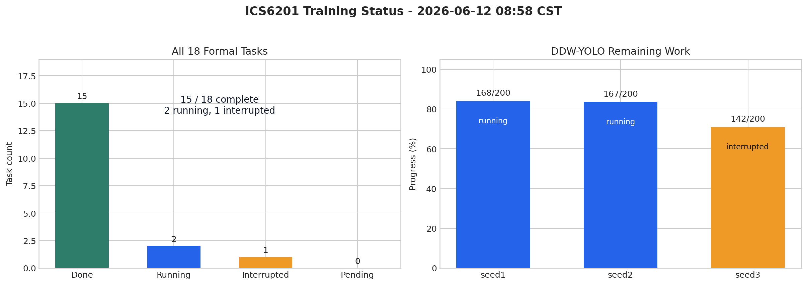

# ICS6201 无人机可见光检测 — 项目完整总结

## 项目概述

**目标**：用 6 种目标检测模型在 3 套无人机数据集上进行对比实验，找出最适合无人机黑飞检测的方案。

**基本信息**：

| 项目 | 详情 |
|------|------|
| 任务 | 单类（drone）目标检测 |
| 检测类别 | `0: drone` |
| 模型数量 | 6 个（YOLOv8n, YOLOv10n, YOLO11m, RT-DETR-L, Faster R-CNN R50-FPN, DDW-YOLO） |
| 每个模型运行 | 3 个随机种子（seed=1,2,3），共计 18 次训练 |
| 服务器 | CPU: `yzhao04-cpu-shanghai:32196`，GPU: `yzhao04-gpu-shanghai:32198` |
| GPU | 8× NVIDIA H200 (141GB HBM3e) |
| 存储 | GPFS 共享存储 `/volume/yzhao04/`，两台机器相同路径 |
| 项目路径 | `/volume/yzhao04/workspace/ICS6201/` |
| 当前环境 | conda env `fly`（PyTorch 2.5.1+cu121 + Ultralytics + Detectron2） |

---

## 一、数据集

### 数据来源

| 数据集 | 格式 | train | val | test | 合计 |
|--------|------|-------|-----|------|------|
| DUT Anti-UAV Detection | VOC XML | 5,200 | 2,600 | 2,200 | 10,000 |
| DroneDetectionDataset | VOC XML | 46,301 | 5,145 | 2,625 | 54,071 |
| ARD-MAV | 视频+XML | 85,997 | 10,749 | 10,751 | 107,497 |
| **总计** | YOLO | **137,498** | **18,494** | **15,576** | **171,568** |

### 数据准备流程

1. **解压原始 zip** → Git LFS 管理，先 `git lfs pull`
2. **合并分卷** → `cat ARD-MAV_Glad.zip.part-* > ARD-MAV_Glad.zip`
3. **VOC→YOLO 转换** → `scripts/prepare_rgb_yolo.py`（DUT + DroneDet）
4. **ARD-MAV 快速抽帧** → `scripts/prepare_ard_mav_fast.py`（60 个视频一次性批量导出帧，10-20 分钟）
5. **COCO 格式** → `scripts/prepare_rgb_coco.py`（给 Detectron2 用）

### 关键经验

- ARD-MAV 原始脚本逐帧调用 ffmpeg（107K 次），预估 18 天 → 改为每视频一次性全帧导出，**10-20 分钟完成**
- GPFS 共享存储 I/O 延迟高，大量小文件 `rmtree` 可能超时 → 数据准备避免 `--clear`
- `ls ardmav_*` 匹配 86K 文件会参数溢出返回 0 → 用 Python glob 或 find 统计

---

## 二、环境搭建与踩坑

### Conda 环境安装（CPU 机器有外网，安装到共享存储）

```bash
conda create -n fly python=3.12 -y
conda activate fly
PIP_CONSTRAINT="" pip install torch torchvision --index-url https://download.pytorch.org/whl/cu121
PIP_CONSTRAINT="" pip install ultralytics pyyaml
PIP_CONSTRAINT="" pip install opencv-python-headless  # GPU 无 libGL
PIP_CONSTRAINT="" pip install --no-build-isolation 'git+https://github.com/facebookresearch/detectron2.git'
```

激活：`source /volume/yzhao04/workspace/ICS6201/activate_fly.sh`

### 踩坑记录

| 问题 | 原因 | 方案 |
|------|------|------|
| `libGL.so.1` 缺失 | GPU 机器无 GUI 库 | 换 `opencv-python-headless` |
| pip constraint 冲突 | NVIDIA 内部 constraint 锁定 torch 版本 | `PIP_CONSTRAINT=""` 覆盖 |
| detectron2 安装失败 | pip 隔离环境无 torch | `--no-build-isolation` |
| SSH `Permission denied` | 无密钥 | CPU 端生成 ed25519 密钥，通过共享存储加到 GPU `authorized_keys` |
| Faster R-CNN 权重下载失败 | GPU 机器无外网 | CPU 端预下载 `pretrained_weights/faster_rcnn_R_50_FPN_3x.pkl`（160MB） |
| Faster R-CNN 训练 NaN | batch=4 太小梯度不稳定 | batch 改 32 |
| DDW-YOLO 训练报错 | Ultralytics Muon optimizer 要求 2D 参数，DDW 自定义模块 ECA/BiFPN 有 1D/3D 参数 | 改用 `AdamW` 或 `SGD` optimizer |
| `CUDA_VISIBLE_DEVICES` 未生效 | PyTorch 2.5.1 CUDA 12.1 与系统 CUDA 13.1 驱动版本不一致 | 改用 conda env `ai`（PyTorch 2.11 CUDA 13.1） |
| `master.sh` 验证失败后直接退出 | `set -euo pipefail` + 验证非零退出码 | 关键命令前加 `set +e`，后恢复 `set -e` |

---

## 三、脚本体系

### 新建脚本

| 文件 | 功能 |
|------|------|
| `scripts/auto_config.py` | 自动检测可用 GPU 数量、型号、显存 |
| `scripts/parallel_launcher.py` | 多 GPU 并行训练启动器，将任务分配到不同卡 |
| `scripts/validate_pipeline.py` | 极小子集全链路验证（环境/数据/训练/keep_alive） |
| `scripts/summarize_results.py` | 从 state 文件和 runs 目录生成对比报告 |
| `scripts/prepare_ard_mav_fast.py` | ARD-MAV 快速批处理（替代逐帧 ffmpeg） |
| `master.sh` | 一键执行入口 |
| `activate_fly.sh` | conda 环境激活 |

### master.sh 执行流程

```
STEP 1: 环境检查（Python 版本、GPU 检测、依赖导入）
STEP 2: 数据准备（YAML 生成、COCO 标注）
STEP 3: 冒烟验证（极小子集并行训练，输出 validation_report.md）
STEP 4: 正式训练（parallel_launcher.py，18 任务分配到 GPU）
STEP 5: 结果汇总（summarize_results.py，输出 training_report.md）
STEP 6: Keep Alive（启动 GPU 防回收守护进程）
```

### 启动命令

```bash
# 完整流程（留 GPU 0 给其他任务）
./master.sh --gpus 1,2,3,4,5,6,7

# 仅验证，跳过正式训练
./master.sh --gpus 1,2,3,4,5,6,7 --skip-train
```

---

## 四、验证结果

最终快速验证：**14/14 全部通过**，总耗时约 5 分钟。

| 检查项 | 结果 | 耗时 |
|--------|------|------|
| 8 GPU 检测 | PASS | 5s |
| GPU 选择（物理 GPU 1-7） | PASS | 0s |
| 环境导入 | PASS | 0s |
| 数据准备 | PASS | 0s |
| YOLOv8n 训练 | PASS | 39s |
| YOLOv10n 训练 | PASS | 38s |
| YOLO11m 训练 | PASS | 40s |
| DDW-YOLO 训练 | PASS | 44s |
| RT-DETR-L 训练 | PASS | 56s |
| Faster R-CNN 训练 | PASS | 4min05s |
| 多卡并行 | PASS | 0s |
| Keep Alive | PASS | skipped |
| 端到端计时 | PASS | 5min07s |

---

## 五、训练结果与当前状态（2026-06-12 更新）

### 核心任务完成情况

本轮优先保证的核心任务为 **RT-DETR-L** 和 **Faster R-CNN Detectron2**，每个模型 3 个 seed。截止 2026-06-09，6 个核心训练任务已全部完成，核心产物已落盘。


| 核心任务 | 状态 | 关键指标/进度 | 主要产物 |
|----------|------|---------------|----------|
| rtdetr_seed1 | DONE | mAP50-95 = **0.6794** | `runs_formal/rtdetr_seed1-2/weights/best.pt` |
| rtdetr_seed2 | DONE | mAP50-95 = **0.6753** | `runs_formal/rtdetr_seed2-2/weights/best.pt` |
| rtdetr_seed3 | DONE | mAP50-95 = **0.6758** | `runs_formal/rtdetr_seed3-2/weights/best.pt` |
| faster_rcnn_seed1 | DONE | iter = **2062560/2062560** | `runs_detectron2/faster_rcnn_seed1/model_final.pth` |
| faster_rcnn_seed2 | DONE | iter = **2062560/2062560** | `runs_detectron2/faster_rcnn_seed2/model_final.pth` |
| faster_rcnn_seed3 | DONE | iter = **2062560/2062560** | `runs_detectron2/faster_rcnn_seed3/model_final.pth` |

### 全量任务状态快照

截止 2026-06-12 08:58 CST，18 个正式训练任务中 **15 个已完成、2 个仍在运行、1 个 DDW-YOLO 中断**。当前剩余风险集中在 DDW-YOLO，其他模型族均已完成 3 个 seed。



### 非核心任务状态

| 任务 | 状态 | 说明 |
|------|------|------|
| yolo11_seed1 | DONE | mAP50-95 = **0.5540** |
| yolo11_seed2 | DONE | mAP50-95 = **0.5546**，从旧 partial run 恢复完成 |
| yolo11_seed3 | DONE | mAP50-95 = **0.5556** |
| yolov10_seed1 | DONE | mAP50-95 = **0.5139** |
| yolov10_seed2 | DONE | mAP50-95 = **0.5122** |
| yolov10_seed3 | DONE | mAP50-95 = **0.5154** |
| yolov8_seed1 | DONE | mAP50-95 = **0.4993** |
| yolov8_seed2 | DONE | mAP50-95 = **0.4998** |
| yolov8_seed3 | DONE | mAP50-95 = **0.5021** |
| ddw_yolo_seed1 | RUNNING | epoch **168/199**，mAP50-95 = **0.4180**，GPU3 继续运行 |
| ddw_yolo_seed2 | RUNNING | epoch **167/199**，mAP50-95 = **0.3850**，GPU4 继续运行 |
| ddw_yolo_seed3 | INTERRUPTED | epoch **142/199**，mAP50-95 = **0.4012**；日志显示 train loss 出现 `nan`，GPU5 已空闲 |

### 当前判断

- 如果按“核心模型 + 常规模型对比”口径，RT-DETR-L、Faster R-CNN、YOLO11、YOLOv10、YOLOv8 已经具备完整 3-seed 结果。
- 如果按“18 个正式任务全部完成”口径，目前还未完成：DDW-YOLO 还剩 seed1/seed2 在跑，seed3 需要决定是否从 `last.pt` 恢复、调整超参重跑，或接受 partial 结果。
- DDW-YOLO 的 optimizer 已改为 AdamW，规避了 Ultralytics Muon 对非 2D 参数的断言问题；但 DDW 自定义结构在长训练阶段仍存在 NaN 风险。

### 恢复训练策略

当前旧版 `master.sh`/`parallel_launcher.py` 控制进程曾被暂停，以避免继续错误调度 secondary 任务。核心任务完成后，使用 `recovery_manifest.py` 识别已完成/可恢复任务，再用新版 `parallel_launcher.py` 执行恢复；该流程已成功恢复并完成 YOLO11 seed2，并启动剩余 secondary 任务。

快速 dry-run 建议显式传入 `--data configs/drone_rgb_abs.yaml`，避免重复执行耗时的 COCO 标注准备：

```bash
cd /volume/yzhao04/workspace/ICS6201
source /volume/yzhao04/workspace/miniconda3/etc/profile.d/conda.sh
conda activate fly

MANIFEST=logs/recovery_manifest_20260609_083136.json

python scripts/parallel_launcher.py \
  --mode formal \
  --data configs/drone_rgb_abs.yaml \
  --gpus 1,2,3,4,5,6,7 \
  --target secondary \
  --resume-existing \
  --skip-complete \
  --manifest "$MANIFEST" \
  --dry-run
```

确认调度结果无误后，去掉 `--dry-run` 即可继续恢复 secondary 任务。当前阶段不要移动 `logs/state_formal.json` 和正在使用的 recovery manifest；如需归档，只复制快照，避免影响仍在运行的 DDW-YOLO seed1/seed2。

### GPU 使用说明

```bash
# GPU 0 完全空闲，留给其他任务
CUDA_VISIBLE_DEVICES=0 python your_script.py
```

---

## 六、文件索引

| 文件 | 说明 |
|------|------|
| `master.sh` | 一键执行脚本 |
| `activate_fly.sh` | 环境激活 |
| `DEVELOPMENT_PLAN.md` | 开发计划 |
| `EXECUTION_LOG.md` | 详细执行记录 |
| `validation_report.md` | 验证报告 |
| `training_report.md` | 训练结果（训练完成后生成） |
| `scripts/recovery_manifest.py` | 恢复训练 manifest 生成，识别 complete/partial/pending |
| `scripts/auto_config.py` | GPU 检测 |
| `scripts/parallel_launcher.py` | 多卡并行训练（含进度监控） |
| `scripts/validate_pipeline.py` | 子集验证 |
| `scripts/summarize_results.py` | 结果汇总 |
| `scripts/prepare_ard_mav_fast.py` | ARD-MAV 快速抽帧 |
| `scripts/prepare_rgb_yolo.py` | VOC→YOLO 数据准备 |
| `scripts/prepare_rgb_coco.py` | YOLO→COCO 转换 |
| `scripts/train_detectron2_fasterrcnn.py` | Faster R-CNN 训练 |
| `train_scripts/run_ultralytics_task.py` | 单次 Ultralytics 训练 |
| `train_scripts/ddw_modules.py` | DDW-YOLO 自定义模块（ECA + BiFPN） |
| `models/ddw_yolo11m_p2_bifpn_eca.yaml` | DDW-YOLO 模型定义 |
| `configs/drone_rgb_abs.yaml` | 数据集配置（绝对路径，自动生成） |
| `pretrained_weights/` | Faster R-CNN 预训练权重（160MB） |
| `raw_zips/` | 原始数据集压缩包（Git LFS） |
| `yolo/` | YOLO 格式数据集（171K 图片） |
| `coco/` | COCO 格式标注 |
| `logs/` | 所有日志 |
| `runs_formal/` | 正式训练输出 |
