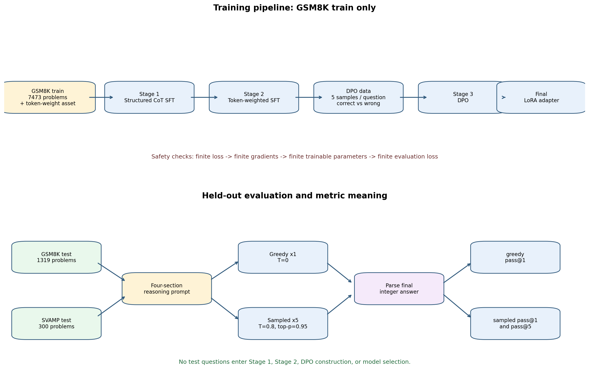

# CoT 三阶段训练工程导读：Stage 1、Stage 2、Stage 3 与正式评测

> 报告日期：2026-07-26
> 范围：依据当前仓库实现说明训练数据、三阶段优化、DPO 对构造、评测和产物关系。
> 核心结论：这是一个针对数学文字题的 LoRA 训练闭环——先学习规范的四段式推理，再强化预先标注的重要推理 token，最后用正确/错误回答对做 DPO；最终只在与训练严格隔离的 GSM8K test 与 SVAMP test 上报告数值答案正确率。
> 不包含：本文不把不同模型、不同随机种子或仍在运行的实验作横向效果结论；也不包含任何机器、账号、绝对路径或原始运行日志。

## 1. 这个工程到底在做什么

工程的目标不是只让模型“报出一个数字”，而是训练模型按照统一的推理结构解决数学文字题，并用可审计的最终答案衡量效果。它将一个学生模型的训练分为三次连续优化：

1. **Stage 1：结构化 CoT 监督微调**。让模型学会把推理组织为 `Decomposition → Solving → Verification → Summary`，再输出 `Answer: <number>`。
2. **Stage 2：token-weighted SFT**。从 Stage 1 adapter 继续训练，但使不同 CoT token 对损失的贡献不同，突出外部资产中标为重要的推理 token。
3. **Stage 3：DPO**。先从 Stage 2 模型采样回答，按最终答案是否正确形成偏好对，再训练模型偏向正确回答、远离错误回答。

三个阶段均采用 LoRA，基座模型冻结，保存的是轻量 adapter 而非一份新的全量基础模型。仓库同时支持 causal LM 和 Seq2Seq LM：前者使用聊天模板；后者使用 encoder 输入 / decoder 标签。学生模型 profile 可指向 Qwen、Llama 或 Flan-T5 一类模型，但**流程语义保持一致**。



上图上半部分是训练闭环，下半部分是被隔离的正式评测。DPO 数据生成位于 Stage 2 和 Stage 3 之间：它不是第四个模型优化阶段，却是 Stage 3 的必要输入。

## 2. 数据边界：训练看什么，评测看什么

| 用途 | 数据 | 代码中的处理 | 作用 |
|---|---|---|---|
| Stage 1 | GSM8K official train | 读取题目和标准解答；默认按 90% / 10% 划分训练与阶段内验证 | 学习结构化推理格式 |
| Stage 2 | train-only token-weight asset | 必须包含 `question`、`correct_answer`、`cot`、`token_weights` 等字段 | 学习带权重的 CoT 输出 |
| DPO 构造 | 同一份 train-only asset + Stage 2 模型生成 | 对每个训练问题采样，构建 `prompt/chosen/rejected` | 形成偏好学习数据 |
| 正式评测 | GSM8K official test（1,319 题）+ SVAMP test（300 题） | 只生成和计分，不回流训练 | 测量泛化的整数答案正确性 |

数据防泄漏是这个工程的重要约束：`prepare_gsm8k_assets.py` 会从原始 token-weight archive 中筛出 GSM8K train 问题，并检查官方 train/test 是否交集；Stage 2 和 DPO 入口又会把输入问题逐个与 GSM8K train 集比对，发现 test 或未知问题即失败。也就是说，**正式评测题不应进入 Stage 1、Stage 2、DPO pair 构造或模型选择**。

需要注意，Stage 2 的 `cot` 和 `token_weights` 是预先准备的训练资产。Stage 2 会继承 Stage 1 的模型参数，但其监督文本来自这个资产，而不是把 Stage 1 当场生成的文本重新拿来当标签。

## 3. Stage 1：结构化 CoT 监督微调

### 3.1 训练样本如何构造

实现入口是 `train/stage_1.py`，辅助逻辑在 `train/stage_1_utils.py`。它从 GSM8K 标准答案中取出 `####` 前的解题过程和 `####` 后的最终整数，并构造四个固定角色的步骤：

| 结构步骤 | 监督内容 |
|---|---|
| Decomposition | 识别题目中的量与关系 |
| Solving | GSM8K 原始解题过程 |
| Verification | 对算术、关系和单位做检查 |
| Summary | 总结并给出最终答案 |

为避免模型只记住一种固定输入形态，Stage 1 默认对每题构造多个变体：四段步骤会被打乱；大多数变体会随机遮掉少量步骤；模型的目标是补全缺失步骤并恢复正确顺序。默认每题最多生成 6 个训练变体，且会避免重复的 `(prompt, target)` 组合。

对于 causal LM，输入是聊天模板中的 system/user prompt 加目标文本；prompt token 的 label 被置为 `-100`，只对模型应生成的推理和答案计算 SFT loss。对于 Seq2Seq LM，prompt 是 encoder 输入，完整的结构化 CoT 与答案是 decoder 标签。

### 3.2 它优化了什么

Stage 1 是常规的 token-level 交叉熵监督微调。它的价值在于先定义一个稳定、易解析的输出协议：

```text
Decomposition: ...
Solving: ...
Verification: ...
Summary: ...
Answer: <integer>
```

这一步主要解决“回答的推理结构和格式”问题，而不是直接进行偏好比较。默认 LoRA 为 rank 8、alpha 16，causal 模型的默认 target modules 是 `q_proj,v_proj`；具体 profile 可以覆盖这些设置。

### 3.3 产物与完成条件

Stage 1 输出 LoRA adapter、tokenizer、checkpoint、`trainer_state.json` 与可选损失曲线。当前工程把“进程退出”与“训练可信”分开：每步在反向传播前检查 loss 是否有限，optimizer step 前检查梯度，optimizer step 后检查可训练参数，并在结束时检查 `eval_loss` 历史。只有 adapter 已写出并通过有限值审计，runner 才会标记本阶段成功。

## 4. Stage 2：按 token 重要性加权的 SFT

### 4.1 为什么需要第二阶段

普通 SFT 把所有需要预测的 token 近似同等对待。数学推理中，一些 token 承载关键运算、关系或结论，另一些则是连接性文字。Stage 2 的假设是：若训练资产提供了每个 CoT token 的重要性分数，模型可将更多优化容量放在关键推理片段上，同时仍保留最终答案的明确监督。

入口是 `train/stage_2.py`，权重构造在 `train/stage_2_utils.py`。它从 Stage 1 adapter（或消融时的基座模型）继续训练，并读取 train-only 的问题、CoT、正确答案和 token 权重。

### 4.2 损失函数的实际形式

对每个样本，prompt 和 padding 的权重为 0；CoT 第 `t` 个 token 的权重为：

```text
weight[t] = base_weight + scale * token_weight[t]
```

其中 `token_weight[t]` 是训练资产给出的 token weight；默认 `base_weight=1.0`、`scale=1.0`。最终答案区域使用独立的固定权重，默认是 1.5。主损失是加权交叉熵：

```text
L_weighted = sum_t(weight[t] * CE[t]) / (sum_t(weight[t]) + epsilon)
```

另外，权重大于默认阈值 0.7 的 token 会加入一个关键 token 交叉熵项；总目标为：

```text
L_stage2 = L_weighted + 0.05 * L_key
```

这表示 Stage 2 不仅整体加权，而且额外强调被阈值选中的位置。这里的 `LPD/token weights` 是输入资产的分数名称；当前实现负责消费这些分数和执行上述损失，并不在 Stage 2 内部重新推导该分数。

### 4.3 消融如何检验它

工程提供 `stage2_random_weights` 变体：保持 Stage 1、Stage 3、数据量与训练流程不变，只把每个 CoT token 的权重改为固定随机种子下的均匀随机值（默认区间 `[0.5, 1.5]`）。它回答的是“有信息的 token 权重”相对“仅改变数值分布的随机权重”是否有额外贡献。

另一个 `without_stage2` 变体会跳过本阶段，让 Stage 1 adapter 直接用于 DPO 构造和 Stage 3。两类消融共同避免把“多训练了一轮”误解为“权重设计有效”。

## 5. DPO 数据构造：如何得到 chosen / rejected

Stage 3 不能直接吃 Stage 2 的普通 SFT 数据，它需要偏好对。因此 `DPO_DATA.py` 位于两阶段之间，完成以下工作：

1. 读取 train-only 资产，验证问题属于 GSM8K train。
2. 用与 Stage 2 一致的四段式 prompt 让 Stage 2 adapter 对每题采样；默认每题 5 个回答，`temperature=0.7`、`top_p=0.9`、最多生成 512 个新 token。
3. 严格从 `Answer: <number>` 提取答案，按是否等于标准答案将生成结果分到正确与错误两组；过短回答会过滤。
4. 若同题同时存在正确和错误生成，正确生成是优先的 `chosen`；若全部生成都错，则用训练资产中的已验证 CoT 作为 `chosen`；若全部生成都正确，没有合格 `rejected`，该题跳过。
5. 从错误回答中最多保留默认 4 个 `rejected`，并按 `(prompt, rejected)` 去重，写成 Parquet。

最终每行是 TRL 标准偏好格式：

```text
prompt:   <already chat-templated question prefix>
chosen:   <correct response>
rejected: <incorrect response>
```

因此，这一步混合了 on-policy 和 teacher fallback：模型已经会答对时，尽量偏好模型自己的正确解；模型全错时，使用训练资产中的正确 CoT 给出明确的正例。它并不把“长回答”自动视为好回答，正确性由最终整数答案决定。

## 6. Stage 3：DPO 偏好优化

### 6.1 训练机制

实现入口是 `train/stage_3.py`，使用 TRL 的 `DPOTrainer` 和 LoRA。DPO 的直觉不是单独最大化 `chosen` 的概率，而是让当前策略相对一个参考策略，更偏向 `chosen` 而非 `rejected`。以 `pi_theta` 为待训练策略、`pi_ref` 为参考策略，常见 sigmoid DPO 目标可写成以下等宽文本：

```text
L_DPO = -log(sigmoid(beta * (
  log(pi_theta(chosen | prompt) / pi_ref(chosen | prompt))
  - log(pi_theta(rejected | prompt) / pi_ref(rejected | prompt))
)))
```

其中 `chosen` 是正确回答，`rejected` 是错误回答；当前默认 `beta=0.3`，loss type 为 sigmoid。当输入是 Stage 2 LoRA adapter 时，代码把该 adapter 作为可训练 PEFT 模型交给 TRL，并以初始 adapter 状态作为固定参考策略，避免再复制一份完整基础模型。

### 6.2 训练/验证切分与稳定性

DPO pair 会先清洗空值、重复项和 `chosen == rejected` 的无效样本。随后按**不同 prompt**而不是逐行随机切分 90% / 10%，防止同一问题的不同 rejected 版本同时出现在训练和验证中。

Stage 3 与前两阶段一样做有限值检查。对于数值敏感的模型或配置，runner 支持只把 Stage 3 切到 FP32，并可选用 `adamw_torch` 与 TF32；这不会改变 Stage 1/2 的数据语义。是否开启 DeepSpeed、具体 dtype 和 optimizer 是运行配置，不应与算法效果混为一谈。

### 6.3 最终模型从哪里来

完整流程完成后，最终模型是 `stage3` adapter。唯一例外是 `without_stage3` 消融：它在 Stage 2 后停止，因此评测时必须加载 `stage2` adapter。这个差别由评测 wrapper 根据 `ABLATION_MODE` 处理，避免错误地评测一个不存在或不匹配的阶段。

## 7. 正式评测：测了什么，三个指标分别是什么意思

评测入口是 `train/stage_1_test.py`，wrapper 是 `scripts/run_pass1_pass5_eval_student.sh`。评测对每个问题给出同一份四段式推理 prompt，然后分别执行：

| 模式 | 生成设置 | 统计指标 | 含义 |
|---|---|---|---|
| Greedy | 每题 1 次，`temperature=0` | `pass@1_greedy` | 该唯一确定性回答的最终答案是否正确 |
| Sampled | 每题 5 次，默认 `temperature=0.8`、`top_p=0.95` | `pass@1_sample` | 五个采样中的第 1 个是否正确 |
| Sampled | 同上 | `pass@5` | 五个采样中是否至少有一个正确 |

计算口径为：

```text
pass_at_1 = number_of_correct_first_answers / N
pass_at_5 = number_of_questions_with_at_least_one_correct_answer_among_five / N
```

`pass@1_sample` 与 greedy pass@1 是两个不同的口径：前者是随机采样序列的第一条，后者是温度为零的确定性输出。`pass@5` 更接近“给模型五次尝试是否能解决题目”，通常不应直接与单次 greedy 准确率等同。

评测会解析最终整数答案。GSM8K 的标准答案从 `####` 后读取；SVAMP 使用其答案字段。模型输出优先解析 `Answer:` 行，评测端允许在必要时退化为最后一个整数；无法解析时记为 `-1`，因而判错。该口径适合当前以整数最终答案为主的任务，但不等同于人工评审完整推理的逻辑正确性。

每完成一个数据集，评测会增量写出：

- `eval_results.json`：配置、各数据集指标和总体指标；
- `eval_results.txt`：便于阅读的文本汇总；
- `predictions.jsonl`：逐题正确答案、greedy 答案、五个 sampled 答案及正确性标记。

总体指标是在 GSM8K 与 SVAMP 的所有逐题记录拼接后重新计算的微平均，而不是简单平均两套数据集百分比。对于 causal 模型，推理可使用 vLLM tensor parallel；Seq2Seq profile 则走 Transformers 生成路径。

## 8. Runner、消融和“成功”的定义

完整 runner 的标准数据流为：

```text
base model
  -> Stage 1 adapter
  -> Stage 2 adapter
  -> DPO pairs
  -> Stage 3 adapter
  -> final adapter sanity check
  -> GSM8K + SVAMP full evaluation
```

矩阵控制器会串行执行下列变体，并在每个训练变体成功后调用完整评测：

| 变体 | 实际数据流 | 要回答的问题 |
|---|---|---|
| `full` | Stage 1 → Stage 2 → DPO → Stage 3 | 完整配方的基线 |
| `without_stage1` | base → Stage 2 → DPO → Stage 3 | Stage 1 的额外贡献 |
| `without_stage2` | Stage 1 → DPO → Stage 3 | Stage 2 的额外贡献 |
| `without_stage3` | Stage 1 → Stage 2 | DPO 的额外贡献 |
| `stage2_random_weights` | Stage 1 → Stage 2(random) → DPO → Stage 3 | 有信息权重相对随机权重的贡献 |

一次运行只有在以下链条都成立时才应称为成功：阶段 adapter 存在、有限值审计通过、最终 adapter 能加载并生成、训练流水线写成功标记、正式评测写成功标记、且逐题预测结构完整。仅看到 loss 日志、GPU 占用或 checkpoint 目录都不足以证明训练有效；非有限 loss、梯度、参数或 `eval_loss` 会触发 fail-fast 错误。

## 9. 如何理解已有结果与下一步

这个工程可以产出“一个模型在一个受控配置下的三阶段消融结果”，但不能仅凭单次运行回答所有科学问题：

- 不同参数量模型的结果不能直接当作三阶段方法的容量比较；模型、精度、吞吐和训练动态都可能不同。
- 单个随机种子的分数差不是统计显著性结论。要判断某一阶段是否稳定有效，应固定其余条件并使用多个 seed。
- `pass@5` 能反映多次采样的解题机会，但不代表单次部署效果；部署侧通常更关心 greedy pass@1 或经过明确选择策略后的单次答案。
- DPO pair 的数量和质量依赖 Stage 2 的采样分布。若模型全对，pair 变少；若模型全错，则更多使用 teacher fallback。这是方法的一部分，也是解释 Stage 3 结果时必须记录的变量。

推荐的实验顺序是：先确认小规模 smoke 通过数据边界、adapter 有限值和最终生成检查；再运行单个完整基线；最后运行串行消融矩阵，并把每组的 `eval_results.json`、逐题预测、DPO 元信息和有限值审计一起归档。

## 10. 实现与图表索引

| 相对文件 | 作用 |
|---|---|
| `train/stage_1.py`、`train/stage_1_utils.py` | 结构化 CoT 样本构造与 Stage 1 SFT |
| `train/stage_2.py`、`train/stage_2_utils.py` | token-weighted SFT 与加权损失 |
| `DPO_DATA.py` | sampled answers 到偏好 pair 的构造 |
| `train/stage_3.py` | TRL DPO 与 prompt-level 切分 |
| `train/stage_1_test.py` | GSM8K/SVAMP 生成、答案解析和 pass@k |
| `data_utils.py`、`scripts/prepare_gsm8k_assets.py` | 本地数据加载与 train-only 防泄漏检查 |
| `scripts/run_full_student_lora_4gpu.sh` | 三阶段训练 runner |
| `scripts/run_qwen_student_ablations_4gpu.sh` | 串行消融矩阵控制器 |
| [assets/cot_main_pipeline_overview.png](assets/cot_main_pipeline_overview.png) | 本文的两段式训练/评测流程图 |
| [assets/cot_main_pipeline_map.csv](assets/cot_main_pipeline_map.csv) | 图表使用的结构化数据 |
| [assets/plot_cot_main_pipeline.py](assets/plot_cot_main_pipeline.py) | 图表生成脚本 |

图表可在安装 `matplotlib` 的环境中重新生成：

```bash
python assets/plot_cot_main_pipeline.py \
  --csv assets/cot_main_pipeline_map.csv \
  --out assets/cot_main_pipeline_overview.png
```
