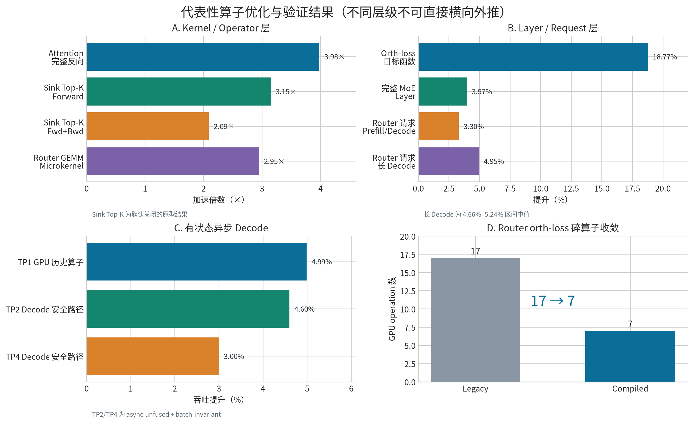

# 大模型训推算子优化的证据闭环

> 脱敏分享版｜更新日期：2026-09-11  
> 作者：冯浩然

## 摘要

大模型算子优化的难点通常不在“写出一个更快的 kernel”，而在于同时守住语义、状态、确定性、图捕获和端到端收益。本报告整理了一套可复用的工程方法，并用四类实践说明其落地方式：RL rollout 中的跨 step 状态与路由回放，训练侧确定性 Attention 反向和 MoE 辅助损失融合，推理侧确定性 Router GEMM 自动选核，以及低精度训练的系统级验证。

核心结论如下：

- 正确性必须拆成数值等价、状态机等价、跨 rank 一致和重复执行确定性四层；只做一次输出比对不足以支撑上线。
- 性能必须按 `kernel → operator → CUDA Graph → model/request` 分层归因；局部加速不能直接外推为训练 step 或在线吞吐收益。
- CUDA Graph 场景下，动态选核和懒初始化应在 capture 前完成，replay 期间只执行已确定、无主机同步的路径。
- 对依赖链较长的确定性 kernel，调度次序本身可能比算术吞吐更重要；消除错误的等待顺序后，完整反向耗时可下降约 75%。
- 未通过语义、严格顺序或端到端门禁的方案应保持默认关闭；“停止继续优化”也是有效的工程结论。



## 1. 范围、脱敏与数据口径

本文只保留可公开讨论的算法结构、开源组件、相对性能和验证方法，已删除内部模型、任务代号、仓库地址、提交号、集群入口、镜像、运行编号、原始日志和业务指标。硬件仅描述为 Hopper/Blackwell 级 GPU 或单节点多 GPU 环境。

所有数据均遵循以下口径：

1. **局部指标不外推。** Kernel、目标函数、完整层、训练 step 和在线请求分别报告。
2. **不同负载不横向拼接。** Prefill、decode、mixed batch、长输出和短输出分别验证。
3. **确定性与容差正确性分开。** 逐位一致、数值容差、重复运行稳定性分别记录。
4. **观测与因果结论分开。** 单次 trace、代理实验和 Amdahl 估算只用于定位，不写成正式收益。
5. **失败结果保留。** 若真实层或端到端结果不改善，即使 microbenchmark 更快，也不升级默认路径。

## 2. 一套可复用的闭环方法

### 2.1 从问题到交付的六步流程

| 阶段 | 要回答的问题 | 典型产物 |
|---|---|---|
| 最小复现 | 问题是否能脱离整网稳定出现？ | 最小 shape、固定 seed、单/多卡复现脚本 |
| 根因隔离 | 是算术、布局、状态、同步还是调度问题？ | 控制变量矩阵、时间线、SASS/trace 证据 |
| 语义 oracle | “正确”具体指什么？ | PyTorch 参考、路由回放目标、跨 rank token、梯度对照 |
| 分层基准 | 加速发生在哪一层？ | Kernel、operator、Graph、模型/请求四层数据 |
| 安全路径 | 不满足前提时如何处理？ | feature flag、preflight、缓存、显式 fallback |
| 交付门禁 | 能否重复、恢复、扩展和回滚？ | 多轮测试、恢复测试、异常路径、默认关闭策略 |

### 2.2 为什么先定义 oracle

训练与推理系统中的“等价”并非单一概念。例如 MoE Top-K 的专家集合相同，但索引顺序不同，后续 compact layout 仍可能变化；异步 decode 的当前输出相同，但 slot reuse 后的历史状态可能已经污染下一请求；容差范围内的浮点输出也不能证明 batch-invariant 路径逐位确定。因此，优化前先明确以下 oracle：

- 数学值与梯度是否在指定容差内一致；
- 路由集合、顺序和 mask 是否符合消费端协议；
- 不同 rank 是否产生相同 token 与路由；
- 相同输入多次 replay 是否逐位一致；
- 请求暂停、恢复、重排和 slot 复用后，状态是否仍属于正确请求。

## 3. RL 算子支持：跨 step 状态、路由回放与 Graph 稳定性

### 3.1 路由回放：把“看起来不一致”变成可测协议

MoE 强化学习链路中，rollout 与训练侧可能因精度、实现和调度差异选择不同专家。直接比较最终 reward 无法定位差异来自何处，因此将路由数据规范为 `[token, layer, top-k]`，打通采集、传输、response mask 对齐、训练侧 observe/replay 和异常检测。

基线实验中可观察到约 17%–19% 的自然路由差异；启用 replay 后，训练侧执行路由与**记录的回放目标**达到 0 mismatch，同时路由敏感的 log-probability 差异指标下降约 36–145 倍，KL 指标下降约 4–7 倍。这里的 0 mismatch 只表示 replay 协议被准确执行，不表示原始 rollout 与训练计算天然一致，也不等价于 reward、准确率或收敛提升。

### 3.2 异步历史依赖算子：状态比 kernel 更难

某历史依赖辅助算子需要根据 recent-token history 构造下一步输入。同步实现会触发 GPU→CPU 等待和 CPU→GPU 回传；异步化后，真正困难的是 mixed batch、首个 decode、请求恢复、slot reuse 和 reorder 中的跨 step 状态归属。

单 GPU 路径将历史与输入构造保留在 GPU，并用 Triton fused-hash 减少同步 bubble。严格 28-case 矩阵全部通过，吞吐较同步基线提升 4.99%，较未融合异步路径提升 1.94%。多 GPU 使用的是 `async-unfused + batch-invariant` 安全路径，而非 fused-hash：TP2/TP4 各 28 个 shape、每个 3 轮，共 84/84 通过且 0 mismatch，decode 吞吐分别提升约 4.6% 和 3.0%。mixed batch 的回退成本单独记录，不与 decode 收益混合。

### 3.3 CUDA Graph 卡死：浮点比较不是位级协议

在张量并行的 FULL CUDA Graph rollout 中，通信融合 kernel 偶发永不结束。最小复现将问题收敛到 fused AllReduce + RMSNorm 的轮询协议：实现用浮点比较识别 Lamport `-0.0` sentinel，而 FTZ 会把合法的负次正规 FP32 payload 当作负零，导致消费者持续等待。

处理方式不是重写通信算法，而是定位后回移并适配上游位级修复：用 `0x80000000` 精确判断 sentinel，再完成双卡最小复现、模型 Graph on/off 和重复 replay 回归。这个案例的通用启示是：只要某个浮点 bit pattern 被当作控制协议，就必须用整数位模式比较，不能依赖会受 FTZ/DAZ 影响的浮点谓词。

## 4. 训练算子支持：从依赖链调度到子图融合

### 4.1 确定性 Attention 反向：优化等待顺序而不是增加并行度

在带滑动窗口与 sink token 的确定性 Attention 反向中，性能回退几乎全部集中在 dQ：已驻留的 CTA 因 semaphore ticket 与 scheduler 顺序不一致而自旋等待。消融显示，dQ 占确定性增量的 99.67%，dK/dV 并非主要矛盾。

优化保留原 fused main kernel，不增加 kernel、workspace 或设备到主机回传，主要完成三点：

1. 将 ticket 改为相对 contributor 次序，而非绝对 tile 次序；
2. 为长短序列分别设计 reverse scheduler，并用 host 端已有的最大/平均长度元数据选择路径；
3. 对短序列和不满足条件的 shape 保留原生调度，避免优化反向伤害常见小尺寸。

在 2K–12K 序列范围内，完整 backward 提升 1.59–5.37 倍；代表性 packed trace 从 6.755 ms 降至 1.699 ms，提升 3.98 倍，主 kernel 提升 5.93 倍。短序列 0.5K/1K 与基线基本持平。目标 reverse 路径连续 1000 次逐位一致，数值参考与通用回归共 3601/3601 通过。当前代码与构建产物已交付，但生产启用前仍需完成训练框架的短步端到端 smoke，因此不宣称完整训练 step 收益。

### 4.2 MoE Router 正交损失：数学等价式减少碎算子

训练 trace 显示，每层 Router orth-loss 都会构造 identity，并执行多段 normalize、margin、pointwise 和 reduction；单次 steady forward 有 17 个 GPU operation，而 Gram GEMM 本身只有 2 个，并非主要优化对象。

对于 Gram 矩阵 `G`，无 margin 情况可用：

```text
||G - I||² = ||G||² - 2·trace(G) + E
```

由此消除 identity；margin 路径则计算全矩阵 excess，再减去 diagonal excess，保持只累计 off-diagonal loss。最后使用 `torch.compile(fullgraph=True)` 融合归一化、margin、pointwise 和归约子图，Gram GEMM 保持不变。

优化经历了明确的淘汰过程：in-place diagonal 版本虽然单函数更快，却因 `CopySlices` backward 使完整层下降 3.16%，因此否决；identity-free 版本完整层接近持平；compiled 版本才成为候选。最终 value/gradient 9/9 通过，目标函数 forward+backward 提升 18.77%，4-GPU 完整 MoE Layer forward+backward 提升 3.97%，单函数峰值显存下降 11.11%，GPU operation 从 17 降至 7。该开关默认关闭，且 3.97% 只代表完整 MoE Layer，不外推为完整训练 step。

### 4.3 原型未过门禁时应停止

另一条 sink-aware Top-K Triton fusion 在目标 shape 上 forward 提升 3.15 倍、forward+backward 提升 2.09 倍，语义与梯度用例 116/116 通过，launch 数从 25 降至 1。但严格 compact-index 顺序只有 102/116 通过，说明“专家集合相同”仍不足以保证消费端布局等价。因此该路径保持实验状态和默认关闭，而不是只凭 microbenchmark 上线。

类似地，通信—计算重叠的代理实验表明：某 FC1 GEMM 自身约 200 μs 的基线正常，跨 stream collective 才是退化主因。联合调整通信 CTA 与 GEMM 配置可使代理 span 下降 12.80%，但尚无真实多节点完整 step 证据，所以只保留为调优方向，不写成训练收益。

## 5. 推理算子支持：确定性 Router GEMM 的 capture-safe 自动选核

Batch-invariant MoE Router 在 decode 小 M 场景中若固定使用大 tile persistent kernel，会产生大量无效计算；但简单替换为更快 kernel 又可能破坏动态 shape 覆盖、逐位确定性或 CUDA Graph replay。

最终方案由三个后端组成：

- DeepGEMM：覆盖已验证的高性能主路径；
- Triton Full-K：作为低依赖、确定性的中间 fallback；
- Persistent kernel：覆盖其余 shape，保证行为完整。

动态选择不发生在 Graph replay 内。系统在 capture 前完成同步数值检查和 Graph preflight，以完整 tensor signature 缓存后端决定；replay 只沿固定路径执行。若主路径预检失败，则依次回退，并保留默认 persistent 模式用于灰度和回滚。

在代表性小 M 上，microkernel 提升约 2.95 倍；一组 48 层模型场景中，Router GEMM 中位耗时下降 73.39%，整步 GPU busy 中位下降 6.16%，kernel 135/135、模型场景 20/20 逐位一致。请求级验证中，代码生成负载的 prefill/decode 提升约 3%，长解码负载的四类配置提升 4.66%–5.24%，受测确定性路径 500/500 输出一致。Amdahl 反推仅用于解释收益上限，不替代 profiler 归因。

多算子栈接入时，还将 fused-sink Attention 与 BF16 fused-MoE 做成可独立启用、强制选路、失败即报错的正交矩阵，并完成张量并行接入与大规模质量回归。由于部分单次性能结果存在输出长度、构建产物和重复控制差异，本文不报告其加速数字。

## 6. 低精度训练验证：性能、数值和恢复缺一不可

在 Blackwell 级多 GPU 平台上，使用随机初始化和 mock data 重建同一训练拓扑，覆盖 BF16、FP8、MXFP8 与 NVFP4、1/2/4/8 GPU、不同序列长度、80 组 Transformer Engine forward+backward shape 以及 checkpoint 恢复。

受测矩阵中，正式短跑全部完成且 step-time 变异系数小于 1%；8-GPU NVFP4 相对 BF16 的吞吐为 1.265 倍，GPU 板卡口径 tokens/J 为 1.434 倍；80/80 个低精度算子用例结果为 finite。Checkpoint 从下一 step 恢复后的 loss 相对差为 `1.38e-6`。这些结果证明了运行稳定性、相对性能和恢复链路，但不证明真实数据上的收敛或最终质量；长序列结果也只属于短步 pilot。

低精度收益呈明显 shape 依赖：部分 attention projection 在小 M 下未获益，而较大的 expert projection 更容易受益。因此部署时应保留按 shape 的精度/后端决策，不能把单个 GEMM 的峰值吞吐推广为整网收益。

## 7. 失败案例与系统边界

### 7.1 正确但更慢的架构实现

某组潜变量专家架构在推理与训练双栈中完成 loader、projection、router、聚合、checkpoint 与恢复，并通过多卡数值和短跑稳定性测试；但代表性端到端性能只有基线的约 0.40–0.78 倍，质量门禁亦未达到扩层条件。因此停止扩大实验。该结果说明：功能完成与值得上线是两个独立问题。

### 7.2 单机 P/D 分离的固定成本

Prefill/Decode 分离实验验证了真实 KV 传输、显式 transfer id 和并发请求链路，未出现缺失传输标识；但在低负载单机场景中，额外服务边界带来约 5.5% 延迟增加和 3.3%–5.9% 吞吐下降。它的价值需要跨机部署、独立扩缩容或更高并发才能体现，不能把“链路打通”直接解释为性能提升。

### 7.3 Proxy 只回答局部问题

代理 benchmark 适合回答“通信 CTA 是否挤占 GEMM”或“某个 shape 是否受益”，但无法代替真实 topology、通信域和完整 step。所有 proxy 结论都应明确待验证项，并避免进入简历的最终收益数字。

## 8. 结果矩阵

| 方向 | 代表结果 | 正确性/稳定性门禁 | 可宣称边界 |
|---|---|---|---|
| RL 路由回放 | 敏感差异指标下降 36–145× / 4–7× | replay target 0 mismatch | 不等价于 reward 或收敛提升 |
| RL 历史依赖算子 | TP1 +4.99%；TP2/TP4 decode +4.6%/+3.0% | 多卡 84/84、0 mismatch | 多卡路径不是 fused-hash |
| Graph 通信稳定性 | 重复 replay 无 hang | 最小复现与模型 Graph on/off | 定位并回移上游修复 |
| Attention 训练反向 | trace backward 3.98× | 1000 次 bitwise；3601/3601 回归 | 尚不宣称完整训练 step |
| Router orth-loss | 目标 fwd+bwd +18.77%；MoE Layer +3.97% | value/gradient 9/9 | 不外推整步，默认关闭 |
| Router 推理 GEMM | microkernel 2.95×；长 decode +4.66%–5.24% | 135/135 kernel；500/500 输出一致 | 只覆盖受测确定性路径 |
| 低精度训练 | 8-GPU NVFP4 吞吐 1.265×；tokens/J 1.434× | 80/80 finite；恢复误差 1.38e-6 | 不证明真实数据收敛 |

## 9. 可复用检查表

在提交任何训推算子优化前，建议逐项确认：

- [ ] 是否存在脱离整网的最小复现与固定输入？
- [ ] 是否定义了数值、梯度、状态、跨 rank 和逐位确定性 oracle？
- [ ] 是否分别覆盖 prefill、decode、mixed batch、恢复、slot reuse 和 reorder？
- [ ] CUDA Graph 的初始化、动态选择与缓存是否在 capture 前完成？
- [ ] 性能数字是否注明硬件、shape、warmup、重复次数和汇总方式？
- [ ] 是否区分 kernel、operator、完整层、step 和请求级收益？
- [ ] 是否记录失败版本、负收益与停止原因？
- [ ] fallback、feature flag、默认值和回滚路径是否清晰？
- [ ] 是否删除内部模型、路径、仓库、运行编号和原始 trace 等敏感信息？

## 10. 结语

高质量算子工程的交付单位不是一个 kernel，而是一条可证明的链路：问题能够复现，根因能够解释，语义有 oracle，性能能分层归因，动态行为可在 Graph 下安全执行，失败时能够回退。只有同时满足这些条件，局部优化才可能稳定地转化为训练或推理系统收益。

