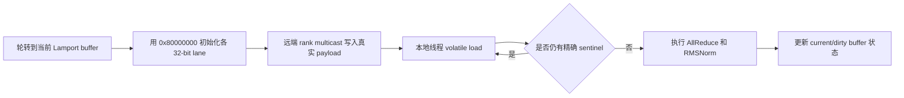
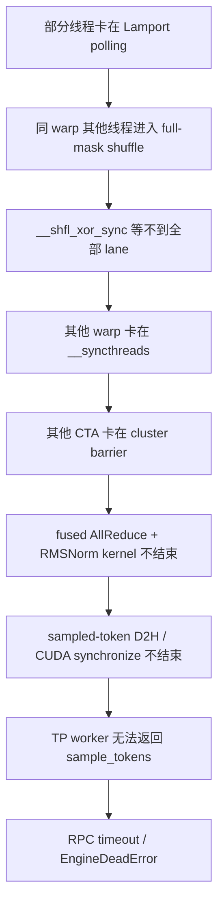

# FlashInfer MNNVL Lamport Sentinel 与 FTZ Hang 机制详解

> 日期：2026-07-17  
> 范围：解释 vLLM TP=2 + FULL CUDA Graph 下 FlashInfer MNNVL fused allreduce + RMSNorm hang 的位级机制、传播路径和修复语义。  
> 核心结论：旧实现不是把 payload 在内存中改成了 `-0.0`，而是 FTZ 浮点比较把合法负次正规 payload **误判**为 `-0.0` sentinel；polling 因而永远认为数据尚未到达，最终表现为 `sample_tokens` RPC timeout。

## 1. 问题背景与结论边界

目标问题出现在以下组合中：

| 项目 | 配置 |
|---|---|
| GPU | 2×NVIDIA H200，SM90 |
| 模型 | Qwen3-30B-A3B，BF16 |
| vLLM | 0.16.0rc1 调试路径 |
| rollout TP | 2 |
| 执行模式 | vLLM compile + FULL CUDA Graph |
| 通信融合 | FlashInfer MNNVL fused allreduce + RMSNorm |
| 旧 FlashInfer | 0.6.4 |

外层最初只能看到：

```text
sample_tokens RPC timeout
  -> EngineCore wait_for_response
  -> shm_broadcast mq.dequeue
  -> EngineDeadError
```

控制变量实验进一步证明：

- `FULL graph + fused` 是目标失败路径；
- `FULL graph + unfused` 可以完成；
- `compile-only + fused` 可以完成；
- sampler、D2H copy、RPC 和 MQ 都是上游 GPU 工作不完成后的等待点；
- PDL on/off 都不能消除旧实现的失败。

本报告解释已经闭环的 kernel 机制，但不声称本地曾直接保存原始 R3 hang 中“某一层、某一个 lane”的具体负次正规 bit pattern。代表模式 `0x80010000` 来自上游修复说明和定向回归设计；本地因果结论来自 source、SASS、控制组和补丁前后 A/B 的共同证据。

## 2. Lamport sentinel 在这里做什么

MNNVL oneshot kernel 需要判断远端 rank 的 multicast 数据是否已经覆盖通信 buffer。它没有给每一个 payload lane 额外设置独立 ready flag，而是先将待写区域填成一个不应与正常数据混淆的 sentinel：

```text
FP32 -0.0
bit pattern = 0x80000000
```

消费者的核心逻辑可以简化为：

```cpp
while (true) {
    // 一次 volatile load 读取 128 bit。
    float4 value = loadPackedVolatile<float4>(ptr);

    bool valid = true;
    for (int i = 0; i < 4; ++i) {
        valid &= !isNegZero(value[i]);
    }

    if (valid) {
        break;
    }
}
```

完整状态变化为：



这里的 `float4` 首先是 128-bit 搬运载体。对于 BF16 输入，一个 32-bit `float` lane 实际承载两个 BF16 元素，polling 阶段不应把这 32 bit 当成普通 FP32 数值做近似语义判断。

## 3. 旧判断为什么看起来合理

旧实现为：

```cpp
return val == 0.F && signbit(val);
```

设计意图是利用 IEEE-754 的两个事实：

- `+0.0 == 0.0` 和 `-0.0 == 0.0` 都为真；
- `signbit(+0.0)` 为假，`signbit(-0.0)` 为真。

在保留次正规数的严格浮点比较下，二者结合确实只会匹配 `-0.0`。问题在于目标 JIT kernel 使用 `-use_fast_math`，它隐含：

```text
--ftz=true
--prec-div=false
--prec-sqrt=false
--fmad=true
```

其中 `FTZ` 是 Flush To Zero。NVIDIA PTX 对 `setp.ftz.f32` 的定义是：FP32 次正规输入在参与比较时，被视为保留符号的零。

## 4. FTZ 如何制造 sentinel 假阳性

FP32 的几个关键 bit pattern：

| 位模式 | 类别 | FTZ 下 `val == 0` | `signbit` | 旧判断结果 |
|---|---|---:|---:|---:|
| `0x00000000` | `+0.0` | true | false | false |
| `0x80000000` | `-0.0` sentinel | true | true | true |
| `0x00000001` | 最小正次正规数 | true | false | false |
| `0x80000001` | 最小负次正规数 | true | true | **true，误判** |
| `0x807fffff` | 最大负次正规数 | true | true | **true，误判** |
| `0x80800000` | 最小负正规数 | false | true | false |

因此在 FTZ 比较语义下，旧 predicate 实际匹配的不是单独一个值：

```text
预期：0x80000000

实际：0x80000000
      以及 0x80000001 ... 0x807fffff
```

需要特别区分两个动作：

1. `ld.volatile.global.v4.f32` 将原始 bit 读入寄存器；
2. `FSETP.*.FTZ` 在浮点比较时将次正规输入按带符号零处理。

FTZ comparison 不等于“global memory 中的 payload 被永久写成零”。原始 bit 仍然存在，位级比较仍可读取它；错误发生在 FP predicate 的解释方式上。

## 5. BF16 payload 为什么会形成 FP32 负次正规模式

目标 kernel 的模板组合为：

```text
PackedType = float4
T          = bfloat16
```

`float4` 共 16 bytes，因此承载 8 个 BF16；每个 32-bit lane 承载两个 BF16。假设小端顺序下，相邻两个 BF16 为：

```text
低 16 bit：0x0000  // BF16 +0
高 16 bit：0x8001  // BF16 最小负次正规数
```

原始 32-bit lane 为：

```text
0x80010000
```

从 BF16 payload 角度，这是两个合法元素；从 FP32 bit layout 临时解释，它又恰好是一个负 FP32 次正规数：

```text
0x80010000 != 0x80000000
```

正常 polling 应判断“真实数据已经到达”。旧代码在 FTZ 下却得到：

```cpp
val == 0.F     // true：comparison 将负次正规输入按 -0 处理
signbit(val)   // true：原始最高位为 1
```

最终将合法 payload 错当成 sentinel。

kernel 在写入前已经会把**精确 BF16 `-0.0`**转换成 `+0.0`，避免真正的 payload 与 sentinel 冲突；但 `0x8001` 是合法负次正规 BF16，不是精确 `-0.0`，不应被清洗。漏洞正是出现在随后按 FP32 检查 packed lane 的步骤。

## 6. 为什么错误会变成永久 hang

producer 已经完成一次真实 payload 写入，之后不会为了满足 poller 再次改写这个位置。假设该位置稳定为 `0x80010000`，旧 poller 的状态为：

```text
读取 0x80010000
  -> FTZ 浮点比较误判为 sentinel
  -> 继续等待
  -> 再次读取同一个 0x80010000
  -> 再次误判
  -> 永久轮询
```

只需要少数 thread/lane 命中该模式，就会产生级联阻塞：



这解释了为什么 EngineCore 的最终栈位于 `mq.dequeue()`：RPC 和共享内存队列只是下游观察点，真正没有完成的是 GPU producer。

FlashInfer issue #3053 的 cuda-gdb 证据也显示：部分线程停在 `loadPackedVolatile`/`isNegZero` polling，其余线程分别停在 warp shuffle、block barrier 和 cluster barrier。

## 7. CUDA Graph 和 fused RMSNorm 分别扮演什么角色

CUDA Graph 不是 FTZ 的来源。FTZ 来自目标 kernel 的编译选项及其浮点比较指令。

Graph replay 在本问题中是稳定暴露条件：

- FULL graph 走到目标 fused MNNVL kernel；
- Lamport buffers、地址和迭代状态被反复使用；
- 特定模型 payload 命中会发生碰撞的负次正规 bit pattern；
- 错误 polling 因而稳定出现。

因此以下两个说法需要同时成立：

1. 不能因为 eager 或随机 standalone 通过，就断言 sentinel 实现正确；随机输入可能没有命中触发 bit pattern。
2. 不能说“CUDA Graph 把数值变成了 `-0.0`”；Graph 只是让错误 kernel、状态和数据组合进入了可稳定复现的执行路径。

`fuse_allreduce_rms=False` 可以通过，是因为它避开了目标 fused polling kernel；这是一种规避方式，不是修复了 sentinel protocol。

## 8. 位级修复为什么正确

FlashInfer PR #3304 将判断改为：

```cpp
constexpr uint32_t kNEGZERO_FP32 = 0x80000000U;

return __float_as_uint(val) == kNEGZERO_FP32;
```

新判断只回答一个问题：

```text
这 32 bit 是否精确等于 0x80000000？
```

因此：

```text
0x80000000 -> sentinel
0x80000001 -> 合法负次正规 payload
0x80010000 -> 合法 packed payload
```

修复的性质：

- 使用原始位模式和整数 equality，不受 FTZ 影响；
- 不改变 AllReduce、residual、RMSNorm、PDL 或 CUDA Graph 的数学公式；
- 不改变通信 buffer layout 和 ABI；
- 不需要为了一个 sentinel predicate 全局关闭 `-use_fast_math`；
- 保留 fast-math 的性能路径，同时恢复 polling 的活性。

直接删除 `-use_fast_math` 不是首选修复，因为它还会同时改变 division、sqrt、FMA 和数学库行为，影响面远大于 sentinel 判定。既然 sentinel 本来就是一个精确 bit pattern，就应该用精确 bit comparison 表达协议契约。

## 9. 本地与上游证据

| 验证项 | 旧 0.6.4 | PR #3304 backport |
|---|---:|---:|
| 16 requests × 16 tokens，FULL graph fused | 0/3 PASS | 2/2 PASS |
| 精确 prompt-9 | 0/1 PASS | 3/3 PASS |
| 目标 kernel `FSETP.*.FTZ` | 8 | 0 |
| compile-only fused control | PASS | PASS |
| FULL graph unfused control | PASS | PASS |

FlashInfer 0.6.12 已包含同类修复，并通过本工程的 eager、graph replay、prompt-9 和 16×16 两卡验证。上述数字用于证明活性修复；它们不代表完整 8×H200 RL `main_ppo` 已经完成最终生产验收。

上游资料：

- [FlashInfer PR #3304：bitwise sentinel fix](https://github.com/flashinfer-ai/flashinfer/pull/3304)
- [FlashInfer issue #3053：oneshotAllreduceFusionKernel graph replay hang](https://github.com/flashinfer-ai/flashinfer/issues/3053)
- [PR #3304 merge commit](https://github.com/flashinfer-ai/flashinfer/commit/1a60071)
- [NVIDIA NVCC `-use_fast_math`](https://docs.nvidia.com/cuda/cuda-compiler-driver-nvcc/index.html#use-fast-math-use-fast-math)
- [NVIDIA PTX `setp.ftz.f32`](https://docs.nvidia.com/cuda/parallel-thread-execution/#comparison-and-selection-instructions-setp)

## 10. 部署和验证要求

只修改 header 不足以生效。`trtllm_mnnvl_allreduce.cuh` 会被 JIT 编译进入：

```text
trtllm_mnnvl_comm.so
```

部署必须同时满足：

1. worker 实际导入 patched FlashInfer package/header；
2. 使用 patched header 重新生成 JIT `.so`，不能复用旧 cache；
3. 验证 fused path、MNNVL backend 和 FULL graph replay 确实发生；
4. 运行 eager fused、graph unfused、graph fused 等控制组；
5. 对目标失败用例进行 fresh-process 重复；
6. 检查 worker 正常退出且没有残留 GPU 进程。

源码和 binary 的基本审计方式：

```bash
# source：只允许位级 sentinel 判断
rg -n 'kNEGZERO_FP32|__float_as_uint|val == 0\.F && signbit' \
  <flashinfer-package>/data/include/flashinfer/comm/trtllm_mnnvl_allreduce.cuh

# binary：确认目标 kernel 不再包含危险的 FTZ FP predicate
cuobjdump --dump-sass <trtllm_mnnvl_comm.so> \
  | rg 'oneshotAllreduceFusionKernel|FSETP.*FTZ'
```

验收不能只看 FlashInfer version string。回移补丁后版本仍可显示 `0.6.4`；真正需要核对的是 header、JIT workspace、`.so` identity、SASS 和功能回归。

## 11. 一句话总结

FlashInfer 0.6.4 把 Lamport `-0.0` sentinel 当作浮点值比较，fast-math/FTZ 因而会将合法负次正规 packed payload 误判成“数据未到达”，造成 MNNVL fused kernel 永久轮询；PR #3304 改用 `0x80000000` 精确位比较后消除了碰撞，且不改变 AllReduce/RMSNorm 数学结果。

## 给 leader 的汇报话术

R3 rollout 在 TP=2 + FULL CUDA Graph 下的 `sample_tokens` timeout 已定位到 FlashInfer 0.6.4 MNNVL fused allreduce + RMSNorm kernel。旧代码在 fast-math/FTZ 下用浮点比较识别 `-0.0` sentinel，会把合法负次正规 payload 误判成未就绪，导致 GPU polling 永久不退出；将判断改成 `0x80000000` 精确位比较并重建 JIT cache 后，原失败用例和 SASS 回归均通过。该修改是活性修复，不改变 fused 算子的输出公式；完整 8 卡 RL 训练仍作为生产验收边界保留。
