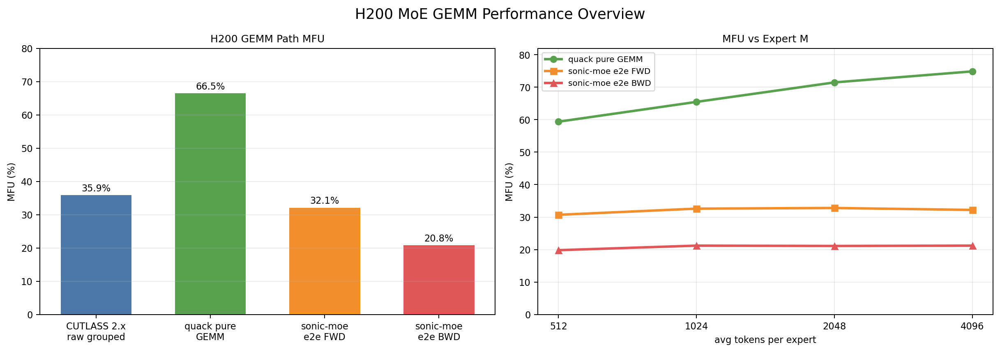

# H200 Grouped GEMM 性能分析（公开版）

> 结论：性能差距的首要问题不是 H200 算力不足，而是 benchmark 与线上链路使用了不同的 routed-row 口径，并叠加 Triton autotune/warmup 污染。统一 DeepEP compact rows 后，三个代表 shape 的本地回放与线上差异收敛到 +0.46% / -1.11% / -5.40%。

## 1. 分析目标

面向 MoE grouped GEMM，工作分为三个问题：

1. CUTLASS 2.x、Quack、DeepGEMM 和 SonicMoE e2e 的性能分别处于什么水平；
2. pure GEMM 与 e2e 差距来自 kernel 本体、routing/communication 还是测试口径；
3. 线上 shape 能否被本地稳定回放，并进一步做配置调优。

硬件口径为 H200 BF16，峰值按 989 TFLOPS 计算 MFU。MFU 只用于同一 FLOPs 定义下的比较。

## 2. 四路 benchmark

最初实验覆盖 18 个 shape，并比较四条路径，共 72 个逻辑数据点：

| 路径 | 测量范围 | 平均或代表结果 |
|---|---|---:|
| CUTLASS 2.x grouped GEMM | raw grouped GEMM | 约 35.9% MFU |
| Quack / CUTLASS 3.x JIT | pure GEMM | 约 66.5% MFU |
| DeepGEMM | 预编译 shape 能命中时 | 依赖 bundle 覆盖 |
| SonicMoE forward | routing + gather + GEMM + combine | 约 32.1% MFU |
| SonicMoE backward | backward e2e | 约 20.8% MFU |

早期归档的 18 行结果中，Quack 平均 64.9%、CUTLASS 2.x 平均 35.2%、SonicMoE forward 平均 31.0%；后续扩展汇总得到 66.5%/35.9%/32.1%。两组数字来自不同汇总批次，简历使用后者，历史归档保留前者。

## 3. Profile 去噪

### 3.1 表象

第一次 profile 中，token_gather_sum 一度显示占总时间约 69.9%，看起来像 gather 是绝对瓶颈。但 trace 同时包含 Triton autotune、JIT 和 warmup，首轮运行不能代表稳态。

### 3.2 处理方法

1. 把首次编译、autotune 和正式计时分开；
2. 对同一 shape 先预热，再抓稳定迭代；
3. 用 NVTX/range 将 routing、gather、GEMM、combine 分段；
4. 对照单 kernel latency 与区间总时长，检查 trace 是否重复计入；
5. 用理论 FLOPs 和实际 compact rows 重新计算 MFU。

### 3.3 稳态结论

| 区间 | 受污染表象 | 稳态口径 |
|---|---:|---:|
| token_gather_sum | 约 69.9% | 约 3.78% |
| Quack GEMM | 被 warmup 稀释 | 约 94.98% |

这一步把优化方向从“优先重写 gather”纠正为“先对齐 rows，再评估 GEMM schedule 和 e2e 通信/融合”。

## 4. Routed-row 口径纠偏

MoE 的 token 数至少有三种常见口径：

| 名称 | 含义 | 本次代表值 |
|---|---|---:|
| T | 原始 token rows | 24,497 |
| T * top-k | 每个 token 对所有选中 expert 展开后的逻辑 rows | 195,976 |
| TK_valid | DeepEP dispatch 后实际 compact rows | 29,446 |

standalone benchmark 早期直接使用 T * top-k，而线上 kernel 接收的是按 expert compact 后的 TK_valid。195,976 / 29,446 约为 6.66，足以制造 4x-6x 的虚假性能差距。

统一原则：

- FLOPs 使用实际执行的 compact rows；
- expert-M 分布由 dispatch 后每个 expert 的有效行数决定；
- padding、capacity 和 dropped token 单独记录；
- pure GEMM 与包含 routing/communication 的 e2e latency 分开报告。

## 5. 线上 shape 回放

从线上 profile 中提取 1,024 条 forward range 的形状统计，按最小、目标、最大 compact rows 选择三个代表 case。公开仓库只保留聚合 shape，不保存内部原始 ranges。

| case | 本地相对线上差异 | 判断 |
|---|---:|---|
| representative-min | +0.46% | 基本一致 |
| representative-target | -1.11% | 基本一致 |
| representative-max | -5.40% | 可接受，需考虑分布和系统噪声 |

差异收敛到约正负 5% 后，本地 benchmark 才适合作为 config tuning 的代理。此前基于全展开 rows 的 4x-6x 结论作废。

## 6. Pure GEMM 与 e2e 的差距

Quack pure GEMM 约 66.5% MFU，而 SonicMoE e2e forward/backward 约 32.1%/20.8%。差距可能来自：

- token dispatch、gather 和 combine；
- expert-M 不均衡与小矩阵尾部；
- 跨 rank 通信和同步；
- activation、scatter/add 与额外 HBM 流量；
- backward 中更多中间结果和依赖链。

因此，pure GEMM 已经较高效并不意味着 e2e 已经接近硬件峰值。优化优先级应由稳态 e2e trace 决定。

## 7. 工程产出

- 四路 benchmark 脚本与 JSON/Markdown 结果归档。
- H200 shape、expert distribution 和 MFU 统一口径。
- 线上 compact-row 回放方法。
- 调优前后 CSV、聚合脚本与组合图。
- SM90 tile/cluster/swizzle 调优指南。

## 8. 结论边界

- DeepGEMM 在早期四路表中部分 shape 未预编译，SKIP 不代表 kernel 性能为 0。
- +0.46% / -1.11% / -5.40% 是本地与线上 latency 差异，不是优化收益。
- 66.5% 是选定 shape 集上的平均值，不代表所有 H200 GEMM。
- 没有 NCU 证据的阶段不声称具体 stall 原因，只陈述时间线、shape 和理论分析。

## 9. 证据索引

- [四路 benchmark 结果](./archive/four_way_benchmark_20260528/four_way_results.md)
- [四路 benchmark 原始 JSON](./archive/four_way_benchmark_20260528/four_way_results.json)
- [H200 汇总绘图脚本](./scripts/plot_h200_gemm_summary_2026_06_05.py)
- [Quack 调优开发记录](./Quack调优开发记录公开版.md)
- [SM90 tuning guide](./references/sm90_tuning_guide.md)

