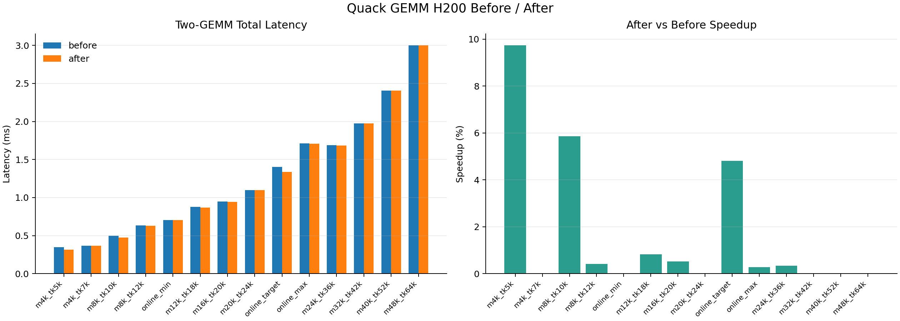
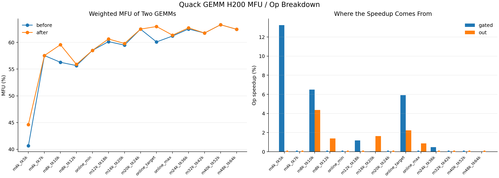
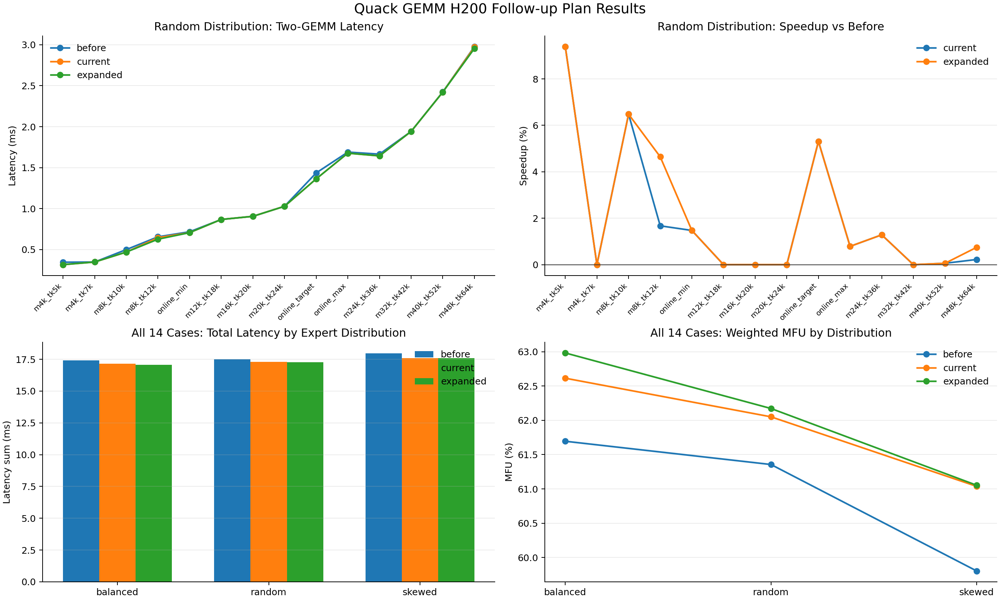

# Quack H200 配置调优开发记录（公开版）

> 结论：不改 kernel 算法，只扩展 SM90 autotune 候选并按线上 compact-row 分布验证；目标 shape 约提升 5.3%，14 shapes x 3 expert distributions 聚合提升约 1.84%，weighted MFU 从 60.94% 提升到 62.06%。

## 1. 为什么做 config-level tuning

口径对齐后，Quack pure GEMM 已达到约 66.5% 平均 MFU。此时直接重写 kernel 成本高且证据不足，先验证 tile、cluster、persistent schedule 和 swizzle 的配置空间是否遗漏 H200/MoE 形状的更优点。

目标不是寻找单个“冠军 shape”，而是：

- 覆盖线上 min/target/max compact rows；
- 扩展到 14 个 routed-row shape；
- 用 random、balanced、skewed 三种 expert-M 分布检查稳健性；
- 分别评估 gated up projection 和 down projection；
- 保留失败配置与次优配置，避免只报告 best case。

## 2. 候选集

| 候选集 | 定义 | 用途 |
|---|---|---|
| before | Quack 当前内置 SM90 搜索空间 | baseline |
| current_after | 少量 H200/MoE 定向候选 | 验证低风险扩展 |
| expanded_after | 基于合法现有配置派生 cluster/swizzle 变体 | 扩大覆盖并避免 JIT 进程级失败 |

主要维度包括 tile M/N、cluster M/N、ping-pong、dynamic persistent 和 max swizzle size。候选生成会去重，并在执行前检查 SM90 gated/out 的合法性。

## 3. Benchmark 设计

固定条件：

- H=3072，I=1536，16 experts，top-k=8；
- H200 BF16 峰值按 989 TFLOPS；
- 每个 case 预热后多次计时，取重复组中位数；
- gated 与 out 分开计时，再计算加权总 latency/MFU；
- 随机种子固定，输出完整 CSV。

数据矩阵：

| 维度 | 数量 |
|---|---:|
| compact-row shapes | 14 |
| expert-M distributions | 3 |
| operators | 2 |
| candidate sets | 3 |

## 4. 结果

| 口径 | before | after | 变化 |
|---|---:|---:|---:|
| 目标线上 shape | baseline | tuned | 约 +5.3% |
| 14 shapes x 3 distributions 聚合 latency | baseline | tuned | 约 +1.84% |
| weighted MFU | 60.94% | 62.06% | +1.12 pp |

目标 shape 的提升高于全局平均，说明 schedule 对特定 compact rows 有价值；全局只有 1%-2% 则说明内置搜索空间已较成熟，新增候选不能在所有分布上稳定获益。

## 5. 开发流程

### 5.1 最小 target sweep

~~~bash
PYTHONPATH=/path/to/sonic-moe:$PYTHONPATH \
python scripts/tune_quack_gemm_h200.py \
  --cases online_target \
  --candidate-set extended
~~~

### 5.2 before/after 扩展 shape 对照

~~~bash
PYTHONPATH=/path/to/sonic-moe:$PYTHONPATH \
python scripts/compare_quack_gemm_before_after_h200.py
~~~

### 5.3 三分布完整计划

~~~bash
PYTHONPATH=/path/to/sonic-moe:$PYTHONPATH \
python scripts/execute_quack_gemm_h200_plan.py \
  --distributions random,balanced,skewed
~~~

脚本默认从本目录的 data/ 读写 CSV，不依赖整理者本机的绝对路径。执行 benchmark 仍需安装兼容的 PyTorch、CUDA、Quack/SonicMoE 环境和 H200 GPU。

## 6. 数据与脚本映射

| 产物 | 说明 |
|---|---|
| [before/after CSV](./data/quack_gemm_h200_before_after_more_inputs_2026-06-04.csv) | 14 shape 的直接对照 |
| [plan summary CSV](./data/quack_gemm_h200_plan_summary_2026-06-05.csv) | shape、分布、算子、候选集明细 |
| [aggregate CSV](./data/quack_gemm_h200_plan_aggregate_2026-06-05.csv) | gated + out 聚合结果 |
| [top configs CSV](./data/quack_gemm_h200_plan_top_configs_2026-06-05.csv) | 每组最佳配置 |
| [tuning script](./scripts/tune_quack_gemm_h200.py) | 最小候选 sweep |
| [plan script](./scripts/execute_quack_gemm_h200_plan.py) | 14 shape x 3 分布完整执行 |
| [summary script](./scripts/summarize_quack_gemm_h200_tuning.py) | Markdown 结果汇总 |

## 7. 失败与约束

- 某些 tile/cluster 组合不是抛 Python 异常，而是使 JIT 进程终止，因此 expanded 集合只从已知合法配置派生。
- expert-M 的总和相同不代表性能相同，skew 会改变 tail 和负载均衡。
- autotune 首轮包含 JIT 成本，必须预热后计时。
- 当前没有形成通用 dispatch policy，只证明候选配置在选定 workload 上有小幅收益。
- 这是 config tuning，不是 CUDA/CuTe kernel 重写；简历应使用“扩展候选并验证”，不使用“重构核心 kernel”。

