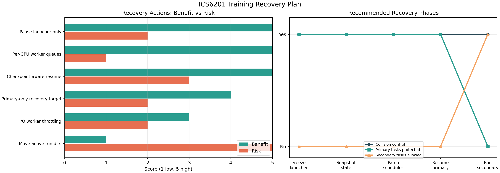

# ICS6201 训练恢复与优先级保护计划

**日期**: 2026-06-05  
**目标**: 在不破坏当前已产出 checkpoint / 日志 / 指标的前提下，暂停旧 launcher 的继续派发能力，修复调度逻辑，并把正式训练目标调整为优先保证 `rt-detr-l` 与 `faster_rcnn_detectron2` 两类任务完成。

## 0. 当前判断

当前正式训练已经跑起来，但 `parallel_launcher.py` 的调度逻辑仍有结构性风险：18 个任务在创建时被预先绑定到 GPU，随后用全局线程池运行。这样某个短任务先结束后，线程池会启动下一个排队任务，但该任务可能已经被预分配到一张仍在训练重任务的 GPU 上，从而触发显存冲突或 OOM。

截至最近一次检查，第一批 7 个任务仍在运行：

| 任务 | GPU | 优先级 | 处理策略 |
|---|---:|---|---|
| `rtdetr_seed1` | 1 | Primary | 保留，继续跑或从 checkpoint 恢复 |
| `rtdetr_seed2` | 2 | Primary | 保留，继续跑或从 checkpoint 恢复 |
| `rtdetr_seed3` | 3 | Primary | 保留，继续跑或从 checkpoint 恢复 |
| `faster_rcnn_seed1` | 4 | Primary | 保留，继续跑或从 checkpoint 恢复 |
| `faster_rcnn_seed2` | 5 | Primary | 保留，继续跑或从 checkpoint 恢复 |
| `faster_rcnn_seed3` | 6 | Primary | 保留，继续跑或从 checkpoint 恢复 |
| `yolo11_seed1` | 7 | Secondary | 不主动杀；结束后不再继续派发 secondary |

核心原则：

- 不移动正在被写入的 `runs_formal/` 子目录。
- 不删除任何旧日志、旧 checkpoint、旧 `results.csv`。
- 先阻止旧 launcher 启动新任务，再修脚本。
- 新恢复脚本默认只保证 primary 任务：`rt-detr-l` 与 `faster_rcnn_detectron2`。
- Secondary 任务，包括 `yolo11`、`ddw_yolo`、`yolov10`、`yolov8`，等 primary 完成后再跑。

下图给出本次恢复动作的收益/风险和推荐执行阶段。



## 1. 立即止血计划

### 1.1 推荐暂停对象

推荐只暂停旧 launcher，不暂停已经启动的 7 个训练子进程。

原因：

- 训练子进程继续占用 GPU 并写 checkpoint，已有训练进度不会白费。
- launcher 被暂停后，不会继续启动 `yolo11_seed2`、`ddw_yolo_*` 等后续任务。
- 避免 `yolo11_seed1` 结束后把 `yolo11_seed2` 错误派发到 GPU1。

执行方式：

```bash
cd /path/to/ICS6201

LAUNCHER_PID=$(pgrep -f 'scripts/parallel_launcher.py --mode formal')
echo "launcher=${LAUNCHER_PID}"
kill -STOP "${LAUNCHER_PID}"
ps -p "${LAUNCHER_PID}" -o pid,stat,etime,args
```

验收标准：

- `parallel_launcher.py` 的 `STAT` 中出现 `T`。
- `run_ultralytics_task.py` 和 `train_detectron2_fasterrcnn.py` 子进程仍在。
- GPU1-7 仍有训练负载，GPU0 仍为空。
- `logs/formal/*.log` 仍在更新，或至少子进程仍在 GPU 上运行。

### 1.2 不推荐的暂停方式

不建议直接 `kill -STOP` 7 个训练子进程，除非必须维护机器或释放资源。

风险：

- 训练完全停止，GPU 仍可能被进程占住。
- 长时间 STOP 后，日志、进程状态、父子进程关系会更难判断。
- 如果后续误杀子进程，可能丢失最后一次 checkpoint 之后的进度。

如果必须全暂停，必须先保存进程快照：

```bash
TS=$(date +%Y%m%d_%H%M%S)
mkdir -p logs/recovery_${TS}

ps -eo pid,ppid,stat,etime,args \
  | grep -E 'master.sh|parallel_launcher.py|run_ultralytics_task.py|train_detectron2_fasterrcnn.py' \
  | grep -v grep \
  | tee logs/recovery_${TS}/process_snapshot.txt

nvidia-smi \
  | tee logs/recovery_${TS}/nvidia_smi_snapshot.txt
```

## 2. 数据保护计划

### 2.1 活跃目录不搬动

当前活跃输出目录包括：

- `logs/master_*.log`
- `logs/formal/*.log`
- `logs/state_formal.json`
- `runs_formal/*`
- `runs_detectron2/*`

在训练子进程仍在写入时，不移动、不重命名这些目录。尤其不能移动 `runs_formal/rtdetr_seed*-2`、`runs_formal/yolo11_seed1-2` 这类 Ultralytics 自动生成目录，否则正在运行的进程可能继续写旧文件句柄，后续恢复也会混乱。

### 2.2 生成恢复 manifest

新增一个只读扫描脚本或 launcher 子命令，生成 `logs/recovery_manifest_<timestamp>.json`，记录每个任务的真实进度：

| 字段 | 用途 |
|---|---|
| `run_key` | 例如 `rtdetr_seed1` |
| `model_family` | `rtdetr` / `faster_rcnn` / `yolo11` |
| `priority` | `primary` / `secondary` |
| `candidate_dirs` | 所有可能的输出目录，例如 `rtdetr_seed1`、`rtdetr_seed1-2` |
| `canonical_dir` | 选中的最佳恢复目录 |
| `last_epoch_or_iter` | 当前训练进度 |
| `target_epoch_or_iter` | 目标训练进度 |
| `last_checkpoint` | 可恢复 checkpoint 路径 |
| `best_checkpoint` | 当前最佳 checkpoint 路径 |
| `complete` | 是否已经完整完成 |
| `resume_allowed` | 是否允许恢复 |
| `reason` | 选择该目录/状态的原因 |

Canonical 目录选择规则：

1. 优先选择进度最高的目录。
2. 进度相同则选择 `mtime` 最新的目录。
3. 必须存在可用 checkpoint，否则只能作为指标参考，不能作为恢复源。
4. 不删除非 canonical 目录，只在 manifest 里标记 `superseded`。

### 2.3 完成判定规则

`rt-detr-l` / Ultralytics：

- `results.csv` 行数达到目标 epoch，或最后 epoch 达到目标。
- `weights/last.pt` 存在。
- `weights/best.pt` 存在则记录为最终评估候选。
- 如果不完整但 `weights/last.pt` 存在，进入 resume 队列。

`faster_rcnn_detectron2`：

- `model_final.pth` 存在，或 `metrics.json` 中 `iteration` 达到目标 `max_iter`。
- `last_checkpoint` 存在则可恢复。
- `metrics.json` 记录的 `iteration` 低于目标时进入 resume 队列。

## 3. 调度器修改计划

### 3.1 修复目标

把旧的“任务预绑定 GPU + 全局线程池”改成“每张 GPU 一个 worker 队列”。

新调度语义：

```text
GPU1 worker: 取任务 -> 绑定 GPU1 -> 跑完 -> 再取下一个任务
GPU2 worker: 取任务 -> 绑定 GPU2 -> 跑完 -> 再取下一个任务
...
GPU7 worker: 取任务 -> 绑定 GPU7 -> 跑完 -> 再取下一个任务
```

这样哪张卡空出来，哪张卡继续拿下一项任务。任务不再提前固定到未来可能仍忙的 GPU。

### 3.2 新增参数

`scripts/parallel_launcher.py` 建议新增：

| 参数 | 默认值 | 作用 |
|---|---|---|
| `--target primary|all|secondary` | `primary` in recovery | 控制训练目标 |
| `--resume-existing` | off | 自动从 canonical checkpoint 恢复 |
| `--skip-complete` | on | 跳过已完整完成的任务 |
| `--manifest PATH` | auto | 指定恢复 manifest |
| `--per-gpu-queue` | on | 启用每 GPU worker |
| `--start-stagger-sec` | `60` | 错开 DataLoader 启动，降低瞬时 I/O / host memory 压力 |
| `--max-active-primary` | `6` | primary 同时训练上限 |
| `--allow-secondary-after-primary` | off | primary 完成前禁止 secondary |

`train_scripts/run_ultralytics_task.py` 建议新增：

| 参数 | 用途 |
|---|---|
| `--resume-path PATH` | 从指定 `last.pt` 恢复 |
| `--resume-auto` | 根据 manifest 自动恢复 |
| `--run-dir PATH` | 显式指定恢复目录，避免 Ultralytics 自动创建 `-2/-3` 目录 |
| `--exist-ok` | 明确允许写入同一 run 目录 |

`scripts/train_detectron2_fasterrcnn.py` 建议新增或确认：

| 参数 | 用途 |
|---|---|
| `--resume` | 使用 Detectron2 checkpointer 恢复 |
| `--output-dir PATH` | 显式指定 seed 输出目录 |
| `--max-iter INT` | 与原 epochs / dataset / batch 一致 |
| `--eval-only-final` | 训练中减少重复验证压力，最终统一评估 |

### 3.3 任务优先级

Recovery 模式默认只调度 primary：

```text
Primary:
  rtdetr_seed1
  rtdetr_seed2
  rtdetr_seed3
  faster_rcnn_seed1
  faster_rcnn_seed2
  faster_rcnn_seed3

Secondary:
  yolo11_seed1/2/3
  ddw_yolo_seed1/2/3
  yolov10_seed1/2/3
  yolov8_seed1/2/3
```

策略：

- 当前已经在跑的 `yolo11_seed1` 不主动杀。
- `yolo11_seed1` 结束后，不再启动任何 secondary。
- primary 6 个任务全部完成并通过最终评估后，才允许 secondary 队列。
- 如果 GPU7 空闲，默认也不拿来跑 secondary，除非显式设置 `--allow-secondary-after-primary` 或 primary 已全部完成。

## 4. 数据读取与 memory-bound 风险控制

训练瓶颈不一定是纯 GPU compute。当前数据量较大，同时启动多个 DataLoader 可能造成：

- host RAM / page cache 压力上升；
- 共享存储随机读放大；
- DataLoader worker 抢 CPU；
- pin memory 与预取队列占用过多内存；
- 多任务同时做 validation 时 I/O 峰值叠加。

### 4.1 默认安全配置

Recovery primary 阶段建议保持模型训练超参不变，只控制数据读取并发：

| 项 | 建议值 | 目的 |
|---|---:|---|
| Ultralytics `workers` | `8` 或 `12` | 从原 `16` 降低瞬时 worker 数 |
| Detectron2 `D2_NUM_WORKERS` | `4` 或 `8` | 降低 host memory 与随机读压力 |
| `start_stagger_sec` | `60-180` | 避免 6 个任务同时初始化 DataLoader |
| image cache | off | 不把全量图像缓存到 RAM |
| final eval | 单独跑 | 避免训练中频繁全量评估叠加 |

说明：

- 降低 `workers` 一般不影响精度，只影响吞吐。
- 不改变 `epochs`、`imgsz`、`batch`、optimizer、seed，避免引入明显精度不可比因素。
- 如果观察到 GPU 利用率长期低于 50% 且 `data_time` 明显升高，再逐步增加 workers。

### 4.2 监控指标

恢复训练期间每 10-30 分钟检查一次：

```bash
nvidia-smi
free -h
iostat -xz 5 3
pidstat -d -p ALL 5 3
```

判定方式：

| 现象 | 可能原因 | 处理 |
|---|---|---|
| GPU 利用率低，`data_time` 高 | I/O 或 DataLoader 瓶颈 | 降低并发任务或增加 worker 试探 |
| host RAM 快耗尽 | worker / prefetch 过多 | 降低 workers，关闭 cache |
| H200 显存接近满但 GPU 利用高 | 模型 compute / activation 压力 | 不优先调整数据读取 |
| validation 阶段多个任务同时变慢 | 全量验证 I/O 峰值 | 改成最终统一 eval 或错峰 eval |

## 5. 恢复执行顺序

### Phase A: 冻结旧 launcher

```bash
cd /path/to/ICS6201
LAUNCHER_PID=$(pgrep -f 'scripts/parallel_launcher.py --mode formal')
MASTER_PID=$(pgrep -f 'bash master.sh --gpus 1,2,3,4,5,6,7')

kill -STOP "${LAUNCHER_PID}"
ps -p "${LAUNCHER_PID}" -o pid,stat,etime,args
```

检查：

```bash
nvidia-smi
ps -eo pid,ppid,stat,etime,args \
  | grep -E 'run_ultralytics_task.py|train_detectron2_fasterrcnn.py' \
  | grep -v grep
```

### Phase B: 生成快照与 manifest

```bash
TS=$(date +%Y%m%d_%H%M%S)
mkdir -p logs/recovery_${TS}

cp logs/state_formal.json logs/recovery_${TS}/state_formal.snapshot.json
cp validation_report.md logs/recovery_${TS}/validation_report.snapshot.md

ps -eo pid,ppid,stat,etime,args > logs/recovery_${TS}/process_snapshot.txt
nvidia-smi > logs/recovery_${TS}/nvidia_smi_snapshot.txt
```

之后运行新增的 manifest 扫描：

```bash
TRAIN_ENV=fly python scripts/recovery_manifest.py \
  --runs-dir runs_formal \
  --detectron-dir runs_detectron2 \
  --target primary \
  --out logs/recovery_${TS}/manifest_primary.json
```

### Phase C: 修改脚本

修改范围：

- `scripts/parallel_launcher.py`
- `train_scripts/run_ultralytics_task.py`
- `scripts/train_detectron2_fasterrcnn.py`
- `master.sh`
- 新增 `scripts/recovery_manifest.py`

不修改当前正在运行子进程依赖的输出目录。脚本文件可以改，因为已启动的 Python 进程不会重新读取这些入口文件。

### Phase D: 等当前 7 个任务安全停住或结束

推荐等当前 6 个 primary 任务结束，至少等它们写出稳定 checkpoint。

如果 `yolo11_seed1` 先结束，由于 launcher 已暂停，不会继续派发 `yolo11_seed2`。

判断子任务结束：

```bash
ps -eo pid,ppid,stat,etime,args \
  | grep -E 'run_ultralytics_task.py|train_detectron2_fasterrcnn.py' \
  | grep -v grep
```

当需要终止旧 master / launcher：

```bash
kill -TERM "${LAUNCHER_PID}" "${MASTER_PID}"
kill -CONT "${LAUNCHER_PID}" "${MASTER_PID}"
sleep 5
ps -p "${LAUNCHER_PID}" "${MASTER_PID}"
```

如果仍未退出，再人工确认没有子训练进程后处理。

### Phase E: 用新脚本恢复 primary

建议启动命令：

```bash
cd /path/to/ICS6201

TRAIN_ENV=fly \
TRAIN_TARGET=primary \
WORKERS=8 \
D2_NUM_WORKERS=8 \
bash master.sh \
  --gpus 1,2,3,4,5,6,7 \
  --resume-existing \
  --skip-complete \
  --no-secondary
```

期望行为：

- 已完成的 primary 任务跳过。
- 未完成的 `rtdetr_seed*` 从 `weights/last.pt` 恢复。
- 未完成的 `faster_rcnn_seed*` 从 Detectron2 `last_checkpoint` 恢复。
- GPU0 不参与。
- primary 完成前不启动 secondary。

### Phase F: primary 完成后再跑 secondary

只有在 primary 训练和最终评估全部完成后，再启动 secondary：

```bash
TRAIN_ENV=fly \
TRAIN_TARGET=secondary \
WORKERS=8 \
bash master.sh \
  --gpus 1,2,3,4,5,6,7 \
  --resume-existing \
  --skip-complete
```

## 6. 风险覆盖

| 风险 | 影响 | 规避方式 |
|---|---|---|
| 暂停错 PID | 可能停掉训练子进程或无效 | 用 `pgrep -f 'parallel_launcher.py --mode formal'` 并核对 `ps` |
| 旧 launcher 继续派发任务 | 可能撞 GPU / OOM | `kill -STOP launcher` 后确认 `STAT=T` |
| 移动活跃 run 目录 | checkpoint / 日志混乱 | 活跃期间只读扫描，不移动不重命名 |
| `runs_formal/*-2` 重复目录误判 | 误跳过或误恢复 | 用 manifest 选择 canonical 目录 |
| checkpoint 半写入 | resume 失败 | 恢复前确认文件大小和 mtime 稳定 |
| 修改 batch / imgsz / optimizer | 影响精度可比性 | primary 恢复阶段不改训练超参 |
| 降低 workers | 可能训练变慢 | 这是吞吐风险，不是精度风险；通过监控再调 |
| 多任务 DataLoader 抢内存/I/O | GPU 利用下降或 host OOM | 错峰启动、降低 workers、必要时限制并发 |
| Detectron2 resume 不完整 | 重复训练或状态错位 | 依赖 `last_checkpoint` 和 `metrics.json` 双重确认 |
| Ultralytics resume 新建目录 | 结果分散 | 显式传 `--run-dir` / `--exist-ok` 或在 manifest 里追踪 |
| Secondary 抢 primary 资源 | primary 延迟 | recovery 默认 `--no-secondary` |

## 7. 验收标准

最低验收：

- 旧 launcher 暂停后没有新的任务被启动。
- 当前 primary 任务 checkpoint 和日志保留完整。
- 新 manifest 能列出每个 primary 的 `complete/resume/missing` 状态。
- 新 launcher 使用 per-GPU worker，不再提前把任务固定到未来 GPU。
- Recovery 模式只调度 `rtdetr_seed1-3` 和 `faster_rcnn_seed1-3`。
- GPU0 始终空闲。

最终验收：

- `rt-detr-l` 三个 seed 均完成 120 epoch 或成功从 checkpoint 续训到目标。
- `faster_rcnn_detectron2` 三个 seed 均完成目标 `max_iter`。
- 生成 primary-only 评估报告，包含每个 seed 的最终指标、checkpoint 路径和训练耗时。
- Secondary 任务只有在 primary 完成后才进入调度。

## 8. 原始文件

- 决策矩阵: `assets/ics6201_recovery_priority_matrix.csv`
- 计划图: `assets/ics6201_recovery_priority_plan.png`
