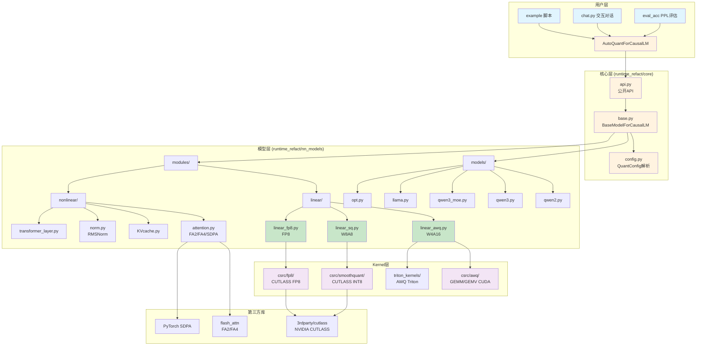
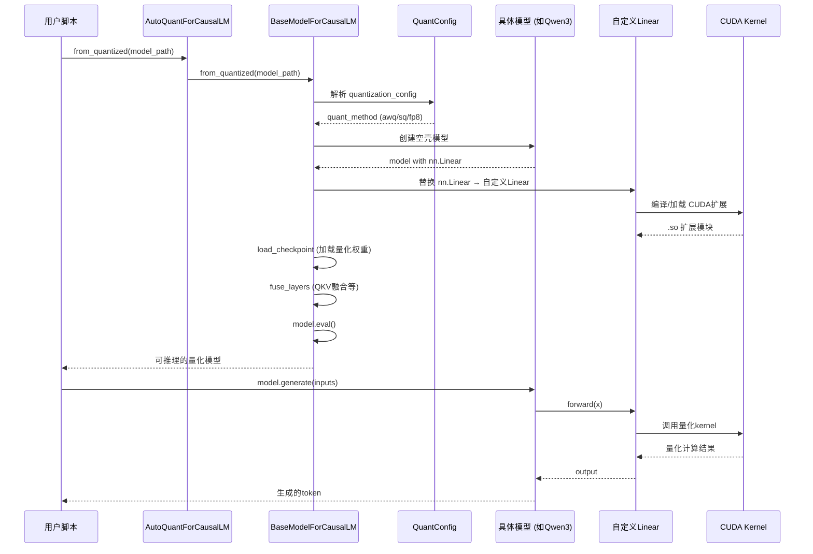
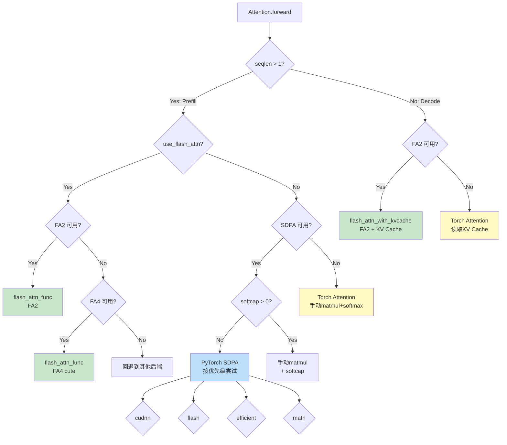
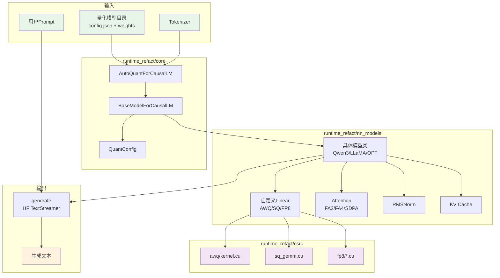

# LLMQRT 架构图

## 1. 整体架构

```mermaid
graph TB
    subgraph "用户层"
        A[example 脚本] --> B[AutoQuantForCausalLM]
        C[chat.py 交互对话] --> B
        D[eval_acc PPL评估] --> B
    end

    subgraph "核心层 (runtime_refact/core)"
        B --> E[api.py<br/>公开API]
        E --> F[base.py<br/>BaseModelForCausalLM]
        F --> G[config.py<br/>QuantConfig解析]
    end

    subgraph "模型层 (runtime_refact/nn_models)"
        F --> H[models/]
        H --> H1[qwen2.py]
        H --> H2[qwen3.py]
        H --> H3[qwen3_moe.py]
        H --> H4[llama.py]
        H --> H5[opt.py]

        F --> I[modules/]
        I --> I1[linear/]
        I1 --> I1a[linear_awq.py<br/>W4A16]
        I1 --> I1b[linear_sq.py<br/>W8A8]
        I1 --> I1c[linear_fp8.py<br/>FP8]

        I --> I2[nonlinear/]
        I2 --> I2a[attention.py<br/>FA2/FA4/SDPA]
        I2 --> I2b[KVcache.py]
        I2 --> I2c[norm.py<br/>RMSNorm]
        I2 --> I2d[transformer_layer.py]
    end

    subgraph "Kernel层"
        I1a --> J1[csrc/awq/<br/>GEMM/GEMV CUDA]
        I1b --> J2[csrc/smoothquant/<br/>CUTLASS INT8]
        I1c --> J3[csrc/fp8/<br/>CUTLASS FP8]
        I1a --> J4[triton_kernels/<br/>AWQ Triton]
    end

    subgraph "第三方库"
        J2 --> K1[3rdparty/cutlass<br/>NVIDIA CUTLASS]
        J3 --> K1
        I2a --> K2[flash_attn<br/>FA2/FA4]
        I2a --> K3[PyTorch SDPA]
    end

    style A fill:#e1f5fe
    style C fill:#e1f5fe
    style D fill:#e1f5fe
    style B fill:#fff3e0
    style E fill:#fff3e0
    style F fill:#fff3e0
    style G fill:#fff3e0
    style I1a fill:#c8e6c9
    style I1b fill:#c8e6c9
    style I1c fill:#c8e6c9
    style J1 fill:#f3e5f5
    style J2 fill:#f3e5f5
    style J3 fill:#f3e5f5
```

## 2. 模型加载流程

```mermaid
sequenceDiagram
    participant User as 用户脚本
    participant API as AutoQuantForCausalLM
    participant Base as BaseModelForCausalLM
    participant Config as QuantConfig
    participant Model as 具体模型 (如Qwen3)
    participant Linear as 自定义Linear
    participant CUDA as CUDA Kernel

    User->>API: from_quantized(model_path)
    API->>Base: from_quantized(model_path)

    Base->>Config: 解析 quantization_config
    Config-->>Base: quant_method (awq/sq/fp8)

    Base->>Model: 创建空壳模型
    Model-->>Base: model with nn.Linear

    Base->>Linear: 替换 nn.Linear → 自定义Linear
    Linear->>CUDA: 编译/加载 CUDA扩展
    CUDA-->>Linear: .so 扩展模块

    Base->>Base: load_checkpoint (加载量化权重)
    Base->>Base: fuse_layers (QKV融合等)
    Base->>Base: model.eval()

    Base-->>User: 可推理的量化模型
    User->>Model: model.generate(inputs)
    Model->>Linear: forward(x)
    Linear->>CUDA: 调用量化kernel
    CUDA-->>Linear: 量化计算结果
    Linear-->>Model: output
    Model-->>User: 生成的token
```

## 3. Attention 后端选择流程

```mermaid
flowchart TD
    A[Attention.forward] --> B{seqlen > 1?}

    B -->|Yes: Prefill| C{use_flash_attn?}
    C -->|Yes| D{FA2 可用?}
    D -->|Yes| E[flash_attn_func<br/>FA2]
    D -->|No| F{FA4 可用?}
    F -->|Yes| G[flash_attn_func<br/>FA4 cute]
    F -->|No| H[回退到其他后端]

    C -->|No| I{SDPA 可用?}
    I -->|Yes| J{softcap > 0?}
    J -->|No| K[PyTorch SDPA<br/>按优先级尝试]
    J -->|Yes| L[手动matmul<br/>+ softcap]

    I -->|No| M[Torch Attention<br/>手动matmul+softmax]

    B -->|No: Decode| N{FA2 可用?}
    N -->|Yes| O[flash_attn_with_kvcache<br/>FA2 + KV Cache]
    N -->|No| P[Torch Attention<br/>读取KV Cache]

    K --> Q{cudnn}
    K --> R{flash}
    K --> S{efficient}
    K --> T{math}

    style E fill:#c8e6c9
    style G fill:#c8e6c9
    style O fill:#c8e6c9
    style K fill:#bbdefb
    style M fill:#fff9c4
    style P fill:#fff9c4
```

## 4. 量化方法对比

```mermaid
graph LR
    subgraph "AWQ W4A16"
        A1[Weight: 4-bit<br/>per-group g=128] --> A2[Activation: FP16<br/>不量化]
        A2 --> A3[Kernel: 手写CUDA<br/>GEMM/GEMV]
        A3 --> A4[适用: 所有模型<br/>精度损失最小]
    end

    subgraph "SmoothQuant W8A8"
        B1[Weight: INT8<br/>per-tensor] --> B2[Activation: INT8<br/>per-tensor]
        B2 --> B3[Kernel: CUTLASS<br/>INT8 GEMM]
        B3 --> B4[适用: OPT<br/>Qwen2输出异常]
    end

    subgraph "FP8 Dynamic"
        C1[Weight: FP8<br/>per-channel] --> C2[Activation: FP8<br/>per-token 动态]
        C2 --> C3[Kernel: CUTLASS<br/>FP8 rowwise]
        C3 --> C4[适用: 所有模型<br/>推理时动态量化]
    end

    subgraph "FP8 Static"
        D1[Weight: FP8<br/>per-tensor] --> D2[Activation: FP8<br/>per-tensor 静态]
        D2 --> D3[Kernel: CUTLASS<br/>FP8 tensorwise]
        D3 --> D4[适用: 所有模型<br/>需要预计算scale]
    end

    style A1 fill:#ffcdd2
    style A2 fill:#ffcdd2
    style B1 fill:#c8e6c9
    style B2 fill:#c8e6c9
    style C1 fill:#bbdefb
    style C2 fill:#bbdefb
    style D1 fill:#e1bee7
    style D2 fill:#e1bee7
```

## 5. 性能加速比

```mermaid
xychart-beta
    title "LLMQRT vs Baseline 延迟对比 (ms)"
    x-axis ["AWQ Prefill", "SQ Prefill", "SQ Decode", "FP8 Dyn Prefill", "FP8 Dyn Decode"]
    y-axis "延迟 (ms)" 0 --> 200
    bar [183.05, 103.10, 100.75, 80.54, 76.07]
    bar [30.22, 49.07, 52.86, 43.97, 38.41]
```

## 6. 目录结构与数据流

```mermaid
graph TD
    subgraph "输入"
        M[量化模型目录<br/>config.json + weights]
        T[Tokenizer]
        P[用户Prompt]
    end

    subgraph "runtime_refact/core"
        API[AutoQuantForCausalLM] --> BASE[BaseModelForCausalLM]
        BASE --> CFG[QuantConfig]
    end

    subgraph "runtime_refact/nn_models"
        BASE --> MOD[具体模型类<br/>Qwen3/LLaMA/OPT]
        MOD --> LIN[自定义Linear<br/>AWQ/SQ/FP8]
        MOD --> ATTN[Attention<br/>FA2/FA4/SDPA]
        MOD --> NORM[RMSNorm]
        MOD --> KV[KV Cache]
    end

    subgraph "runtime_refact/csrc"
        LIN --> CUDA_AWQ[awq/kernel.cu]
        LIN --> CUDA_SQ[sq_gemm.cu]
        LIN --> CUDA_FP8[fp8/*.cu]
    end

    subgraph "输出"
        MOD --> GEN[generate<br/>HF TextStreamer]
        GEN --> OUT[生成文本]
    end

    M --> API
    T --> API
    P --> GEN

    style M fill:#e8f5e9
    style T fill:#e8f5e9
    style P fill:#e8f5e9
    style OUT fill:#fff3e0
    style CUDA_AWQ fill:#f3e5f5
    style CUDA_SQ fill:#f3e5f5
    style CUDA_FP8 fill:#f3e5f5
```
