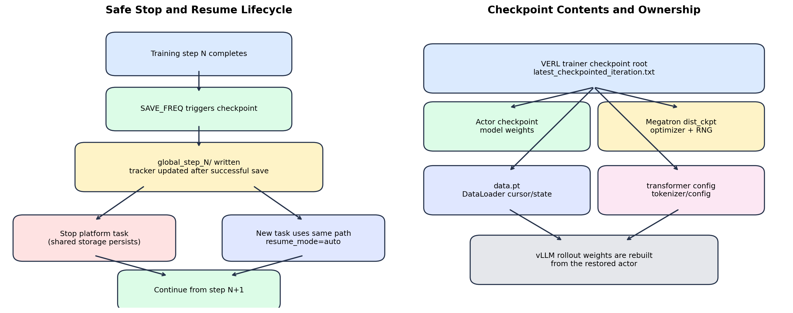
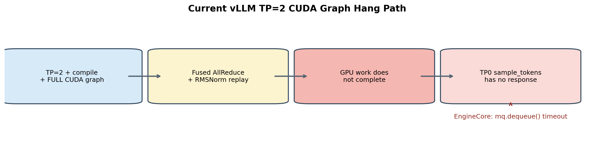
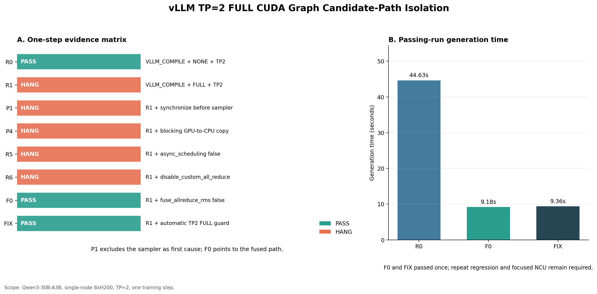

# R3 CUDA Graph 与集群排障（公开版）

> 2026-07-15 更新：本文第 1～9 节保留 6 月阶段性排障过程；后续两卡最小复现已经把根因闭环到 FlashInfer MNNVL fused allreduce + RMSNorm 的 FTZ/sentinel 误判，并完成 PR #3304 回移与 0.6.12 回归。最新结论见 [FlashInfer TP2 CUDA Graph Hang 根因与修复](../flashinfer/README.md)。

> 当前结论：`sample_tokens timed out` 是下游表象，最小触发组合为 TP=2 + VLLM_COMPILE + FULL CUDA Graph + fused allreduce/RMSNorm；旧实现的浮点 sentinel 判断会受 FTZ 影响而永久轮询，精确 bit-pattern 修复后两卡 graph replay 通过，完整大规模 RL 任务仍待最终验收。

## 1. 故障现象

R3 rollout 在多卡配置下偶发或稳定卡住，外层最终表现为：

- sample_tokens timed out；
- engine process 无返回或抛出 engine-dead 类错误；
- sampler、D2H copy、async output queue 或消息队列等待超时。

这些位置都在执行链后段。仅依据超时栈把问题归因到 sampler 会误判，因此排查目标是找到最后一个确定完成的 GPU 阶段和最小触发条件。

## 2. 控制变量矩阵

| 变量 | 对照 | 观察 |
|---|---|---|
| Tensor Parallel | TP=1 vs TP=2 | TP=2 才稳定触发 |
| CUDA Graph | eager vs FULL | eager 通过，FULL 触发 |
| Compile | off vs on | compile + FULL 组合风险最高 |
| fused AllReduce + RMSNorm | on vs guarded off | 关闭后首次通过完整 step |
| sampler / D2H | 保持不变 | 仍只是等待点，非首因证据 |

最小复现可以概括为：

~~~text
TP=2
+ vLLM compile
+ FULL CUDA Graph capture/replay
+ fused AllReduce + RMSNorm candidate
=> rollout hang
~~~

## 3. 排查过程

1. 先用 eager 证明模型、数据、权重同步和基本 TP 通信可运行。
2. 固定 batch 与随机性，只切换 graph mode，确认问题与 FULL graph 相关。
3. 对比 TP=1/TP=2，缩小到需要跨 rank 协同的执行路径。
4. 使用 Nsys 标记 rollout、collective、sampler 和 D2H 时间线，排除后段“报错即根因”的解释。
5. 对 fused pass 增加 guard，单独关闭 AllReduce + RMSNorm 融合；完整 training step 首次通过。
6. 规划 standalone reproducer 与 NCU，准备验证 rank 对称性、barrier/scoreboard stall 和 memory traffic。

## 4. 当前结论等级

| 结论 | 置信度 | 原因 |
|---|---|---|
| sampler 不是首因 | 高 | eager 和部分 graph 对照能完成，sampler 只在上游未完成后等待 |
| 问题依赖 TP=2 + FULL graph | 高 | 控制变量可重复区分 pass/fail |
| fused AllReduce + RMSNorm 路径不可靠 | 中高 | guard-off 首次完整通过，仍需多轮回归 |
| 已定位到具体 kernel 指令或同步点 | 不成立 | 目标 NCU 和指令级证据未完成 |

因此对外准确说法是“把 hang 收敛到 fused collective + normalization 路径，并给出 eager/guard 规避方案”，而不是“修复了 vLLM CUDA Graph kernel bug”。

## 5. 稳定规避与验收

当前默认稳定方案是启用 eager。候选 guard 若要升级成正式方案，至少需要：

- 相同输入连续多次通过；
- FULL、PIECEWISE 和组合 graph mode 的最小回归；
- R3 5-step 以上端到端回归；
- 性能差异与正确性指标同时记录；
- 两个 TP rank 的行为对称性验证。

一次通过只提高嫌疑路径的置信度，不能作为修复完成的依据。

## 6. Checkpoint 与恢复

多节点实验将“训练状态”和“可观测产物”分开管理：

| 产物 | 用途 | 能否恢复训练 |
|---|---|---:|
| model/optimizer/scheduler checkpoint | 恢复训练状态 | 是 |
| console / tracking metrics | 观察趋势 | 否 |
| rollout dump | 调试输入输出 | 否 |
| Nsys / NCU profile | 定位性能和 hang | 否 |

推荐恢复流程：

1. 长跑前做 2-step 保存与恢复 smoke；
2. 验证 checkpoint 完整性和 step 编号；
3. 中断前确认最新 checkpoint 已落盘；
4. 恢复时复用同一实验配置，只改变 resume 参数；
5. 对比恢复前后 loss、global step、optimizer state 和 route 指标连续性。

自动恢复只应选择同一实验实例下的有效 checkpoint，不能扫描并误用其他实验目录。

## 7. 集群观测结果

对两组集群运行记录的对比表明：

- eager/no-resume 组可以完成 5-step smoke；
- fullgraph + checkpoint 组合出现过 Ray memory pressure 和 OOM；
- profiling 能解释资源和时间线，但本身不会修复稳定性问题；
- graph mode、checkpoint 峰值和对象存储/日志开销需要分别控制，避免同时引入多个变量。

## 8. Profiling 产物状态

已生成并验收一份覆盖完整 rollout 的 fixed-path Nsys；早期 fused-on trace 因 guard 实际生效，不能作为 fused kernel 证据。standalone reproducer 已准备，目标 NCU 尚未形成，因此报告保留“待验证”状态。早期 Nsight 状态图与最终周报不一致，未纳入公开归档。

- [根因矩阵 CSV](./assets/vllm_tp2_rootcause_matrix_2026-06-25.csv)
- [根因矩阵绘图脚本](./assets/generate_vllm_tp2_rootcause_matrix_2026-06-25.py)

## 9. 面试展开框架

- **现象**：外层 sampler timeout，但错误点不等于首因。
- **方法**：用 TP、graph、compile、fusion 四个维度做控制变量矩阵。
- **结果**：先收敛到 TP=2 + FULL graph 下 fused AllReduce + RMSNorm，再用两卡 graph reproducer 和 SASS 对照定位 FTZ/sentinel 误判。
- **处置**：回移精确 bit-pattern 修复并验证新版 FlashInfer；完整大规模 RL 任务仍保留最终验收边界。
- **工程化**：补 checkpoint smoke、恢复 SOP 和 profile 产物验收，降低多节点实验重跑成本。
