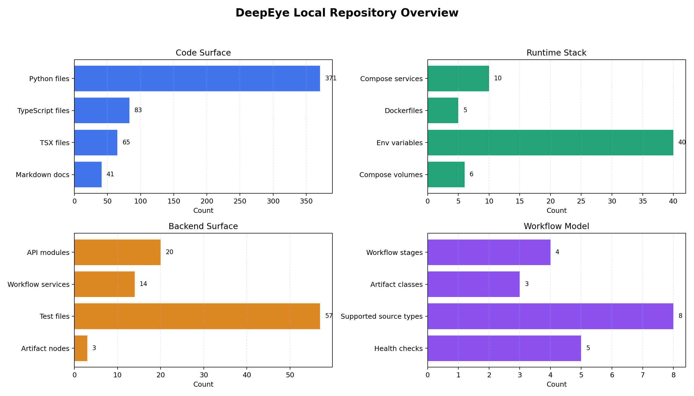

# DeepEye 工程分析报告（2026-06-15）

> 分析对象：`/path/to/DeepEye`  
> 本报告基于本地代码快照、README/docs、轻量编译检查，以及上游公开资料交叉确认。

## 核心结论

DeepEye 是一个面向数据分析场景的“可 steering 的自驾驶数据智能体系统”。它不是一个简单 ChatBI demo，而是把自然语言分析请求拆成可验证、可执行、可观察的工作流 DAG，并以 Data Videos、Dashboards、Analytical Reports 三类工件交付结果。

从工程形态看，它是一个完整平台：后端 FastAPI/Celery/Postgres/Redis/MinIO，核心 agent/workflow 包，React 前端，Docker Compose 本地栈，外加 runtime-control 和 Docker sandbox。优势是系统边界完整、执行过程透明、适合复杂多源数据分析；代价是环境较重，必须配置 LLM、密钥、容器权限和本地安全边界。

下图是本地仓库快照的结构统计，便于快速判断工程规模和运行面。



## 本地仓库状态

| 项目 | 结果 |
|---|---|
| 本地路径 | `/path/to/DeepEye` |
| 当前分支 | `master` |
| 当前提交 | `93379f2a365fb596f117a35e9edf35a0f5fa5ef0` |
| 提交日期 | `2026-05-28` |
| 提交说明 | `docs: refresh README with visual demo assets (#123)` |
| 工作区状态 | DeepEye 仓库自身 `git status --short` 无输出 |
| `origin` | `https://github.com/XFDG/DeepEye.git` |
| `upstream` | `https://github.com/HKUSTDial/DeepEye.git` |

已按请求配置好 git remote：保留个人/镜像远端 `origin`，新增官方上游 `upstream`。

## 是什么

DeepEye 的定位是生产级、可控的 self-driving data agent system。官方 README 和论文摘要都强调它不同于线性 ChatBI：DeepEye 把分析过程建模为 workflow-centric architecture，处理数据库、文件、文档等异构数据源，并输出多模态分析工件。

仓库的主要结构如下：

| 路径 | 作用 |
|---|---|
| `packages/core` | 核心 agent、datasource、workflow、graph、sandbox primitives |
| `packages/backend` | FastAPI API、Celery worker、workflow 编排、持久化、sandbox/runtime 控制 |
| `packages/frontend` | React + TypeScript 前端，包括 chat、workflow graph、artifact preview |
| `docker` | 本地 Docker Compose 运行所需 Dockerfile、nginx、runtime 脚本和测试 DB |
| `docs` | 架构说明、节点系统、sandbox、安全模型、RFC、测试 checklist |

它的关键产品输出是三类：

| 工件 | 作用 |
|---|---|
| Data Videos | 把分析结果转成带叙事、动画和可视化的短视频 |
| Dashboards | 生成交互式数据看板 |
| Analytical Reports | 生成结构化的分析报告 |

## 环境要求

| 类别 | 要求 | 说明 |
|---|---|---|
| Python | `>=3.11` | `pyproject.toml` 声明 workspace 使用 Python 3.11+ |
| Python 包管理 | `uv` | README 和 `scripts/check.sh` 使用 `uv sync`、`uv run` |
| 前端 | Node.js / npm | Docker 外运行前端时需要；前端是 Vite + React + TypeScript |
| 容器 | Docker + Docker Compose | 官方 Quick Start 默认用 Compose 启动全栈 |
| LLM | `LLM_API_KEY`、`LLM_BASE_URL`、`LLM_MODEL` | 启动后端和 agent 工作流的必要配置 |
| 存储服务 | Postgres、Redis、MinIO | Compose 内置，分别承担系统状态、队列/缓存、数据/工件对象存储 |
| Sandbox | Docker socket / runtime-control | 代码执行、dashboard/video preview 等需要容器化运行边界 |
| 可选语音 | Azure Speech key/region | Data Video narration 相关 |

最小本地启动流程：

```bash
cd /path/to/DeepEye
cp env.example .env
# 编辑 .env，至少设置 LLM_API_KEY、LLM_BASE_URL、LLM_MODEL、
# JWT_SECRET_KEY、POSTGRES_PASSWORD、MINIO_ACCESS_KEY、MINIO_SECRET_KEY
docker compose up --build
```

默认入口是：

```text
http://localhost:8080
```

共享机器建议额外设置：

```bash
COMPOSE_PROJECT_NAME=deepeye_<your_name>
HOST_GATEWAY_PORT=<unused_port>
```

## 解决什么问题

| 问题 | DeepEye 的目标 |
|---|---|
| 线性 ChatBI 难处理复杂迭代分析 | 把分析拆成 DAG 工作流，每一步可观察、可重试、可验证 |
| 多源数据联合分析上下文容易爆炸 | 用 Unified Multimodal Orchestration 接入数据库、CSV/Excel、JSON/XML、PDF/TXT/Markdown 等数据 |
| LLM 直接生成结果容易幻觉 | 把复杂意图分解为 AgentNodes 与 deterministic ToolNodes，并做结构验证 |
| 分析结果难复现、难审计 | 每次 workflow run 有 node-level 输入、SQL、状态、输出和 artifact 记录 |
| 分析产物不只是文本 | 同一套工作流可生成视频、看板、报告三类工件 |

一句话说，它想把“问一句话拿一个回答”升级为“生成一个可检查的数据分析流水线”。

## 怎么解决

### 1. 用 typed workflow DAG 作为执行骨架

核心执行器在 `packages/core/deepeye/workflows/engine.py`。它提供：

| 组件 | 作用 |
|---|---|
| `ExecutionEngine` | 执行 workflow，先验证再按拓扑序运行 |
| `HandlerRegistry` | 按 node type 注册运行 handler |
| `ConditionRegistry` | 处理 edge condition |
| `TransformRegistry` | 处理 edge transform |
| `validate_workflow_graph` | 执行前校验 node、port、edge 约束 |
| `ExecutionContext` / `NodeRun` | 记录每个节点的输入、输出、状态、错误和时间 |

README 描述的工作流阶段是：

| 阶段 | 作用 |
|---|---|
| Compiler | 把 LLM 生成的 workflow plan 解析成 typed DAG |
| Validator | 检查 node type、参数和边约束 |
| Optimizer | 对独立节点做 topology-aware 调度优化 |
| Executor | 在隔离 runtime 中执行 DAG |

本地 `ExecutionEngine` 当前体现了验证、拓扑排序、handler 调度、输入解析、条件/转换、输出校验和失败短路这些核心执行语义。

### 2. 用 backend service 管理 session、draft、run、artifact

README 给出的业务链路是：

```text
session -> turn -> draft -> run -> artifact
```

本地后端把它拆到多个服务和仓储中：

| 模块 | 作用 |
|---|---|
| `app/api/v1/chat.py` | 对话入口 |
| `app/api/v1/workflows.py` | workflow 生命周期 API |
| `app/api/v1/workflow_files.py` | workflow JSON 文件读写 |
| `app/api/v1/workflow_nodes.py` | 节点规格暴露 |
| `app/workflow/services/*` | draft、run、event、artifact、dataset、execution 等服务 |
| `app/repositories/*` | session/message/workflow/run/artifact/datasource 等持久化 |

这说明 DeepEye 不是把 agent 逻辑写在一个脚本里，而是把“对话、计划、运行、工件、事件流”拆成服务边界，方便前端观察和人工介入。

### 3. 用 NodeSpec / BaseNode 做节点扩展

`docs/workflow_node_system.md` 和 `app/node/core/base.py` 定义了节点扩展模型：

| 概念 | 作用 |
|---|---|
| `BaseNode.spec()` | 声明节点输入、输出、配置、UI 元信息 |
| `BaseNode.build_handler()` | 生成运行时 handler |
| `NodeRegistry` | 注册节点规格 |
| `workflow-nodes` API | 给前端暴露可用节点定义 |

本地 backend 当前明确落地了 `report`、`dashboard`、`video` 三个 artifact node，并包含 `code/python_code.py` 这类通用代码执行能力。

### 4. 用 Docker sandbox 和 runtime-control 隔离执行

`docs/sandbox_system.md` 与 Compose 配置显示，DeepEye 使用 sandbox manager、runtime-control 服务和 Docker 容器处理生成代码执行、dashboard/video preview 等风险点。`app/core/config.py` 中可以看到 sandbox 资源限制：

| 配置 | 默认含义 |
|---|---|
| `SANDBOX_MEMORY_LIMIT` | 默认 `2g` |
| `SANDBOX_CPU_LIMIT` | 默认 `2.0` |
| `SANDBOX_PIDS_LIMIT` | 默认 `256` |
| `SANDBOX_EXEC_TIMEOUT_SECONDS` | 默认 `300` 秒 |
| `SANDBOX_NO_NEW_PRIVILEGES` | 默认开启 |
| `SANDBOX_DROP_ALL_CAPABILITIES` | 默认开启 |

但 Compose 里的 `runtime-control` 会挂载 `/var/run/docker.sock`，这对生产安全是高风险边界，必须按 `docs/security_model.md` 做部署加固。

## 效果如何

| 维度 | 结论 |
|---|---|
| 公开定位 | README 和 arXiv 都把它定位为 production-ready、workflow-centric data agent system |
| 学术/公开结果 | README 标注论文与代码已发布，并被 SIGMOD Demo 2026 接收 |
| 本地工程完整度 | 有 monorepo、Compose、迁移、API、worker、frontend、sandbox、测试与安全文档 |
| 本地可验证结果 | Python 语法编译通过；Compose 配置检查因缺 `.env` 停在预期前置条件 |
| 定量性能 | 本地仓库未提供可直接复现实测 benchmark；不要把 demo 效果等同于吞吐/准确率指标 |

本次轻量验证记录：

| 命令 | 结果 |
|---|---|
| `python3 -m compileall -q packages/core/deepeye packages/backend/app` | 通过，无语法错误输出 |
| `make compose-config` | 失败，原因是缺少 `.env`：`Missing .env. Copy env.example to .env and update local values first.` |

`make check` 未运行，因为它会依赖完整 `uv` workspace、前端 npm 依赖、审计工具和测试环境；当前分析目标是静态工程分析与轻量 smoke。

## 优势与限制

### 优势

| 优势 | 说明 |
|---|---|
| 工作流优先 | 比单轮 ChatBI 更适合长链路、多步骤、可回放的数据分析 |
| 多模态数据接入 | README 明确覆盖数据库、CSV/Excel、JSON/XML、PDF/TXT/Markdown 等 |
| 结果形态丰富 | 同一系统内生成 video、dashboard、report |
| 可观察性强 | workflow graph、node inspector、run events、artifact versioning 都有工程支撑 |
| 工程边界完整 | API、worker、storage、object store、frontend、gateway、runtime-control 都在 Compose 中 |
| 有安全意识 | 有 security model、默认 secret 校验、sandbox resource limit 和本地部署警告 |

### 限制

| 限制 | 影响 |
|---|---|
| 启动成本高 | LLM、Postgres、Redis、MinIO、Docker socket、前后端都要配好 |
| 安全边界复杂 | Docker socket、生成代码执行、artifact rendering 都不能直接暴露到不可信网络 |
| 强依赖 LLM 质量 | workflow plan、artifact generation、报告/视频质量会随模型变化 |
| 本地无 benchmark | 无法从仓库直接判断准确率、时延、并发能力 |
| 系统状态多 | session、draft、run、artifact、object store、sandbox 生命周期都要维护 |

## 推荐使用方式

| 使用场景 | 建议 |
|---|---|
| 本地体验 demo | 按 README 配 `.env` 后用 `docker compose up --build` |
| 二次开发 artifact node | 从 `docs/workflow_node_system.md`、`app/node/core/base.py`、现有 `report/dashboard/video` 节点入手 |
| 接入内部数据源 | 先看 `packages/core/deepeye/datasource` 和 backend datasource API |
| 做安全评估 | 必读 `docs/security_model.md`，重点看 Docker socket、secret、CORS/cookie、sandbox 网络 |
| 做当前 H200/MoE 项目配套分析 | 可把它作为“自动分析报告/可视化工件生成平台”参考，但不直接解决 GPU kernel 性能问题 |

## 和当前项目的关系

对你当前 `gpu-workspace`、DeepGEMM、SonicMoE、H200 性能分析资料来说，DeepEye 的价值更偏“分析结果产品化”和“自动化报告生成”：

| 当前需求 | DeepEye 可借鉴点 |
|---|---|
| 性能实验数据多、报告多 | Workflow DAG + artifact versioning 可减少手工整理 |
| 希望自动生成图表/报告 | report/dashboard node 的设计可参考 |
| 多数据源输入 | datasource abstraction 可借鉴 |
| 要可追溯 | node-level 输入输出和事件流设计很适合实验审计 |
| GPU kernel 优化本身 | DeepEye 不提供 kernel 优化能力，只能作为分析/展示/编排层 |

## 原始文件

| 文件 | 说明 |
|---|---|
| `assets/deepeye_overview_data_2026-06-15.csv` | 图表原始数据 |
| `assets/plot_deepeye_overview_2026-06-15.py` | 绘图脚本 |
| `assets/deepeye_overview_2026-06-15.png` | 报告内嵌组合图 |

## 参考资料

- DeepEye 上游仓库：https://github.com/HKUSTDial/DeepEye
- DeepEye arXiv：https://arxiv.org/abs/2603.28889
- DeepEye SIGMOD Demo DOI：https://doi.org/10.1145/3788853.3801612
- 本地 README：`/path/to/DeepEye/README.md`
- 本地安全模型：`/path/to/DeepEye/docs/security_model.md`
- 本地 workflow 节点系统：`/path/to/DeepEye/docs/workflow_node_system.md`
