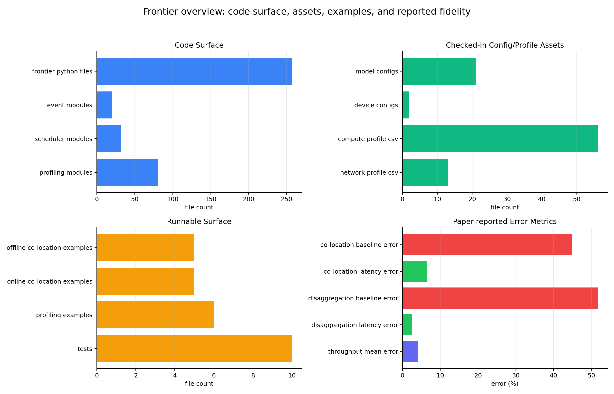

# Frontier 工程分析

> 日期: 2026-06-10  
> 本地工程: `/path/to/Frontier`  
> 口径: 结合本地 clone、README/AGENTS/docs/examples/源码、公开 GitHub/arXiv 信息。本文中的性能/准确性数据来自公开论文摘要和本地仓库记录，本轮未重新跑完整 LLM serving benchmark 或 GPU profiling。

## 1. 核心结论

Frontier 是一个面向现代 LLM inference serving 的离散事件模拟器。它不是推理引擎，也不是 kernel 优化库，而是一个用来回答“某个模型、并行策略、调度策略、runtime optimization、硬件/网络配置在 serving 场景下会怎样表现”的 what-if 仿真平台。

| 问题 | 结论 |
|---|---|
| 是什么 | LLM serving discrete-event simulator，当前开源分支主打 co-located serving，并提供 profiling、predictor training、metrics、examples。 |
| 解决什么 | 直接在大 GPU 集群上反复部署、调参、压测太贵太慢；Frontier 用仿真把架构/调度/并行/缓存/推测解码/MoE routing 的设计空间提前筛出来。 |
| 怎么解决 | 用事件队列模拟 request arrival、scheduler、batch lifecycle、KV cache、MoE、communication cost 和 execution-time predictor；真实硬件 profiling CSV 可训练 sklearn predictor，dummy mode 可做快速 smoke。 |
| 效果如何 | 论文摘要报告在 16-H800 testbed 上 throughput 平均误差低于 4%；相比现有 simulator，co-location latency error 从 44.9% 降到 6.4%，disaggregation latency error 从 51.7% 降到 2.6%。 |
| 当前分支边界 | `pre-release-v0.1` 只支持 co-location；PDD/AFD disaggregation、aiconfigurator backend 仍被 release guard 拦截。 |
| 主要优势 | 能在 CPU 上跑 E2E 仿真；同时覆盖 workload、scheduler、parallelism、MoE、KV cache、speculative decoding、profiling-backed predictor 和 metrics 输出。 |

下图左上展示代码模块覆盖，右上展示本地配置/profile 资产，左下展示 release-facing examples/tests，右下展示论文公开的误差指标。注意右下的 disaggregation 指标来自论文完整系统，不代表当前 public branch 已开放 PDD/AFD 运行路径。



## 2. 本地仓库状态

| 项 | 内容 |
|---|---|
| 本地路径 | `/path/to/Frontier` |
| remote | `https://github.com/XFDG/Frontier.git` |
| 本地 HEAD | `88f8afdc0665bc81d7ff9ba2d5b2bb838396eae8`, 2026-06-10, `Revise README for clarity and feature updates` |
| package | `frontier-simulator`, version `0.1.0` |
| license | MIT |
| Python 要求 | `>=3.10` |
| 当前 release 状态 | `pre-release-v0.1`, co-location only |

本地规模快照:

| 类别 | 数量 |
|---|---:|
| `frontier/**/*.py` | 257 |
| `frontier/events/*.py` | 20 |
| `frontier/scheduler/**/*.py` | 32 |
| `frontier/profiling/**/*.py` | 81 |
| model config JSON | 21 |
| device config JSON | 2 |
| compute profiling CSV | 56 |
| network profiling CSV | 13 |
| co-location offline examples | 5 |
| co-location online examples | 5 |
| profiling examples | 6 |
| test files | 10 |

## 3. 是什么

Frontier 把 LLM serving 系统抽象成一组 cluster、replica、scheduler、request、batch 和事件。它的核心不是执行真实模型，而是用 profiling-backed 或 analytical 的时间模型预测每一步执行成本，再通过离散事件推进系统状态。

从 README 和 AGENTS.md 看，当前公开分支定位很明确:

| 层级 | Frontier 建模内容 |
|---|---|
| Workload | synthetic request、trace replay、prefill/decode token 长度、Poisson/Gamma/static/trace arrival、thinking mode 多轮请求 |
| Control plane | global scheduler、cluster scheduler、replica scheduler、stage scheduler、vLLM/vLLM V1/SGLang-style scheduler |
| Execution plane | batch、pipeline stage、decode sync、prefill sync、MoE all-to-all combine、KV cache block 管理 |
| Fidelity plane | linear/attention/MoE profiling CSV、sklearn predictor、communication backend、CPU overhead、non-KV overhead |
| Metrics | request metrics、system metrics、batch metrics、utilization、optional trace/plot/chrome trace |

它当前更像 “Vidur 的现代化/扩展版 LLM serving simulator”，README 也明确致谢 Frontier 主要 built on top of Vidur，同时参考/适配 ASTRA-Sim 和 htsim。

## 4. 环境要求

### 4.1 普通仿真环境

普通 E2E simulation 可以在 CPU-only 机器上运行，前提是使用已存在的 profiling database 或 dummy execution-time predictor。

| 项 | 要求 |
|---|---|
| Python | `>=3.10` |
| Conda 环境 | `environment.yml`, env name `frontier` |
| pip 安装 | `python -m pip install -e ".[test]"` |
| 主要依赖 | `numpy`, `pandas`, `scipy`, `scikit-learn`, `plotly`, `pyyaml`, `tqdm`, `fasteners`, `ddsketch` |
| 测试依赖 | `pytest` |
| W&B | 默认建议设置 `WANDB_DISABLED=true`, `VIDUR_DISABLE_WANDB=1` |

典型安装:

```bash
cd /path/to/Frontier
conda env create -f environment.yml
conda activate frontier
python -m pip install -e ".[test]"
export PYTHONPATH=$PWD
export WANDB_DISABLED=true
export VIDUR_DISABLE_WANDB=1
```

### 4.2 GPU profiling 环境

Profiling 才需要 GPU。`environment_profiling.yml` 单独列出 GPU profiling 依赖，避免污染普通仿真环境。

| 项 | 要求 |
|---|---|
| GPU | 至少 1 张 GPU，用于采集 operator-level timing |
| CUDA | conda-forge `cuda-nvcc=12.8.*`, `cuda-cudart=12.8.*`, `cuda-cudart-dev=12.8.*` |
| 深度学习栈 | `torch>=2.7,<2.9`, `vllm>=0.10,<0.11`, `flashinfer-python>=0.3,<0.4`, `triton>=3,<4` |
| 输出 | `data/profiling/compute/<device>/<model>/{linear_op.csv,attention.csv,moe.csv}` |

典型安装:

```bash
cd /path/to/Frontier
conda env create -f environment_profiling.yml
conda activate frontier-profiling
python -m pip install -e ".[test]"
export PYTHONPATH=$PWD
```

### 4.3 通信 backend

co-location example 默认走 formula-based `analytical` backend，不需要额外编译。

| Backend | 作用 | 要求 |
|---|---|---|
| `analytical` | release examples 默认，轻量公式估计 | 无额外编译 |
| `astra_sim_analytical` | ASTRA-Sim-inspired topology model | 无额外编译 |
| `vidur` | sklearn-based prediction from profiling data | 需要 profile/training 数据 |
| `collective_sim` | topology-aware collective simulation | 需要初始化并编译 submodule |

`collective_sim` 编译:

```bash
git submodule update --init --recursive frontier/cc_backend/backends/collective-sim
cd frontier/cc_backend/backends/collective-sim/sim
make -j"$(nproc)"
```

## 5. 解决什么问题

LLM serving 的设计空间已经不是“一个模型放几张卡”这么简单。现代 serving 系统里，很多因素会互相影响:

| 问题 | 为什么难 |
|---|---|
| 架构选择贵 | co-location、PDD、AFD、不同 replica/cluster 切分都要真实部署才知道 SLA/吞吐/成本。 |
| 调度和 runtime optimization 强耦合 | CUDA Graph、Chunked Prefill、Prefix Caching、Speculative Decoding 会改变 batch shape、内存状态、请求推进速度。 |
| MoE serving 更复杂 | Expert Parallelism、routing top-k、token imbalance、dispatch/combine 同步都会影响 latency tail。 |
| profiling 粒度粗会误导 | 只用平均 token latency 或单个 GEMM 时间，无法准确推断 TTFT、TPOT、queueing 和 utilization。 |
| 大规模实验成本高 | 16/32/64 GPU 的真实压测昂贵，且改调度策略或并行配置需要大量工程接入。 |
| stateful workload 变多 | reasoning agent、tool calls、RL rollouts、多轮 hidden thinking 会产生请求状态和 prefix-cache continuity。 |

Frontier 的目标是把这些因素搬到一个可重复、可扫参、可解释的 simulator 里，让研究和工程团队先筛出有前途的 serving design，再投入真实集群验证。

## 6. 怎么解决

### 6.1 离散事件核心

入口是 `python -m frontier.main`。`main.py` 先做 release guard，然后从 CLI 构建 `SimulationConfig`，最后创建 `Simulator(config)` 并运行。

`Simulator` 的初始化路径大致是:

```text
SimulationConfig
  -> Cluster / Replica
  -> QuantizationManager
  -> TraceStore / MetricsStore
  -> RequestGenerator
  -> ExecutionTimePredictor
  -> BaseGlobalScheduler
  -> event queue
```

事件系统位于 `frontier/events/`，覆盖:

| 事件类型 | 作用 |
|---|---|
| `RequestArrivalEvent` | 请求到达 |
| `GlobalScheduleEvent` / `ClusterScheduleEvent` / `ReplicaScheduleEvent` | 多层调度 |
| `BatchStageArrivalEvent` / `BatchStageEndEvent` / `BatchEndEvent` | batch 生命周期 |
| `PrefillSyncEvent` / `DecodeSyncEvent` | prefill/decode 同步 |
| `EpAllToAllCombine*` | MoE EP combine 相关事件 |
| `ThinkingRoundRequeueEvent` | thinking mode 多轮请求回队 |

### 6.2 Scheduler 和 runtime optimization

调度模块分四层:

```text
frontier/scheduler/
├── global_scheduler/
├── cluster_scheduler/
├── replica_scheduler/
└── replica_stage_scheduler/
```

replica scheduler 里包含 FasterTransformer、LightLLM、Orca、Sarathi、SGLang-style、vLLM、vLLM V1，以及多种 SJ2Q/FastServe-lite 变体。当前 examples 主要走 `vllm_v1`，并显式建模:

| 功能 | 例子/开关 |
|---|---|
| Chunked Prefill | `--vllm_v1_scheduler_config_enable_chunked_prefill` |
| Decode CUDA Graph | `--decode_cuda_graph_mode full_decode_only` |
| Prefix Caching | prefix-cache trace replay examples |
| Speculative Decoding / MTP | `--speculative_decoding_config_enabled`，当前与 decode CUDA Graph 冲突时用 `decode_cuda_graph_mode=none` |
| Thinking Mode | `--enable_thinking_mode`, `--thinking_depth`, hidden round tokens |

### 6.3 Execution-time predictor

Frontier 有两种运行口径:

| 口径 | 用途 |
|---|---|
| Dummy mode | 快速 smoke，验证 CLI/runtime/metrics，不代表真实硬件性能。 |
| Profiling-backed mode | 从 `linear_op.csv`、`attention.csv`、`moe.csv` 训练/加载 sklearn predictor，用于 latency study。 |

`docs/training/README.md` 说明: dummy mode 关闭后，E2E simulation 会检查 predictor cache；cache miss 时直接从配置的 profiling CSV 训练 predictor，再写入 `cache/`。这让用户可以先采集 profile，再做大量仿真扫参。

### 6.4 Profiling 闭环

release-facing profiling wrappers 在 `examples/profiling/`:

| Script | 输出 | 用途 |
|---|---|---|
| `profile_linear_op.sh` | `linear_op.csv` | dense linear、projection、LayerNorm、residual add、replicated ops |
| `profile_attention_chunked_prefill.sh` | `attention.csv` | attention prefill/decode，含 chunked prefill 状态 |
| `profile_moe.sh` | `moe.csv` | MoE gating、routing、shuffle、grouped GEMM |
| `smoke_metadata.sh` | metadata validation | 校验已有 profile 目录 |
| `smoke_simulator_dense_csv.sh` | E2E smoke | 用 CSV 关闭 dummy mode 跑 dense 仿真 |
| `smoke_simulator_moe_csv.sh` | E2E smoke | 用 CSV 关闭 dummy mode 跑 MoE 仿真 |

这条链路是 Frontier 的关键工程价值: `GPU profiling -> CSV -> sklearn predictor/cache -> DES E2E simulation -> metrics`。

### 6.5 Communication backend

`frontier/cc_backend/` 提供通信成本模型:

| Backend | 适用场景 |
|---|---|
| `analytical` | 快速 co-location smoke 和轻量估算 |
| `astra_sim_analytical` | 需要 topology hint 但不想编译 collective-sim |
| `collective_sim` | 需要 topology-aware collective simulation |
| `vidur` | 使用 profiling/training 数据预测通信成本 |
| `aiconfigurator` | 当前 release guard 拦截，不开放 |

### 6.6 当前 release guard

`frontier/main.py` 明确拦截:

| 被拦截内容 | 状态 |
|---|---|
| `--sys_arch pd-disaggregation` | 当前 public branch 不支持 |
| `--sys_arch pd-af-disaggregation` | 当前 public branch 不支持 |
| `--cluster_config_prefill_*` 等 disaggregated cluster options | 拦截 |
| `kv_cache_transfer_config` / `m2n_transfer_config` | 拦截 |
| `--cc_backend_config_type aiconfigurator` | 拦截 |

这说明本地 public branch 是 co-location release，而不是论文完整功能全集。

## 7. 效果如何

公开论文摘要给出的效果是:

| 指标 | 结果 |
|---|---:|
| 16-H800 testbed throughput mean error | `<4%` |
| co-location latency error, existing simulator | `44.9%` |
| co-location latency error, Frontier | `6.4%` |
| disaggregation latency error, existing simulator | `51.7%` |
| disaggregation latency error, Frontier | `2.6%` |

这些数字说明 Frontier 的价值不在于单个 kernel 更快，而在于 “simulation fidelity” 更高: 它把现代 runtime optimization、profiling-backed operator model、scheduler behavior 和系统状态纳入仿真，因此比粗粒度平均模型更接近真实 serving。

本地 release-facing 工程效果:

| 维度 | 当前状态 |
|---|---|
| one-click co-location examples | offline 5 个、online 5 个 |
| advanced runtime examples | MoE、Speculative Decoding/MTP、Prefix Caching、Thinking Mode |
| profiling coverage | linear、attention、MoE 三类 wrapper |
| checked-in profiles | compute CSV 56 个、network CSV 13 个 |
| metrics output | request/system/batch/utilization CSV/JSON，plot/trace 可选 |
| release boundary | PDD/AFD 未开放，roadmap 说 near-term release |

### 本轮验证

我做了两个轻量验证:

1. README quick-start 中的 `tests/unit/test_open_source_release_arch_guard.py` 在当前 checkout 不存在，所以该命令未运行。
2. 改跑现有的 `test_colocation_release_review_contracts.py` 和 `test_examples_documentation_contracts.py`，结果 `25` 项中 `12` 项通过、`13` 项失败。

失败主要集中在:

| 类别 | 现象 |
|---|---|
| 依赖缺失 | 当前 Python 环境缺少 `fasteners`，导致 predictor 相关 import 失败。 |
| 测试引用缺失路径 | 测试引用 `tests/debug/e2e-level/...` 和 `frontier.config_optimizer...`，当前 checkout 没有这些路径。 |
| README contract 不同步 | 测试要求 README 列出所有 offline/online/profiling scripts，但当前 README 只列了部分入口。 |

这更像 release 整理过程中的文档/测试同步问题，不直接否定 simulator 主路径，但对使用者有提醒: 需要先按 `environment.yml` 安装完整依赖，并优先参考 `AGENTS.md`、`docs/cli/README.md`、`examples/README.md`。

## 8. 优势与限制

优势:

| 优势 | 说明 |
|---|---|
| 仿真成本低 | 普通 E2E simulation 可在 CPU-only 机器跑，适合大量 what-if sweep。 |
| 模型粒度比平均模型细 | 不是简单 token/s，而是 request、batch、stage、scheduler、KV cache、MoE、communication event。 |
| 现代 serving 特性覆盖广 | CUDA Graph、Chunked Prefill、Prefix Caching、Speculative Decoding/MTP、MoE、Thinking Mode 都有入口。 |
| profiling 闭环完整 | GPU 采集 profile CSV 后可训练 predictor，再进入 E2E simulation。 |
| release examples 友好 | 默认 analytical backend + dummy predictor，能先验证 runtime plumbing。 |
| 可扩展性较强 | scheduler/backend/predictor/request generator 都是 registry/模块化结构。 |

限制:

| 限制 | 影响 |
|---|---|
| 当前 public branch 只开放 co-location | PDD/AFD 和论文完整 disaggregation 能力还不能直接用。 |
| 真实 latency 依赖 profile 数据 | dummy mode 只能 smoke，不能据此做硬件性能结论。 |
| 环境分裂 | 普通 simulation 和 GPU profiling 依赖不同，profiling 环境含 vLLM/FlashInfer/CUDA，版本敏感。 |
| 测试/README 有同步问题 | 当前 checkout 中 quick-start 测试文件缺失，部分 contract 测试引用未开放路径。 |
| 不是生产 serving engine | 不能替代 vLLM/SGLang/TensorRT-LLM，只能辅助设计和评估。 |
| 预测模型存在外推风险 | 对没有 profile 覆盖的模型/shape/并行策略，sklearn predictor 可能偏离真实行为。 |

## 9. 推荐使用方式

| 目标 | 建议 |
|---|---|
| 快速理解项目 | 先读 `AGENTS.md`，再读 `README.md`、`docs/cli/README.md`、`examples/README.md`。 |
| 只验证能不能跑 | 用 co-location examples，保留 dummy mode 和 `--cc_backend_config_type analytical`。 |
| 做真实性能研究 | 先用 `examples/profiling/` 采集 linear/attention/MoE CSV，再关闭 dummy mode 跑 E2E。 |
| 做 MoE serving 设计 | 从 `moe_model_basic`、`moe_spec_dec`、`moe_prefix_caching` examples 开始，注意 routing mode 和 CSV metadata 一致。 |
| 做 scheduler 研究 | 看 `frontier/scheduler/replica_scheduler`，优先对比 `vllm_v1`、`sglang_style` 和 SJ2Q variants。 |
| 做 communication 研究 | co-location 先用 `analytical/astra_sim_analytical`，需要 topology-aware collective 再编译 `collective_sim`。 |
| 等待 disaggregation | 不要绕 release guard；关注 roadmap 中 PDD/AFD 公开释放。 |

## 10. 和 H200/MoE 工作的关系

Frontier 和 ThunderKittens/mKernel/xpu-perf 处在不同层:

```text
ThunderKittens / CUTLASS / Triton: 单卡或算子级 kernel 实现
mKernel / DeepEP: 通信计算融合和 distributed operator
xpu-perf: XPU/算子/模型/trace benchmark 口径
Frontier: serving system architecture / scheduling / E2E simulator
```

对 H200 MoE 推理优化的启发:

| 方向 | 启发 |
|---|---|
| 不只看 GEMM | Frontier 会把 GEMM、attention、MoE routing、queueing、KV cache、scheduler 都放到 E2E latency 中。 |
| 能评估业务 SLA | 可以围绕 TTFT、TPOT、throughput、tail latency 做配置筛选，而不是只看 TFLOPS。 |
| 可连接 profile | 如果已有 H200 linear/attention/MoE profile，理论上可训练 predictor 做 H200 上的 MoE serving what-if。 |
| 可评估 runtime feature | Chunked Prefill、Prefix Caching、Spec Decoding 对不同 workload 的收益可通过 simulator 做初筛。 |

## 11. 参考资料

外部资料:

- Frontier GitHub: <https://github.com/XFDG/Frontier>
- Frontier paper, arXiv 2605.21312: <https://arxiv.org/abs/2605.21312>
- Vidur: <https://github.com/microsoft/vidur>
- ASTRA-Sim: <https://github.com/astra-sim/astra-sim>
- htsim: <https://github.com/Broadcom/csg-htsim>

本地文件:

- `/path/to/Frontier/README.md`
- `/path/to/Frontier/AGENTS.md`
- `/path/to/Frontier/pyproject.toml`
- `/path/to/Frontier/environment.yml`
- `/path/to/Frontier/environment_profiling.yml`
- `/path/to/Frontier/docs/cli/README.md`
- `/path/to/Frontier/docs/profiling/README.md`
- `/path/to/Frontier/docs/training/README.md`
- `/path/to/Frontier/docs/roadmap/README.md`
- `/path/to/Frontier/examples/README.md`
- `/path/to/Frontier/examples/architecture/README.md`
- `/path/to/Frontier/frontier/main.py`
- `/path/to/Frontier/frontier/simulator.py`
- `/path/to/Frontier/frontier/cluster_simulator.py`

生成文件:

- `assets/frontier_overview_2026-06-10.png`
- `assets/frontier_overview_data_2026-06-10.csv`
- `assets/plot_frontier_overview_2026-06-10.py`
