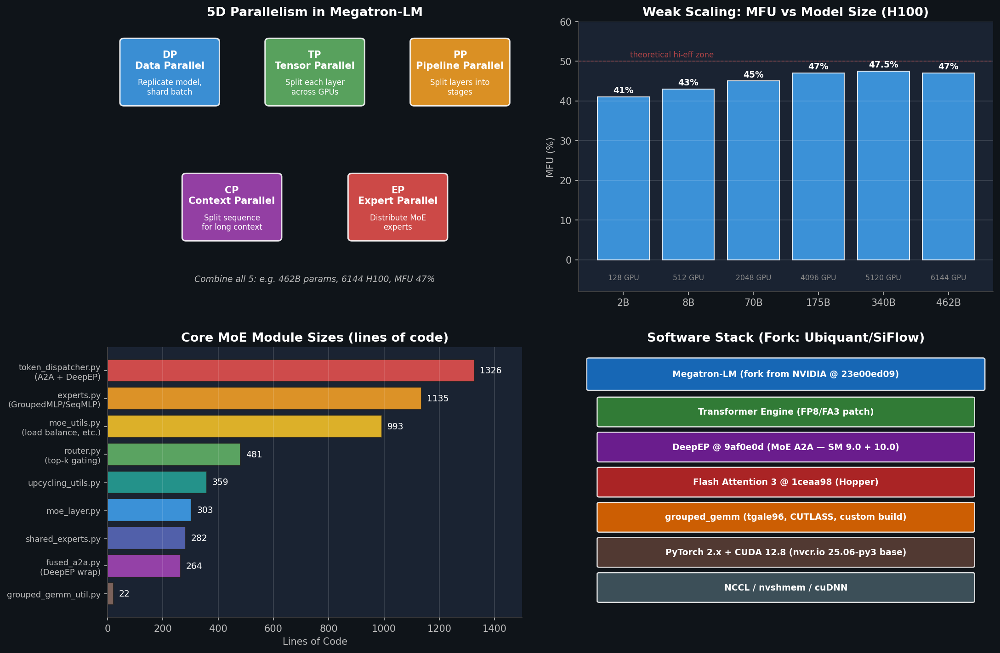
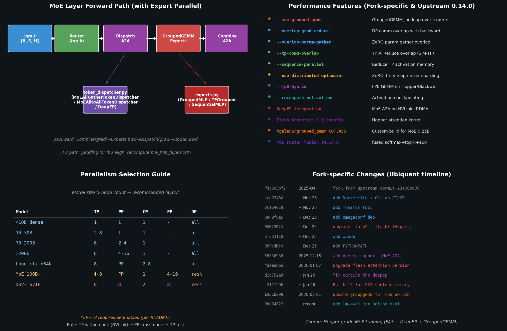

# Megatron-LM 工程分析

> 日期：2026-06-08
> 本地工程：`/path/to/megatron-lm`
> 口径：本地内部 fork 实际读码 + 上游 NVIDIA Megatron-LM 0.14 CHANGELOG + 官方 README 公开数据。本轮未跑训练 benchmark。

## 1. 核心结论

Megatron-LM 是 NVIDIA 开源的、面向超大 Transformer 模型的训练库。它解决的是"一台 GPU 装不下、多张卡也只是堆出来"的问题：把模型沿多个维度切片，并把 GPU 之间的通信和算子尽量重叠起来，把 MFU 推到 40%+。

| 维度 | 简述 |
|---|---|
| 是什么 | GPU-optimized 训练库 + 上层 `Megatron-LM` 训练脚本，下层 `megatron-core` 可被 NeMo / mcore 框架复用 |
| 主要问题 | 单机装不下大模型；裸 DDP 在 100B+ 上既慢又 OOM；MoE A2A 通信成本高 |
| 解法 | 5D 并行（DP/TP/PP/CP/EP）+ 全链路通信/计算 overlap + FP8 + FA3 + DeepEP + GroupedGEMM |
| 效果 | 官方 README：462B 模型在 6144 H100 上 47% MFU；2B→462B 弱扩展 MFU 从 41% → 47% 超线性 |
| 本地 fork 特色 | 加 DeepEP（MoE A2A）+ FA3 + tgale96 GroupedGEMM + lm-eval；专门为 200B+ MoE 训练打包 Docker |

下图概览 5 个并行维度、官方弱扩展 MFU、核心 MoE 模块代码量、以及本地 fork 的软件栈：



## 2. 本地仓库状态

| 项 | 值 |
|---|---|
| 路径 | `/path/to/megatron-lm` |
| Remote | 内部 fork（地址省略） |
| 上游 | NVIDIA/Megatron-LM（fork 自 commit `23e00ed09`） |
| 本地 HEAD | `98a948220` — `add lm-eval related packges for supoorting online eval` |
| 分支 | `main`，远端另有大量调试分支（`cqs/*`, `cj/loop`, `baseline_0307` 等） |
| 代码体量 | `megatron/` 下 ~117 K 行 Python；`megatron/core` 308 个 `.py` 文件 |
| 包版本号 | `0.12.0`（CHANGELOG 已记录到 0.14.0，本仓库滞后于上游一两个 minor） |

注意：这是内部 fork，不是 NVIDIA 上游主干；任何 issue 都应先看本仓库 commits，再回上游对照。

## 3. 是什么 — 两层结构

Megatron 仓库实际上是两层：

| 层 | 路径 | 用途 |
|---|---|---|
| `megatron-core` | `megatron/core/` | 可复用的核心库：并行、Transformer block、MoE、FP8、checkpointing、optimizer。被 NeMo、Megatron-LM 训练脚本等同时使用 |
| `Megatron-LM` 训练入口 | `pretrain_gpt.py` / `pretrain_bert.py` / `pretrain_mamba.py` / `pretrain_vlm.py` / `examples/` | 参考训练脚本：GPT3、LLaMA、Mixtral、Mamba、T5、Retro、多模态 |

`megatron-core` 是产品化的库，对外 API 稳定；`Megatron-LM` 是 reference implementation，主要给研究 / 内部训练用。

## 4. 环境要求

### 4.1 硬件

| 项 | 要求 |
|---|---|
| GPU 架构 | 推荐 Turing 之后任何一代；FP8 需要 Hopper/Ada/Blackwell（H100/H200/B200） |
| 多卡互联 | 单节点 NVLink 越快越好（TP within node）；多节点 InfiniBand 或 RoCE，最好支持 GDR/RDMA（PP/EP 跨节点） |
| 内存 | 大模型场景一般 H100 80G / H200 141G 起步；FP8 + ZeRO 可降一档 |

### 4.2 软件栈（本地 fork 的 Dockerfile 实测）

| 组件 | 版本 / 提交 | 说明 |
|---|---|---|
| Base image | `nvcr.io/nvidia/pytorch:25.06-py3` | CUDA 12.8、PyTorch 2.x、cuDNN、NCCL |
| Transformer Engine | 镜像自带，本仓库打了 patch | 给 FA3 的 `seqlens_rotary` 新接口加参数 |
| Flash Attention | v3 @ `1ceaa98`，Hopper 版本 | `Dao-AILab/flash-attention/hopper` 路径手动 build |
| DeepEP | `9af0e0d`，`TORCH_CUDA_ARCH_LIST="9.0;10.0"` | DeepSeek MoE A2A 库 |
| nvshmem | `nvidia-nvshmem-cu12` | DeepEP 通信底层依赖 |
| GroupedGEMM | `tgale96/grouped_gemm`，CUTLASS 后端 | 卸载 `nv_grouped_gemm`，本地 build for MoE 0.25B |
| 其他 | `mosaicml-streaming`, `duckdb`, `tos`, `swanlab==0.7.2`, `wandb`, `omegaconf`, `lm-evaluation-harness` | 数据流、日志、评测 |
| 部署辅助 | `uv` 包管理、`code-server`、SSH | Dev container 配置 |

### 4.3 关键依赖说明

- **Transformer Engine** — 提供 FP8 GEMM + `LayerNorm` + cuDNN attention，是 Megatron FP8 训练的实际执行者。
- **Flash Attention 3** — Hopper 上的 attention kernel；本 fork 从 `flash-attn 2 → 3` 的升级在 commit `686709ca0` 完成。
- **DeepEP** — DeepSeek 开源的 MoE A2A 通信库，融合 NVLink + RDMA 直接做 token dispatch / combine；本 fork 在 commit `85656956` 集成。
- **GroupedGEMM** — `tgale96` 实现，CUTLASS 后端，针对 MoE 中 "B 个不同形状的小 GEMM" 场景。

## 5. 解决什么问题

Transformer 大模型训练有几个核心难点，Megatron 一一对应给出解法：

| 痛点 | Megatron 的解法 |
|---|---|
| 单卡装不下模型权重 | TP 把每层切片 + PP 把层切到多卡 + ZeRO 分片 optimizer state |
| Batch 太大 / batch 太小都吃亏 | DP + 梯度累积 + 微批 |
| 注意力序列过长（≥64K） | CP（Context Parallel）切 sequence 维 |
| MoE 专家数多导致 A2A 通信爆炸 | EP + DeepEP + GroupedGEMM + A2A overlap |
| 通信 expose 拖慢迭代 | `--overlap-grad-reduce`、`--overlap-param-gather`、`--tp-comm-overlap` 全链路细粒度重叠 |
| FP16 数值精度不够 / FP8 难落地 | TE 提供的 FP8 hybrid（W FP8 + Acc FP32），配合 `fp8-recipe` |
| 大模型 OOM | 激活重计算（`--recompute-activations`）+ FP8 layernorm/moe_act 重计算 + optimizer offload |

## 6. 解法的实现 — 5D 并行 + 通信重叠

下图左上是 MoE 层 forward 数据流，右上是关键性能开关，左下是并行选型指南，右下是本地 fork 的 commit 时间线：



### 6.1 五个并行维度

| 维度 | 全称 | CLI 参数 | 切的是什么 |
|---|---|---|---|
| **DP** | Data Parallel | 由 `--world-size / TP*PP*CP*EP` 推算 | Batch 维，每卡完整模型副本 |
| **TP** | Tensor Parallel | `--tensor-model-parallel-size N` | 单层（attention / MLP）权重列/行切分 |
| **PP** | Pipeline Parallel | `--pipeline-model-parallel-size N` + `--virtual-pipeline-model-parallel-size M` | 模型深度切多段，再用虚拟 PP 平衡负载 |
| **CP** | Context Parallel | `--context-parallel-size N` | Sequence 维切分，给超长 context 用 |
| **EP** | Expert Parallel | `--expert-model-parallel-size N` + `--num-experts K` | MoE 专家分散到 N 张卡 |

实际部署时这五维同时打开：典型 DSV3 671B → `TP=8 PP=8 CP=2 EP=8 DP=rest`。`EP+TP` 必须同时打开 `--sequence-parallel`，否则会重复计算。

### 6.2 MoE 数据流（fork 主战场）

`megatron/core/transformer/moe/` 是这个 fork 修改最多的子系统，共 5165 行：

```
moe/
├── token_dispatcher.py   1326 行  ← Dispatch / Combine A2A，支持 DeepEP/AllGather/AlltoAll
├── experts.py            1135 行  ← GroupedMLP / TEGroupedMLP / SequentialMLP
├── moe_utils.py           993 行  ← load balance, capacity, permute/unpermute
├── router.py              481 行  ← top-k 路由 + aux loss
├── upcycling_utils.py     359 行  ← Dense → MoE 模型转换
├── moe_layer.py           303 行  ← 串起 router→dispatcher→experts
├── shared_experts.py      282 行  ← Shared expert（DSV3 风格）
├── fused_a2a.py           264 行  ← DeepEP 的薄包装
└── grouped_gemm_util.py    22 行  ← grouped_gemm 库导入
```

Forward 路径：

```
Input [B, S, H]
  → Router (top-k 选专家、可选 fused softmax+top-k)
  → Dispatch A2A (token_dispatcher.py: AllGather / AlltoAll / DeepEP)
  → GroupedGEMM Experts (experts.py: 一次 grouped_gemm 跑完所有专家)
  → Combine A2A
  → Output [B, S, H]
```

Backward 走对称路径。FP8 训练时 `token_dispatcher` 会做 `get_fp8_align_size` padding，`shared_experts` 会保存 `pre_mlp_layernorm` 输出供 router 复用。

### 6.3 通信—计算重叠

| 开关 | 重叠的对象 |
|---|---|
| `--overlap-grad-reduce` | DP AllReduce ⟷ backward 反向 |
| `--overlap-param-gather` | ZeRO param AllGather ⟷ forward |
| `--tp-comm-overlap` | TP AllReduce/ReduceScatter ⟷ GEMM |
| `--sequence-parallel` | 让 TP AllReduce 退化成 AllGather+ReduceScatter，分散到两点重叠 |
| Expert Parallel A2A Overlapping（0.14） | MoE dispatch/combine A2A ⟷ expert GEMM |

## 7. 效果 — 公开 Benchmark

NVIDIA 官方 README 公布的 H100 弱扩展数据：

| 模型 | GPU 数 | MFU |
|---|---|---|
| 2 B | 128 | 41% |
| 8 B | 512 | 43% |
| 70 B | 2048 | 45% |
| 175 B | 4096 | 47% |
| 340 B | 5120 | 47.5% |
| 462 B | 6144 | 47% |

关键事实：

- **超线性扩展**：从 2B 41% 升到 462B 47%。原因是 GEMM 越大，算术强度越高，越能吃满 tensor core。
- **强扩展会衰减**：175B GPT3 从 96 卡扩到 4608 卡，MFU 从 47% 降到 42%，因为 batch 不变、通信占比上升。
- **测量口径**：包含数据加载、optimizer step、checkpoint、log，所有开销都摊到 MFU 里。

本地 fork 在 H200 / 200B MoE 场景下的实测数据见 `docs/groued_gemm&sonic_moe/`，本文不重复。

## 8. 本地 Fork 的关键改动

按 commit 时间线（见上面右下图）：

| commit | 时间 | 改动 | 意义 |
|---|---|---|---|
| `f4c3c3bf2` | 2025-Q4 | fork from `23e00ed09` | 起点 |
| `fcd974803` | ~ Nov 25 | Dockerfile + GitLab CI/CD | 自动 build 训练镜像 |
| `686709ca0` | ~ Dec 25 | flash2 → flash3 升级 | Hopper attention 跑满 |
| `856569569` | 2025-12-18 | add DeepEP support | MoE A2A 走 NVLink+RDMA 融合路径 |
| `faaaaddbd` | 2026-01-07 | upgrade flash attention | FA3 hopper 路径再升 |
| `f21115967` | ~ Jan 26 | patch TE for FA3 `seqlens_rotary` | CP + FA3 兼容 |
| `b45c8a99a` | 2026-02-01 | grouped_gemm for MoE 0.25B | tgale96 grouped_gemm 替换 nv_grouped_gemm |
| `98a948220` | recent | add lm-eval | 训练中在线评测 |

主线目标很清楚：**让 Hopper + 200B 级 MoE 跑得快**。

## 9. 上手命令

### 9.1 用 Docker（推荐）

```bash
# fork 自带的 Dockerfile 已经把 FA3、DeepEP、grouped_gemm 都装好
cd /path/to/megatron-lm
docker build -t megatron-fork .
docker run --gpus all --rm -it -v $(pwd):/workspace megatron-fork
```

### 9.2 直接安装（不推荐，依赖很多）

```bash
pip install megatron-core
pip install --no-build-isolation transformer-engine[pytorch]
# 然后自己装 FA3 + DeepEP + grouped_gemm，按 Dockerfile 顺序来
```

### 9.3 最小训练示例

```bash
# 2 卡，mock data
torchrun --nproc_per_node=2 examples/run_simple_mcore_train_loop.py

# Llama3-8B FP8
./examples/llama/train_llama3_8b_fp8.sh

# Mixtral 8x7B 多机
sbatch examples/mixtral/train_mixtral_8x7b_distributed.sh
```

## 10. 与本地其他项目的关系

| 项目 | 关系 |
|---|---|
| `sonic-moe` | 上层 MoE 框架，调用 `grouped_gemm` 和类似 `experts.py` 的逻辑；和 Megatron-MoE 是同类问题的两个解 |
| `mKernel` / `ThunderKittens` | 比 Megatron 更低一层。Megatron 用 TE + FA3 + grouped_gemm 这些"成品 kernel"；TK/mKernel 是写这些 kernel 的工具 |
| `xpu-perf` | 拿 Megatron 作为典型负载来跑评测，定位 GEMM/通信瓶颈 |
| `vllm` | 推理框架，和 Megatron 的训练栈互补 |

## 11. 看代码的入口建议

- 从训练脚本入：`pretrain_gpt.py`
- 看 5D 并行：`megatron/core/parallel_state.py`（`initialize_model_parallel`）
- 看 MoE 主线：`moe/moe_layer.py` → `router.py` → `token_dispatcher.py` → `experts.py`
- 看通信优化：`megatron/core/distributed/`、`megatron/core/tensor_parallel/`
- 看 FP8：`megatron/core/fp8_utils.py` + `megatron/core/extensions/transformer_engine.py`

## 12. 原始资料

| 文件 | 内容 |
|---|---|
| `/path/to/megatron-lm/README.md` | 上游 README，性能数字、并行说明 |
| `/path/to/megatron-lm/CHANGELOG.md` | 0.10 → 0.14 的 feature 累积 |
| `/path/to/megatron-lm/Dockerfile` | 本 fork 实际依赖栈 |
| `/path/to/megatron-lm/megatron/core/transformer/moe/` | MoE 子系统 5K 行核心代码 |
| `assets/megatron_overview.png` | 5D 并行 + MFU + 模块体量 + 软件栈 |
| `assets/megatron_moe_pipeline.png` | MoE 数据流 + 性能开关 + 并行选型 + commit 时间线 |
