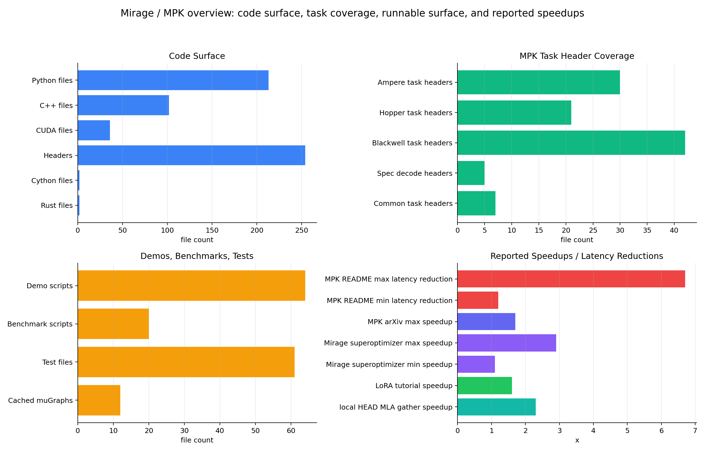

# Mirage / MPK 工程分析

> 日期: 2026-06-14  
> 本地工程: `/path/to/mirage`  
> 本地分支: `mpk`  
> 口径: 结合本地 clone、README/INSTALL/docs/demo/tests/源码、上游 GitHub、arXiv/USENIX/CMU Catalyst 页面。本文中的性能数据来自公开论文/README/本地文档和 commit message，本轮未重新跑 GPU benchmark 或完整 Qwen/DeepSeek demo。

## 1. 核心结论

Mirage 现在需要分成两层理解:

| 层 | 定位 | 解决的问题 |
|---|---|---|
| Mirage 原始系统 | tensor program multi-level superoptimizer | 自动搜索并验证等价的高性能 GPU tensor program，覆盖 algebraic transformation、schedule transformation、自定义 kernel 生成。 |
| Mirage Persistent Kernel, MPK | LLM inference megakernel compiler + runtime | 把多 GPU LLM inference 的计算和通信编译到一个 persistent megakernel 中，减少 kernel launch、CPU 调度、operator boundary、通信/计算粗粒度串行带来的 latency。 |

当前本地仓库在 `mpk` 分支，README 主标题已经是 “Mirage Persistent Kernel: Compiling LLMs into a MegaKernel”。所以这份报告重点分析 MPK，同时说明它继承的 Mirage superoptimizer 基础。

| 问题 | 结论 |
|---|---|
| 是什么 | C++/CUDA/Cython/Python/Rust 混合工程，提供 Python API、Mirage runtime、uGraph/superoptimizer、CUDA transpiler、MPK persistent runtime 和大量 LLM task kernels。 |
| 环境要求 | Python 3.10/3.11 更稳；CMake 3.24+、Cython、CUDA 11+、cuDNN 8+、Z3、Rust/Cargo、CUTLASS、PyTorch、Transformers；MPK multi-GPU 还涉及 NVSHMEM/MPI。 |
| 解决什么 | 深度学习框架 kernel-per-op 执行模型导致 launch gap、CPU-side scheduling、operator 间同步、通信计算难以细粒度 overlap；手写全模型 persistent kernel 又难维护。 |
| 怎么解决 | 用 uGraph/SM-level task graph 表示程序，把层级图 lowering 成 CUDA task + JSON task graph，再由 in-kernel worker/scheduler runtime 在一个 persistent kernel 内执行任务和事件依赖。 |
| 效果如何 | 原始 Mirage 论文报告 1.1-2.9x；MPK README 报告 LLM inference latency 1.2-6.7x 降低；MPK arXiv 摘要报告相比 kernel-per-operator LLM serving up to 1.7x；本地 HEAD 还包含 MLA KV-cache gather 约 2.3x 的优化提交。 |
| 优势 | 覆盖从 graph 搜索、等价验证、代码生成到 persistent runtime 的完整链路；MPK task 已覆盖 Ampere/Hopper/Blackwell、MoE、MLA、FP8、speculative decoding、Qwen3/DeepSeek demos。 |
| 主要风险 | 安装重、编译链复杂、调试难；当前本地环境缺 `z3` 和 `cargo`，无法直接 import/build；MPK 属于快速演进研究工程，生产落地需要强约束的模型/shape/硬件验证。 |

下图左上是本地代码语言面，右上是 MPK task header 覆盖，左下是 demo/benchmark/test 覆盖，右下汇总公开性能口径。不同性能柱来自不同 baseline，不能直接互相比较。



## 2. 本地仓库状态

| 项 | 内容 |
|---|---|
| 本地路径 | `/path/to/mirage` |
| remote | `https://github.com/XFDG/mirage.git` |
| 当前分支 | `mpk`, tracking `origin/mpk` |
| 本地 HEAD | `dd8729b342d76675a996dc0b2c14f24eb3f6ff74`, 2026-06-13, `perf: flatten the MLA kv-cache gather and add 4-way ILP (~2.3x on the gather) (#720)` |
| tracked files | 757 |
| package | `mirage-project` |
| license | Apache-2.0 |

本地规模快照:

| 类别 | 数量 |
|---|---:|
| Python files | 213 |
| C++ files | 102 |
| CUDA files | 36 |
| headers | 254 |
| Cython files | 2 |
| Rust files | 2 |
| demo scripts | 64 |
| benchmark scripts | 20 |
| test files | 61 |
| cached muGraph JSON | 12 |

MPK persistent task 覆盖:

| 目录 | 文件数 | 代表能力 |
|---|---:|---|
| `tasks/ampere` | 30 | Ampere 版 linear、attention、MoE、norm、rotary、sampling 等 |
| `tasks/hopper` | 21 | Hopper WGMMA/TMA、linear、attention、MoE、norm 等 |
| `tasks/blackwell` | 42 | Blackwell FP8、MLA、MoE、top-k、SM100 PTX、2-SM MLA 等 |
| `tasks/speculative_decoding` | 5 | EAGLE3、MTP token ops、prompt lookup、target verify |
| `tasks/common` | 7 | common header、sampling、copy、worker config 等 |

## 3. 是什么

### 3.1 Mirage 原始系统

原始 Mirage 是一个 tensor program superoptimizer。它把 tensor program 表示成层级 uGraph:

| 层级 | 对应 GPU 层级 | 作用 |
|---|---|---|
| Kernel Graph | kernel / device memory | 节点是 kernel operator，边是 device memory tensor；可以引用 cuBLAS/cuDNN 这类预定义 kernel，也可以引用 lower-level graph-defined kernel。 |
| Thread Block Graph | thread block / shared memory | 描述单个 CTA 内的计算，使用 shared memory 保存中间 tensor，支持 grid dimension、for-loop dimension、imap/omap/fmap。 |
| Thread Graph | thread / registers | 描述单线程级别计算，输入从 shared memory 到 register，输出回 shared memory。 |

这个表示的意义是: 优化不只发生在图级别，也能跨 kernel、thread block、thread 三层联合搜索，让系统有机会自动发现类似 FlashAttention、FlashDecoding、LoRA fusion 这类人工专家优化。

### 3.2 当前 `mpk` 分支

MPK 是 Mirage 之上的 persistent megakernel 路径。用户通过 Python API 构建 LLM graph:

```python
import mirage as mi

mpk = mi.PersistentKernel(
    world_size=world_size,
    mpi_rank=rank,
    num_workers=96,
    num_local_schedulers=48,
    num_remote_schedulers=0,
    meta_tensors={...},
)

x = mpk.attach_input(torch_tensor=input_tokens, name="input_token")
y = mpk.new_tensor(dims=(batch, hidden), dtype=mi.bfloat16, name="embed_out")
mpk.rmsnorm_linear_layer(...)
mpk.compile()
mpk()
```

本地 `PersistentKernel` 支持 6 种模式:

```text
offline, online, online_notoken, onepass, online_multi_turn, online_pinned
```

`persistent_kernel.py` 中有约 65 个 `*_layer` API，覆盖 embedding、RMSNorm、linear、paged attention、MLA、MoE、FP8 quant/linear、allreduce、sampling、speculative decoding/MTP、EAGLE3 等。

## 4. 环境要求

### 4.1 官方/本地文档要求

| 项 | 要求 |
|---|---|
| Python | 安装说明和 CI 常用 Python 3.10/3.11；release wheels 覆盖 3.10/3.11/3.12 |
| CMake | `>=3.24` |
| Cython | `>=0.28` |
| CUDA/cuDNN | CUDA `>=11.0`、cuDNN `>=8.0`；CI/wheels 覆盖 CUDA 12.1/12.4/12.6/12.8；本地系统是 CUDA 13.1 |
| C++ | C++17；MPK 动态 compile 会检测 C++20 可用则用 C++20 |
| Rust/Cargo | 必需，用于 `abstract_subexpr` 和 `formal_verifier` 两个 Rust library |
| Z3 | Python `z3-solver==4.16` / C++ `libz3.so`，用于 layout/search/verification |
| GPU stack | PyTorch、Transformers、Accelerate、FlashInfer、CUDA Python、tg4perfetto 等 |
| 子模块 | `deps/cutlass`, `deps/z3`, `deps/json` |
| MPK multi-GPU | NVSHMEM/MPI include/lib，编译命令中会在 `use_nvshmem=True` 时启用 `-rdc=true` 并链接相关库 |

### 4.2 安装方式

PyPI / wheel:

```bash
pip install mirage-project
```

源码安装:

```bash
git clone --recursive --branch mpk https://www.github.com/mirage-project/mirage
cd mirage
pip install -e . -v
export MIRAGE_HOME=$(pwd)
```

Conda 环境:

```bash
conda env create -f conda/mirage.yml
conda activate mirage
pip install -e . -v
```

Standalone C++ library:

```bash
cd $MIRAGE_ROOT/deps/z3
mkdir build && cd build
cmake ..
make -j
export Z3_DIR=$MIRAGE_ROOT/deps/z3/build

cd $MIRAGE_ROOT
mkdir build && cd build
cmake ..
make -j
make install
```

### 4.3 当前机器验证

本轮只做了轻量验证，没有构建 Mirage:

| 检查 | 结果 |
|---|---|
| `python3 --version` | Python 3.12.3 |
| `cmake --version` | 3.31.6 |
| `nvcc --version` | CUDA 13.1 |
| `torch.__version__` | `2.11.0a0+eb65b36914.nv26.02` |
| `cargo --version` | 未找到 |
| `PYTHONPATH=... python3 -c 'import mirage'` | 失败: `ModuleNotFoundError: No module named 'z3'` |

也就是说，这台环境有 CUDA/PyTorch，但缺 `z3` 和 Cargo，不能直接 import/build Mirage。实际跑 demo 前需要按 `requirements.txt` 或 `conda/mirage.yml` 补依赖，且源码构建会触发 Rust/CMake/CUDA 编译。

## 5. 解决什么问题

### 5.1 原始 Mirage 解决 tensor program 优化问题

传统 DL compiler / runtime 往往只在 kernel graph 层做优化，依赖固定 kernel library。问题是:

| 痛点 | 影响 |
|---|---|
| 只做图级 algebraic rewrite 不够 | 很多真正的性能收益来自 shared-memory tile、thread mapping、register reuse、epilogue fusion 等低层决策。 |
| 手写 kernel 难泛化 | FlashAttention、LoRA fusion、specialized attention 都要专家写大量代码。 |
| 搜索空间巨大 | 同时搜索 algebraic transform、schedule、custom kernel layout 会爆炸。 |
| 正确性难保证 | 自动发现的图必须和原始 tensor program 等价。 |

Mirage 用 uGraph 把多层优化空间统一起来，再用 abstraction pruning 和 probabilistic equivalence verification 控制搜索成本和正确性风险。

### 5.2 MPK 解决 LLM inference kernel-per-op 问题

LLM inference 的 decode 阶段常见瓶颈不是单个 GEMM，而是大量小 kernel、CPU 调度、framework runtime、跨 operator 同步和通信/计算 overlap 不充分。

MPK 针对这些问题:

| 痛点 | MPK 对应做法 |
|---|---|
| 每个 operator 单独 launch | 把整条 inference pipeline 编译成一个 persistent megakernel。 |
| CPU-side scheduler 参与每步执行 | 在 GPU 内部放 worker/scheduler runtime，任务和事件在 megakernel 内推进。 |
| operator 边界导致数据落回 global memory | 用 task graph 和 fused task 尽可能压缩边界和中间 tensor 生命周期。 |
| compute/communication 粗粒度串行 | SM-level task graph 表示依赖，支持跨 operator software pipelining 和 fine-grained overlap。 |
| 手写 megakernel 难维护 | 用户通过 Python layer API 组合模型，编译器生成 CUDA 和 runtime metadata。 |

## 6. 怎么解决

### 6.1 uGraph 和 superoptimizer

Mirage 的基本优化路径:

```text
Python tensor graph
  -> Kernel Graph
  -> Thread Block Graph
  -> Thread Graph
  -> search / pruning / equivalence verification
  -> CUDA transpiler
  -> compiled kernel
```

关键机制:

| 机制 | 作用 |
|---|---|
| multi-level uGraph | 同时表达 kernel、CTA、thread 三层优化。 |
| abstraction pruning | 用抽象表达式剪掉不可能优的搜索分支，降低搜索空间。 |
| probabilistic equivalence verification | 给优化后 uGraph 做等价性验证。 |
| CUDA transpiler | 把 optimized uGraph 转成 CUDA code。 |
| Z3 layout resolution | 文档中描述 layout resolution 会构造 boolean ILP，用 Z3 决定 tensor innermost dimension 和 swizzle。 |
| TB scheduling / memory planning | 在同步次数和 shared memory peak usage 之间权衡。 |

### 6.2 CUDA transpiler

`docs/source/cuda-transpiler.rst` 把 transpiler 拆成:

| 阶段 | 内容 |
|---|---|
| Threadblock-level data reuse | 规划可 fuse 的 threadblock ops，典型是 matmul 后接 unary elementwise epilogue。 |
| Layout resolution | 决定 DTensor/STensor stride、swizzle，避免 bank conflict 并适配 runtime kernel 约束。 |
| Kernel-level memory planning | 给 device-memory tensor 分配 buffer。 |
| Kernel-level transpile | 预定义 kernel 调 runtime 函数；custom op 进入 threadblock-level transpilation。 |
| TB graph scheduling | 线性化 TB graph，尽量减少 `__syncthreads()` 和 shared memory peak。 |
| STensor memory planning | 规划 shared memory tensor 生命周期。 |

### 6.3 MPK compile-to-runtime pipeline

仓库自带 `.claude/skills/mpk-internals/SKILL.md` 对 MPK 生命周期写得很清楚。简化后是:

```text
Python PersistentKernel.compile()
  -> layer methods build KNGraph/TBGraph
  -> kn_graph.generate_task_graph()
  -> C++ Graph::generate_task_graph()
  -> register_mugraph() + print_task_graph()
  -> emit test.cu + task_graph.json
  -> nvcc builds test.so Python extension
  -> Python loads __mirage_launcher
  -> init_persistent_kernel()
  -> launch_persistent_kernel()
  -> worker_kernel + scheduler_kernel persistent loop
```

两个核心生成物:

| 文件 | 内容 |
|---|---|
| `test.cu` | 生成的 CUDA task dispatch、runtime init、Python C extension wrapper。 |
| `task_graph.json` | task descriptors、event descriptors、dependencies、first tasks。 |

Runtime 初始化会:

| 步骤 | 内容 |
|---|---|
| meta tensor mapping | `step`, `tokens`, `input_tokens`, `output_tokens`, `qo_indptr`, paged-KV metadata 等。 |
| NVSHMEM init | multi-GPU 时创建 NVSHMEM teams。 |
| construct task graph | 解析 JSON，构造 `FullTaskDesc` / `EventDesc` / TMA descriptors。 |
| allocate GPU queues | worker queues、scheduler queues、event counters。 |
| launch persistent loop | workers 拉取 task，schedulers 处理 event，把 ready task 入队。 |

### 6.4 Task 扩展方式

MPK 的一个 task 是 megakernel 内部的一个 fused GPU operation，不是单独 kernel launch。新增一个 task 通常要改 7 处:

| 层 | 文件 |
|---|---|
| Task enum | `include/mirage/persistent_kernel/runtime_header.h` |
| CUDA device function | `include/mirage/persistent_kernel/tasks/{arch}/{task}.cuh` |
| include header | `tasks/{arch}/task_header.cuh` |
| C++ register declaration | `include/mirage/kernel/task_register.h` |
| codegen register implementation | `src/kernel/task_register.cc` |
| task name dispatch | `src/kernel/graph.cc` |
| Python API | `python/mirage/mpk/persistent_kernel.py` |

这个结构说明 MPK 不是普通 Python framework，而是一个 codegen + runtime 系统。Python API 只是 front-end；真正执行的是生成的 CUDA + persistent runtime。

## 7. 效果如何

公开资料里有几组不同口径的性能结论:

| 来源 | 结果 | 解释 |
|---|---:|---|
| Mirage arXiv 2405.05751 | 1.1-2.9x | 原始 Mirage superoptimizer 在常见且已优化 DNN 上相对现有方法的加速。 |
| Mirage docs LoRA tutorial | 1.6x | LoRA kernel 相比 torch 更快；文档还指出 torch.compile 在该案例慢 2x。 |
| MPK README | 1.2-6.7x latency reduction | README 对 MPK end-to-end GPU fusion 的总体宣传口径。 |
| MPK arXiv 2512.22219 摘要 | up to 1.7x | 相比 kernel-per-operator LLM serving systems 的端到端 inference latency 降低。 |
| 本地 HEAD commit | ~2.3x on MLA KV-cache gather | 最近提交针对 MLA KV-cache gather flatten + 4-way ILP 的局部优化。 |

需要注意:

- 这些数字不是同一 benchmark、同一模型、同一硬件、同一 baseline，不能横向简单相除。
- README 的 1.2-6.7x 更像 MPK 项目宣传总览；arXiv abstract 的 up to 1.7x 是论文摘要中的更严格对比口径。
- 本轮没有重新跑 `demo/qwen3/demo.py --use-mirage`、`tests/ci-tests/run_batch_perf.py` 或 Nsight profiling，所以本文不新增本地性能结论。

## 8. 优势与限制

优势:

| 优势 | 说明 |
|---|---|
| 层级完整 | 从 graph IR、superoptimizer、equivalence verification、CUDA transpiler 到 persistent runtime 都在一个工程里。 |
| 目标直击 LLM latency | MPK 针对 decode 小 batch、小 kernel、launch gap、scheduler overhead、communication overlap 等真实 serving 痛点。 |
| 代码生成能力强 | 自动生成 CUDA task dispatch、Python extension、task graph JSON，减少手写 megakernel 的维护成本。 |
| 架构覆盖新 | 已有 Ampere/Hopper/Blackwell task，Blackwell 目录覆盖 FP8、MLA、MoE、SM100 PTX、2-SM MLA 等。 |
| LLM 场景贴近当前热点 | Qwen3、DeepSeek V3、MLA、MoE、MTP/EAGLE3、paged attention 都有 demo 或 task 支持。 |
| Python 使用体验 | 用户主要通过 `PersistentKernel` / `MPK` API attach tensor、new tensor、调用 layer method、compile/run。 |
| 可研究性强 | uGraph、transpiler、task graph JSON、profiler timeline 都适合做 compiler/runtime 研究。 |

限制:

| 限制 | 影响 |
|---|---|
| 安装复杂 | CMake/CUDA/Z3/Rust/Cython/PyTorch/Transformers/CUTLASS/NVSHMEM 组合，任何一项不匹配都可能失败。 |
| 编译链重 | `pip install -e .` 会构建 Rust libs、CMake runtime、Cython extension；MPK compile 又会动态 nvcc 生成 `.so`。 |
| 调试难 | bug 可能出在 Python graph、Cython bridge、C++ codegen、generated CUDA、task JSON、in-kernel scheduler、NVSHMEM 任一层。 |
| shape/model 约束强 | 很多 task 是面向特定架构、dtype、layout、模型模式写的，外推到新模型需要新增 task 或 builder。 |
| 首次运行开销 | 动态 codegen + nvcc compile 会带来 warmup/compile latency。 |
| 生产可用性需验证 | 它是研究型高性能系统；上线要补 fallback、observability、error handling、版本锁定和长期维护策略。 |
| 当前本地环境未就绪 | 缺 `z3` 和 `cargo`，不能直接 import/build；需要先搭环境。 |

## 9. 推荐使用方式

| 目标 | 建议 |
|---|---|
| 快速理解 | 先读 `README.md` 和 `.claude/skills/mpk-internals/SKILL.md`，再读 `python/mirage/mpk/persistent_kernel.py`。 |
| 研究原始 Mirage | 读 `docs/source/mugraph.rst`、`docs/source/cuda-transpiler.rst`、`src/search`、`src/transpiler`。 |
| 跑最小安装 | 先按 `conda/mirage.yml` 或 `requirements.txt` 补 `z3-solver`、Cargo、CUDA/PyTorch；再 `pip install -e . -v`。 |
| 跑 MPK demo | 从 `demo/qwen3/demo.py` 开始，先跑 native Triton/FlashInfer，再跑 `--use-mirage`，最后开 `--profiling`。 |
| 看 Blackwell/MLA/MoE | 读 `include/mirage/persistent_kernel/tasks/blackwell` 和 `demo/deepseek_v3`。 |
| 新增 task | 参考 `.claude/skills/add-mpk-task/SKILL.md`，严格按 7 文件路径加。 |
| 新增模型 | 参考 `.claude/skills/add-mpk-model/SKILL.md`，先盘点已有 layer method，缺 task 时先补 task。 |
| 做本地性能验证 | 用 `tests/ci-tests/run_ci_tests_qwen3.sh`、`tests/ci-tests/run_batch_perf.py` 或 demo 自带 profiling；记录模型、GPU、batch、tokens、mode、compile cache 状态。 |

## 10. 和 H200/MoE/Attention 工作的关系

Mirage / MPK 和之前分析过的 ThunderKittens、mKernel、xpu-perf、Frontier 可以这样放:

```text
ThunderKittens / CUTLASS / Triton: 单 kernel 或 kernel primitive
Mirage superoptimizer: 自动搜索等价 tensor program + 生成 custom CUDA
MPK: 把模型子图/整条 inference pipeline 编译成 persistent megakernel
mKernel / DeepEP: 通信计算融合 distributed operator
xpu-perf: benchmark / simulation / trace / TCO 评估口径
Frontier: LLM serving system-level simulator
```

对当前 native sparse attention / MoE / H200-B200 相关工作，Mirage 的价值主要在:

| 方向 | 启发 |
|---|---|
| Sparse/MLA attention | Blackwell task 已有 MLA decode/prefill/kv-cache gather；可以参考它如何把 attention 子任务纳入 persistent task graph。 |
| MoE | MPK 有 top-k routing、MoE W13/W2、FP8、silu/combine 任务，适合参考模型内 MoE 子图 megakernel 化方式。 |
| B200/SM100 | Blackwell 目录已有 FP8、SM100 PTX、TMA/2-SM 风格 task，是研究 B200 kernel/runtime 的好入口。 |
| End-to-end latency | 它关注从 single op 到 model pipeline 的 latency，和只调 GEMM TFLOPS 的视角互补。 |
| 系统化融合 | 相比手写一个 fused kernel，MPK 更像建立“可扩展的 megakernel 编译/runtime 框架”。 |

## 11. 参考资料

外部资料:

- Mirage GitHub: <https://github.com/mirage-project/mirage>
- MPK arXiv 2512.22219: <https://arxiv.org/abs/2512.22219>
- Mirage arXiv 2405.05751: <https://arxiv.org/abs/2405.05751>
- Mirage OSDI 2025 USENIX page: <https://www.usenix.org/conference/osdi25/technical-sessions>
- CMU Catalyst Mirage page: <https://catalyst.cs.cmu.edu/projects/mirage.html>

本地文件:

- `/path/to/mirage/README.md`
- `/path/to/mirage/INSTALL.md`
- `/path/to/mirage/requirements.txt`
- `/path/to/mirage/conda/mirage.yml`
- `/path/to/mirage/pyproject.toml`
- `/path/to/mirage/setup.py`
- `/path/to/mirage/CMakeLists.txt`
- `/path/to/mirage/config.cmake`
- `/path/to/mirage/docs/source/mugraph.rst`
- `/path/to/mirage/docs/source/cuda-transpiler.rst`
- `/path/to/mirage/docs/source/tutorials/lora.rst`
- `/path/to/mirage/python/mirage/mpk/persistent_kernel.py`
- `/path/to/mirage/python/mirage/kernel.py`
- `/path/to/mirage/.claude/skills/mpk-internals/SKILL.md`
- `/path/to/mirage/.claude/skills/add-mpk-task/SKILL.md`
- `/path/to/mirage/.claude/skills/add-mpk-model/SKILL.md`

生成文件:

- `assets/mirage_overview_2026-06-14.png`
- `assets/mirage_overview_data_2026-06-14.csv`
- `assets/plot_mirage_overview_2026-06-14.py`
