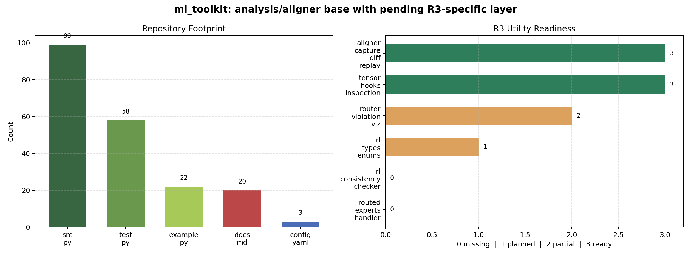

# ml_toolkit 工程分析与 R3 关联评估

> 日期: 2026-06-11  
> 本地工程: `/path/to/ml_toolkit`  
> 关联 R3 文档：`/path/to/docs/r3/online/R3:工程实现笔记.md`  
> 口径: 基于本地 clone、README、docs、examples、源码、tests 与轻量验证。本轮未访问外部仓库，也未运行完整 `uv sync` / 全量测试。

## 1. 核心结论

`ml_toolkit` 是一个面向 ML 训练分析、张量诊断、量化诊断和分布式追踪对齐的 Python 工具包。它不是训练框架，也不是 inference engine；它更像“训练/推理过程的观测、对齐、诊断、可视化层”。

和 R3 的关系很明确: 当前代码库**没有直接实现 R3 replay**，也没有出现 `routed_experts`、`Routing Replay`、`R3` 专用逻辑；但它已经具备做 R3 周边工具的基础设施，包括:

| 已有能力 | 对 R3 的价值 |
|---|---|
| `aligner` capture / analyze / replay | 可以比较 SGLang/vLLM rollout capture 与 Megatron train capture，定位首个路由/概率分歧 |
| `TrackRecord` / `StorageBackend` / HTML JSON renderer | 可以把 routed experts、logprob、KL、router overlap 作为结构化记录落盘和渲染 |
| `RolloutSample` / `ConsistencyReport` / `RolloutBackend` | RL/R3 诊断类型已经预留，但逻辑还没实现 |
| `MetricCategory.RL_*` 与 `ROUTER_MAX_VIOLATION` | 可纳入 R3 相关指标过滤和趋势分析 |
| `plot_router_violation` | 已有 router 类指标可视化入口，可扩展到 route mismatch / top-k overlap |
| Tensor hooks / inspector | 可对 Megatron 训练侧 router logits、expert 输入输出、FP8/QDQ 误差做采样诊断 |

最适合利用 R3 思路做的事情不是“在这里训练 R3”，而是做一个 **R3 Consistency Toolkit**:

1. 从 rollout 侧保存 `tokens/log_probs/routed_experts`。
2. 从 train 侧保存 Megatron recompute 的 `log_probs/routed_experts/router_logits` 摘要。
3. 用 `ml_toolkit.aligner` 对齐两侧样本。
4. 计算 `route_mismatch_rate`、`topk_overlap`、`train_infer_kl`、`F(tau=2)`。
5. 输出 HTML / JSON / 趋势图，辅助判断 R3 是否真的降低训推不一致。

这张图左侧是仓库规模，右侧是我按源码实现情况给出的 R3 工具化 readiness。`3` 表示已可直接复用，`0` 表示需要新增实现。



## 2. 本地仓库状态

| 项目 | 信息 |
|---|---|
| 路径 | `/path/to/ml_toolkit` |
| remote | 内部 fork（地址省略） |
| 最新提交 | `5463f25a37a0ac7d2e22a05168a682fdd3038c6a` |
| 提交日期 | 2026-06-01 |
| 提交标题 | `Merge branch 'lqiu_dev' into 'main'` |
| 工作区 | clean |
| 包名 | `ml-toolkit` |
| 版本 | `0.1.0` |
| Python | `>=3.10`，仓库 `.python-version` 为 `3.10` |
| License | Apache-2.0 |

规模概览:

| 类型 | 数量 |
|---|---:|
| `src/ml_toolkit` Python 文件 | 99 |
| pytest 文件 | 58 |
| examples Python 文件 | 22 |
| docs Markdown 文件 | 20 |
| YAML preset | 3 |

主要目录:

| 目录 | 作用 |
|---|---|
| `src/ml_toolkit/aligner` | 运行时追踪、离线对齐、报告渲染、单条记录回放 |
| `src/ml_toolkit/analysis` | `AnalysisPipeline`、实验聚合、模型指标后处理 |
| `src/ml_toolkit/providers` | DataFrame / CSV / TensorBoard provider |
| `src/ml_toolkit/keys` | TensorBoard key 解析、分类、过滤 |
| `src/ml_toolkit/tensor` | 张量分位数、FP8/FPx、矩阵性质、相似度 |
| `src/ml_toolkit/hooks` | 训练期 forward/backward hook 与 TensorInspector |
| `src/ml_toolkit/viz` | loss、p99、FP8、router violation、trend、event comparison 等图 |
| `examples/30_deepseek_v3_analysis` | DeepSeek-style hooks、训练后分析、权重检查、实验对比示例 |

## 3. 是什么

`ml_toolkit` 是一个“训练诊断工具箱”，当前已经落地两条主线:

| 主线 | 生命周期 | 典型用途 |
|---|---|---|
| analysis pipeline | 训练后 | 从 TensorBoard/CSV/DataFrame 拉指标，解析 key，做趋势图和实验对比 |
| aligner | 训练/推理运行中 + 离线 | 在线 capture 关键 payload，离线 LCS 对齐两侧记录，输出 HTML/JSON/graph，按 `record_id` 回放 |

README 里列出的核心能力:

| 能力 | 已有实现 |
|---|---|
| Analysis pipeline | `AnalysisPipeline` / `ExperimentAnalyzer` / `ModelAnalyzer` |
| Providers | `DataFrameProvider`、`CSVProvider`、`TensorBoardProvider` |
| Tensor analysis | `inspect_tensor()`、percentile、FP8 underflow、QDQ distortion、SVD |
| Hooks | `TensorInspector`、`TensorInspectorCallback` |
| Aligner | `TrackerService`、`AnalyzerService`、`ReplayerService`、CLI |
| Storage | `torch(.bin)`、`jsonl(.jsonl)` |
| CLI | `mltk align analyze/replay/serve` |

系统设计文档还保留了 `rl/` 子包 Phase 9 的草案，目标包括 rollout provider、reward stats、policy KL、train-infer consistency、RL 可视化和 CLI。但当前 `src/ml_toolkit` 下还没有 `rl/` 目录。

## 4. 环境要求

核心依赖来自 `pyproject.toml`:

| 类型 | 依赖 |
|---|---|
| core | `numpy`、`pandas`、`scipy`、`pydantic`、`pydantic-settings`、`pyyaml`、`joblib`、`tqdm`、`jinja2` |
| `viz` extra | `matplotlib`、`seaborn`、`networkx` |
| `torch` extra | `torch>=2.1` |
| `fpx` extra | `torchao>=0.14.0` |
| `tensorboard` extra | `tbparse` |
| `hooks` extra | `torch`、`tensorboard` |
| `upload` extra | `oss2` |
| `web` extra | `flask` |
| dev | `pytest`、`pytest-cov`、`pytest-xdist`、`ruff`、`mypy`、`pre-commit` |

推荐安装:

```bash
cd /path/to/ml_toolkit
uv sync --dev
uv sync --extra torch --extra viz --extra tensorboard
```

临时运行源码:

```bash
export PYTHONPATH=/path/to/ml_toolkit/src
```

当前容器验证时发现环境缺少:

| 缺失 | 影响 |
|---|---|
| `pydantic_settings` | analysis/config 相关测试无法收集 |
| `seaborn` | viz/router_violation 测试无法收集 |

这些都是 `pyproject.toml` 中声明的依赖，属于当前环境未完整安装，不是代码中找不到声明。

## 5. 解决什么问题

### 5.1 普通训练分析

| 问题 | ml_toolkit 对应能力 |
|---|---|
| TensorBoard key 混乱，层/专家/张量类型难以筛选 | `keys.parser` 解析 `layer_idx/layer_type/tensor_type/expert_idx` |
| 多实验指标对比繁琐 | `AnalysisPipeline` + `ExperimentSpec` |
| FP8/FPx 量化问题定位困难 | `tensor.dtypes`、`fp8_heatmap`、`inspect_tensor()` |
| 某层权重/激活异常 | TensorInspector + percentile / outlier / matrix property |
| 两次运行结果分叉，不知道从哪条记录开始 | `aligner` LCS 对齐 + HTML/JSON report |

### 5.2 对 R3/Routing Replay 的潜在问题

R3 场景里最难的是“训推路径是否真的对齐”。这类问题不能只看最终 eval 分数，需要看中间证据:

| R3 诊断问题 | 需要的数据 |
|---|---|
| SGLang/vLLM rollout 和 Megatron train 是否选了同一批 experts | `routed_experts[token, layer, top_k]` |
| R3 后 train-infer KL 是否下降 | selected-token logprob 或 top-k/full vocab logprob |
| 极端 token 是否减少 | `F(tau=2)` 或 probability ratio |
| 哪一层/哪类 token 首先分叉 | token-level + layer-level route mismatch |
| replay 是否引入 dispatcher/padding 错位 | token index、response_mask、remove-padding offset、layer index |

`ml_toolkit` 正好适合把这些中间证据捕获、对齐、汇总和可视化。

## 6. 怎么解决

### 6.1 Analysis pipeline

常规链路:

```text
DataFrame/CSV/TensorBoard
  -> MetricProvider
  -> ExperimentAnalyzer
  -> ModelAnalyzer
  -> AnalysisPipeline.data
  -> viz
```

`keys.parser` 支持从 `TensorInspect/{module}.{tensor_type}/{analysis_key}` 里抽取 MoE expert index。例如测试里覆盖了:

```text
TensorInspect/decoder.layers.5.mlp.experts.linear_fc1_3.fwd_w/amax
```

解析后可以得到:

```text
layer_idx = 5
expert_idx = 3
```

这对 MoE/R3 很有用，因为 R3 route mismatch 通常要按 layer 和 expert 聚合。

### 6.2 TensorInspector / hooks

`TensorInspector` 可以对训练期模型模块注册 forward/backward hooks:

```text
model.named_modules()
  -> pattern match layer name
  -> register_forward_hook
  -> register_full_backward_hook
  -> log_tensor_hook
  -> TensorInspect/... metrics
```

可采集:

| 指标类型 | 用途 |
|---|---|
| percentile / p99 | 看激活/权重异常值 |
| FP8 underflow | 看低精度下溢 |
| QDQ distortion | 看量化前后误差 |
| matrix property / SVD | 看权重矩阵性质 |

R3 如果和 FP8 inference、BF16 training 混用，这些工具能帮助区分“router path drift”与“精度/量化噪声”。

### 6.3 Aligner

`aligner` 是跟 R3 最直接相关的模块。它的当前链路:

```text
TrackerService
  -> capture(.bin/.jsonl)
  -> AnalyzerService
  -> AlignResult
  -> HtmlRenderer / JsonRenderer / GraphRenderer
  -> ReplayerService
```

对 R3 来说，可以把两侧记录设计为:

```text
left:  rollout capture from SGLang/vLLM
right: train recompute capture from Megatron
```

每条 record 可以包含:

```text
{
  "prompt_id": "...",
  "token_ids": [...],
  "response_mask": [...],
  "routed_experts": [tokens, layers, top_k],
  "selected_log_probs": [...],
  "router_logits_summary": optional,
}
```

然后用 `AnalyzerService` 先解决“样本配对/记录配对/报告渲染”问题，再在 handler 中实现 R3 专用比较逻辑。

## 7. 和 R3 有没有联系

结论: **有联系，但当前是工具层/诊断层联系，不是 replay 执行层联系。**

| 层级 | 当前 ml_toolkit 状态 | 与 R3 的关系 |
|---|---|---|
| R3 replay 执行 | 未实现 | 不负责修改 Megatron router，不负责传 `routed_experts` 给训练引擎 |
| rollout 数据结构 | 部分预留 | 有 `RolloutSample` 和 `RolloutBackend`，但没有 routed_experts 字段建模 |
| 训推一致性检查 | 设计草案 | `ConsistencyReport` 已有，`TrainInferConsistencyChecker` 尚未实现 |
| 两侧 capture 对齐 | 已实现 | 可直接复用 aligner |
| route mismatch 可视化 | 部分实现 | 有 generic `plot_router_violation`，缺 route overlap/mismatch 专用图 |
| MoE expert key 解析 | 已实现 | `expert_idx` 解析可复用到 MoE 诊断 |
| 张量/精度诊断 | 已实现 | 可辅助判断 R3 中的数值噪声来源 |

系统设计文档的 Phase 9 与 R3 高度重合。尤其是这几项:

| Phase 9 设计项 | 对应 R3 改造 |
|---|---|
| `rl/divergence.py` | 增加 `route_mismatch_rate`、`topk_overlap`、`extreme_token_fraction` |
| `rl/rollout/provider.py` | 读取 SGLang/vLLM 的 `tokens/log_probs/routed_experts` JSONL |
| `rl/consistency/checker.py` | 比较 rollout capture 与 Megatron train capture |
| `aligner/handlers/logprob_handler.py` | 可扩展为 `RoutedExpertsHandler` 或 `MoERouteHandler` |
| `viz/plot_train_infer_divergence` | 扩展为 token × layer route mismatch heatmap |

## 8. 能不能利用 R3 的思路做点事情

可以，建议从“诊断 R3 是否生效”做起，而不是一上来改训练框架。

### 8.1 MVP: R3 Consistency Checker

目标:

```text
输入:
  rollout.jsonl  # SGLang/vLLM 输出
  train.jsonl    # Megatron recompute 输出

输出:
  report.json
  report.html
  route_mismatch.csv
  divergence.png
```

建议数据 schema:

```json
{
  "prompt_id": "math_0001",
  "tokens": [101, 102, 103],
  "response_mask": [0, 1, 1],
  "selected_log_probs": [-0.12, -0.34, -0.56],
  "routed_experts": [
    [[1, 2], [3, 7]],
    [[1, 5], [3, 6]],
    [[2, 4], [8, 9]]
  ],
  "metadata": {
    "backend": "sglang",
    "model": "qwen3-30b-a3b",
    "format": "tokens_layers_topk"
  }
}
```

核心指标:

| 指标 | 公式/含义 | R3 用途 |
|---|---|---|
| `route_exact_match_rate` | rollout top-k set == train top-k set 的比例 | 判断 replay 是否成功对齐 |
| `topk_overlap` | `|A ∩ B| / K` | 允许 top-k 部分重合 |
| `layer_mismatch_rate` | 按 layer 聚合 mismatch | 定位高风险层 |
| `token_mismatch_rate` | 一个 token 是否至少一层 mismatch | 对应 R3 论文 token-level 94% 观察 |
| `selected_logprob_abs_diff` | `abs(logp_train - logp_rollout)` | 看 policy gap |
| `F(tau=2)` | probability ratio 超 2 的 token 比例 | 对应 R3 论文极端 token 指标 |
| `estimated_kl` | 选定 token 或 top-k 近似 KL | 对应论文 train-infer KL |

### 8.2 用 aligner 做左右对齐

推荐把 rollout 和 train recompute 都写成 `TrackRecord`:

```text
record.name  = "r3_route"
record.step  = global_step
record.phase = prompt_id
record.data  = {
  "tokens": ...,
  "routed_experts": ...,
  "selected_log_probs": ...
}
```

然后:

```bash
mltk align analyze \
  --left ./captures/rollout \
  --right ./captures/train \
  --output ./r3_report \
  --format html,json
```

这一步可以马上复用现有 CLI。但要让报告更懂 R3，需要新增 handler。

### 8.3 新增 RoutedExpertsHandler

建议新增:

```text
src/ml_toolkit/aligner/handlers/routed_experts_handler.py
```

它做三件事:

1. 识别 payload 中的 `routed_experts`。
2. 比较两侧 shape、token 数、layer 数、top_k。
3. 输出 route mismatch 摘要，而不是只给一个 tensor equal/unequal。

比较逻辑:

```text
rollout: [T, L, K]
train:   [T, L, K]

per_position_overlap = |set(rollout[t,l]) ∩ set(train[t,l])| / K
exact_match = set(rollout[t,l]) == set(train[t,l])
```

输出:

```json
{
  "shape_equal": true,
  "exact_match_rate": 0.993,
  "mean_topk_overlap": 0.998,
  "worst_layers": [17, 23, 31],
  "token_mismatch_rate": 0.012
}
```

### 8.4 新增 R3/RL divergence 模块

建议新增:

```text
src/ml_toolkit/rl/divergence.py
src/ml_toolkit/rl/consistency/checker.py
```

最小函数:

```python
def topk_overlap(left, right) -> float: ...
def route_mismatch_rate(left, right) -> float: ...
def extreme_token_fraction(logp_train, logp_infer, tau=2.0) -> float: ...
def selected_token_kl_estimate(logp_train, logp_infer) -> float: ...
```

这和小米 R3 论文的指标完全对齐:

| 论文指标 | ml_toolkit 可实现 |
|---|---|
| router-level discrepancy | `route_mismatch_rate(..., reduce="router")` |
| token-level discrepancy | `route_mismatch_rate(..., reduce="token")` |
| train-infer KL | `selected_token_kl_estimate` 或 top-k/full-vocab KL |
| `F(tau=2)` | `extreme_token_fraction` |

### 8.5 新增 R3 图

现有 `plot_router_violation` 只画 generic time series。R3 更需要:

| 图 | 用途 |
|---|---|
| token × layer mismatch heatmap | 看哪些层/位置最容易分叉 |
| route mismatch over step | 看 R3 开启前后路径漂移是否下降 |
| train-infer KL over step | 对齐论文 KL 曲线 |
| `F(tau=2)` over step | 对齐论文 collapse 诊断 |
| top-k overlap histogram | 看部分重合/完全不重合的分布 |

可以放到:

```text
src/ml_toolkit/viz/r3_consistency.py
```

## 9. 推荐落地路线

我建议分三步做，避免过早侵入训练框架。

### Step 1: 离线 JSONL checker

不改 Megatron/SGLang 内部，只定义 dump schema。先拿已有 R3 实验或模拟数据跑通:

```text
rollout_routed_experts.jsonl
train_routed_experts.jsonl
```

交付:

| 产物 | 内容 |
|---|---|
| `rl/divergence.py` | top-k overlap、route mismatch、KL、F(tau) |
| `rl/rollout/provider.py` | JSONL loader |
| `tests/integration/rl/test_r3_consistency.py` | 小 fixture |

### Step 2: 接入 aligner handler

新增 `RoutedExpertsHandler`，让 HTML 报告不仅显示 tensor unequal，还显示:

```text
exact_match_rate
mean_topk_overlap
worst_layer
worst_token_position
```

交付:

| 产物 | 内容 |
|---|---|
| `aligner/handlers/routed_experts_handler.py` | R3 route 专用比较 |
| `docs/rl/consistency.md` | 使用文档 |
| `examples/r3_consistency_demo.py` | 最小 demo |

### Step 3: 与训练/rollout hook 对接

再考虑给 SGLang/vLLM/Megatron 的 dump 做适配:

```text
SGLang output meta_info.routed_experts
vLLM output.routed_experts
Megatron replay / recompute routed_experts
```

交付:

| 产物 | 内容 |
|---|---|
| `capture_hook.py` | 训练/推理侧统一写 TrackRecord |
| `mltk rl consistency` | CLI |
| `plot_r3_consistency` | 图表入口 |

## 10. 优势与限制

### 优势

| 优势 | 说明 |
|---|---|
| 工具定位清晰 | 不和训练框架抢职责，专注观测/诊断/报告 |
| 与 R3 诊断天然契合 | R3 需要比较 rollout 和 train 两侧记录，aligner 正好做这个 |
| 已有 MoE 解析能力 | `expert_idx`、router violation、TensorInspect key 解析都能复用 |
| 可扩展性好 | handler、storage、renderer、provider 都有协议/registry |
| 文档和示例较完整 | README、系统设计、aligner 文档、DeepSeek-style examples 都比较齐 |
| 测试覆盖面广 | 58 个 pytest 文件，覆盖 core/aligner/analysis/hooks/viz/integration |

### 限制

| 限制 | 影响 |
|---|---|
| 没有直接 R3 实现 | 不能直接替代 veRL/Megatron 的 router replay patch |
| `rl/` 仍是 Phase 9 草案 | 需要新增 checker/provider/divergence/viz/CLI |
| 当前没有 `routed_experts` schema | 需要先统一 `[tokens, layers, top_k]`、mask、padding、response_mask 语义 |
| 当前 handler 不懂 route overlap | 默认 tensor 比较只能告诉你 unequal，不能给 R3 友好的解释 |
| 依赖环境未完整安装 | 当前容器缺 `pydantic_settings`、`seaborn`，完整测试需 `uv sync --dev` |
| 不负责线上热路径性能 | 如果要在大规模 rollout 中采集 routed_experts，需要额外注意采样率、压缩和异步落盘 |

## 11. 推荐使用方式

短期可以这样用:

```bash
cd /path/to/ml_toolkit
export PYTHONPATH=src

python examples/aligner_track_analyze_demo.py --output-dir /tmp/mltk_align_demo
```

如果要接 R3 诊断，我建议先不碰训练过程，先准备两个离线 dump:

```text
/tmp/r3/rollout.jsonl
/tmp/r3/train_recompute.jsonl
```

每行包含:

```json
{
  "prompt_id": "p0",
  "tokens": [1, 2, 3],
  "response_mask": [0, 1, 1],
  "selected_log_probs": [-0.1, -0.2, -0.3],
  "routed_experts": [[[1, 2]], [[2, 3]], [[3, 4]]],
  "metadata": {"backend": "sglang"}
}
```

然后新增最小 checker 计算:

```text
route_mismatch_rate
topk_overlap
selected_logprob_abs_diff
F(tau=2)
```

这个比一开始就改 `TrackerService` 更稳，先把指标定义跑通，再决定是否接入 aligner capture。

## 12. 和用户当前 R3 工作的关系

你现在的 R3 理解已经到“论文 mask 与工程 top-k ids 的对应”这一步。`ml_toolkit` 可以补下一层: **帮你验证这些 top-k ids 在两套系统里是否真的对齐，以及 R3 开启后 gap 是否下降**。

可以把关系理解成:

```text
veRL / Megatron / SGLang: 执行 R3
ml_toolkit: 诊断 R3 是否执行正确、是否真的改善训推一致性
```

最有价值的两个落点:

| 落点 | 价值 |
|---|---|
| `RoutedExpertsHandler` | 让 routed_experts 的 diff 从“两个 tensor 不一样”变成“第几层、第几个 token、top-k overlap 多少” |
| `TrainInferConsistencyChecker` | 自动产出 R3 论文里那类 KL、极端 token、route mismatch 指标 |

如果后面要把 R3 工程化做扎实，`ml_toolkit` 可以成为专门的回归验证工具: 每次改 SGLang/vLLM/Megatron replay 逻辑后，跑一批固定 prompts，检查 route exact match、KL、F(tau=2) 是否回归。

## 13. 最近对话补充: 谱分析、工程进度与 R3 数据存储

本节整理最近几轮讨论，重点回答三个问题:

1. 奇异值谱在训练/推理一致性里怎么用。
2. `ml_toolkit` 工程当前做到哪一步。
3. 如果采用 R3，`routed_experts` 数据存在哪里，会不会爆内存。

### 13.1 奇异值集中还是均匀，哪个更好

对一个矩阵做 SVD:

```text
X = U S V^T
```

奇异值谱大致有两种形态:

| 形态 | 含义 | 可能是好事 | 可能是坏事 |
|---|---|---|---|
| 少数几个奇异值特别大 | 信息集中在少数主方向，近似低秩 | 主方向清晰、可压缩、噪声少 | representation collapse、通道/专家过强、梯度集中、尾部信息容易被量化损失 |
| 奇异值更均匀 | 信息分散在更多方向，有效秩更高 | 表达更充分，多个方向都在工作 | 可能结构不明显、噪声多、没有形成有效主方向 |

所以不能简单说“集中更好”或“均匀更好”。对推训一致性来说，更重要的是:

```text
同一批输入在训练框架和推理框架中的奇异值结构是否一致。
```

例如同一层 hidden states:

```text
train: top1_energy_ratio = 0.75, effective_rank = 3.2
infer: top1_energy_ratio = 0.30, effective_rank = 18.5
```

这说明训练侧和推理侧的表示结构差很多，即使最终 logits 暂时没有明显炸，也值得排查。

推荐指标:

| 指标 | 公式/定义 | 用途 |
|---|---|---|
| `energy_ratio_k` | `sum(S[:k]^2) / sum(S^2)` | 看信息是否集中在前 k 个方向 |
| `stable_rank` | `||X||_F^2 / ||X||_2^2` | 比普通 rank 更稳定，适合训练诊断 |
| `spectral_entropy` | `-sum(p_i log p_i)`，`p_i=S_i^2/sum(S^2)` | 衡量奇异值是否均匀 |
| `effective_rank` | `exp(spectral_entropy)` | 近似“有效参与表达的方向数” |
| `condition_number` | `S_max / S_min` | 看数值稳定性，实际需加 epsilon 或只看有效奇异值 |

对 R3/训推一致性插件来说，SVD 不应该替代 route/logprob 检测，而是第三层诊断:

```text
第一层: 输出分布一致性, 例如 KL、logprob diff、F(tau=2)
第二层: MoE 路由一致性, 例如 top-k overlap、route mismatch
第三层: 中间表示结构一致性, 例如 singular spectrum delta
```

建议采样位置:

| Tensor | 为什么看 |
|---|---|
| `router_logits` | R3 最关键，直接影响 top-k expert 选择 |
| `hidden_states` | 表示是否在训练/推理间漂移 |
| `expert_input` | token 进入 expert 前是否一致 |
| `expert_output` | expert 计算后是否一致 |
| `final_logits` | 最终 policy 是否一致 |

### 13.2 推训一致性插件应该怎么检测

建议插件目标不是判断“某种谱更好”，而是判断“同一输入的训练侧和推理侧是否足够一致”。一个合理的插件可以叫:

```text
R3ConsistencyPlugin
```

或更通用:

```text
TrainInferConsistencyPlugin
```

建议模块:

```text
ml_toolkit/rl/divergence.py
ml_toolkit/rl/consistency/checker.py
ml_toolkit/aligner/handlers/routed_experts_handler.py
ml_toolkit/aligner/handlers/spectrum_handler.py
ml_toolkit/viz/r3_consistency.py
```

输入数据:

```text
rollout side:
  tokens
  selected_log_probs
  routed_experts
  optional hidden/router summaries

train side:
  tokens
  selected_log_probs
  routed_experts or replayed routed_experts
  optional hidden/router summaries
```

输出指标:

| 类别 | 指标 |
|---|---|
| 输出分布 | `train_infer_kl`、`selected_logprob_abs_diff`、`F(tau=2)` |
| 路由 | `route_exact_match_rate`、`topk_overlap`、`token_mismatch_rate`、`layer_mismatch_rate`、`worst_layer` |
| 奇异值谱 | `delta_top1_energy_ratio`、`delta_effective_rank`、`delta_spectral_entropy`、`delta_stable_rank` |

判断标准应以相对一致性为主:

```text
route_exact_match_rate > 99%
F(tau=2) < 1e-4
delta_top5_energy_ratio < 0.05
delta_effective_rank / train_effective_rank < 10%
train_infer_kl 接近历史 good baseline 或 dense baseline
```

实现上不要每步全量 SVD，成本太高。建议:

```text
每 N step 采样
固定一小批 prompts
只采关键 tensor
大矩阵用 top-k/randomized SVD
只保存摘要，不保存 U/V 或完整矩阵
```

### 13.3 ml_toolkit 当前进行到哪一步

按 `docs/system_design_cn.md` 的 phase 描述，当前仓库已经做到:

```text
Phase 0-8: Done
Phase 9: Pending
Phase 10: Pending
```

已完成:

| 阶段 | 内容 |
|---|---|
| Phase 0-2 | 工程骨架、配置、日志、并行、缓存、storage |
| Phase 3 | 数学工具、tensor 分析、FP8/FPx、attention 工具 |
| Phase 4 | providers、key parser、analysis pipeline、viz、hooks |
| Phase 5 | aligner: track / analyze / render / replay |
| Phase 6 | aligner 与 tensor inspector、parallel_map 打通 |
| Phase 7 | CLI: `mltk align analyze/replay/serve` |
| Phase 8 | 集成测试、文档、examples、DeepSeek-style 分析 demo |

还没做:

| 未做 | 对 R3 的影响 |
|---|---|
| `ml_toolkit.rl` 子包 | 还不能直接做 RL/R3 诊断 |
| `TrainInferConsistencyChecker` | 还不能自动比较 rollout vs train |
| `RolloutProvider` | 还不能直接读 SGLang/vLLM rollout dump |
| `routed_experts` schema | 还没标准化 `[tokens, layers, top_k]`、mask、padding、response 边界 |
| `RoutedExpertsHandler` | 还不能专门解释 route overlap/mismatch |
| `logprob_handler` | 还不能专门比较 KL、logprob diff、`F(tau)` |
| R3 可视化 | 还没有 route mismatch heatmap、train-infer KL 曲线 |
| `mltk rl ...` CLI | 还没有 RL/R3 命令 |

困难点:

| 困难点 | 为什么难 |
|---|---|
| 数据 schema 统一 | SGLang、vLLM、Megatron 的 token、mask、logprob、routing 输出格式不同 |
| routed_experts 对齐 | dynamic batch、remove-padding、micro-batch、PP/EP/TP 都可能改变顺序或切分 |
| 不能只做 tensor equal | R3 需要知道第几层、第几个 token、top-k overlap，而不只是 unequal |
| 数值误差和真实分歧要分开 | FP8/BF16/FP16、kernel、batch shape 都会引入正常误差 |
| 采集开销大 | `tokens * layers * top_k` 在长序列大 batch 下很大 |
| 指标要对齐论文 | 需要实现 KL、`F(tau=2)`、route mismatch、token-level/layer-level discrepancy |

一句话总结:

```text
ml_toolkit 已经是训练分析 + 分布式对齐工具箱;
但 R3/RL 专用诊断还停在设计阶段;
下一步最值得做 Phase 9: RoutedExpertsHandler + TrainInferConsistencyChecker + R3 指标与可视化。
```

### 13.4 R3 数据存在哪里，是否持久化，会不会爆内存

正常 R3 训练里，`routed_experts` 更像随 batch 流动的临时元数据，不应该默认永久保存。

生命周期:

```text
SGLang/vLLM 临时 capture
  -> veRL batch 暂存
  -> Megatron replay 消费
  -> batch 释放
```

不是:

```text
每一步都永久保存到磁盘
```

除非额外打开 debug dump、aligner capture、checkpoint 或日志保存，才会持久化。

`routed_experts` 的逻辑形状是:

```text
[num_tokens, num_layers, top_k]
```

内存估算:

```text
memory = tokens * layers * top_k * bytes_per_id
```

如果用 int32:

```text
bytes_per_id = 4
```

例子 1:

```text
tokens = 2048 samples * 1024 response tokens = 2,097,152
layers = 48
top_k = 2

memory ≈ 2,097,152 * 48 * 2 * 4 ≈ 805 MB
```

例子 2:

```text
tokens = 2048 samples * 30720 tokens
layers = 48
top_k = 2
int32

memory ≈ 24 GB
```

所以答案是: **会，有可能爆内存**。尤其在长序列、大 batch、多层 MoE、top-k 较大时，`routed_experts` 会带来明显内存和通信压力。

控制策略:

| 方法 | 作用 |
|---|---|
| 传 top-k ids，不传完整二值 mask | `[1,2]` 比 `000...0110` 小很多 |
| 用 `uint8/uint16` | experts <= 255 用 uint8，<= 65535 用 uint16 |
| 只存 response tokens | prompt 部分尽量靠 KV/prefix cache 或 mask 规则处理 |
| micro-batch 消费后释放 | 避免把整个 global batch 的 routed_experts 长时间堆在内存里 |
| 异步/分片传输 | 避免 Ray object store 或主进程内存堆积 |
| debug 采样保存 | 诊断工具只保存部分 prompt/step/layer |
| router mask caching | 多轮 prefix 命中时复用，但要控制 cache 容量 |

对 `ml_toolkit` 插件的建议:

```text
训练热路径: 只临时传递 top-k ids，不默认持久化;
诊断路径: 抽样持久化 routed_experts + selected_logprobs + 摘要指标。
```

例如:

```text
每 100 step 抽 32 条 prompt
只保存 response tokens
只保存 routed_experts + selected_logprobs
保存成 jsonl/bin
```

这样可以检查 R3 是否真的对齐，同时避免把所有训练样本的 routed_experts 全量落盘。

## 14. 验证结果

| 验证项 | 命令 | 结果 |
|---|---|---|
| 基础导入与 RL 类型 | `PYTHONPATH=src python - <<'PY' ...` | 通过，`ml_toolkit 0.1.0`，`RolloutSample/ConsistencyReport/RolloutBackend` 可用 |
| aligner demo | `PYTHONPATH=src python examples/aligner_track_analyze_demo.py --output-dir /tmp/ml_toolkit_aligner_demo_r3_check` | 通过，生成 HTML/JSON，summary 为 `matched_equal=3 matched_unequal=3` |
| core/aligner/keys 部分测试 | `PYTHONPATH=src python -m pytest -q tests/test_smoke.py tests/core tests/keys/test_parser.py tests/aligner tests/integration/test_aligner_e2e.py` | 105 passed，1 failed；失败原因是环境缺 `pydantic_settings` |
| analysis/providers/math/tensor 部分测试 | `PYTHONPATH=src python -m pytest -q tests/analysis tests/providers tests/math tests/tensor/test_inspector.py tests/tensor/test_percentile.py` | collection 失败；环境缺 `pydantic_settings` |
| viz/router 测试 | 包含 `tests/viz/test_router_violation.py` 的测试 | collection 失败；环境缺 `seaborn` |
| 图表生成 | `python docs/ohter/assets/plot_ml_toolkit_overview_2026-06-11.py` | 通过，PNG 为 `2520 x 936` |

说明: 当前环境没有完整安装仓库声明依赖，因此未运行全量 `pytest`。报告中的功能判断主要来自源码/文档/局部验证，而不是全量 CI。

## 15. 原始文件

| 类型 | 路径 |
|---|---|
| 报告 | `/path/to/docs/ohter/ml_toolkit_analysis_2026-06-11.md` |
| 图 | `/path/to/docs/ohter/assets/ml_toolkit_overview_2026-06-11.png` |
| 数据 | `/path/to/docs/ohter/assets/ml_toolkit_overview_data_2026-06-11.csv` |
| 绘图脚本 | `/path/to/docs/ohter/assets/plot_ml_toolkit_overview_2026-06-11.py` |
| 本地工程 | `/path/to/ml_toolkit` |

## 16. 参考资料

1. `/path/to/ml_toolkit/README.md`
2. `/path/to/ml_toolkit/pyproject.toml`
3. `/path/to/ml_toolkit/docs/system_design_cn.md`
4. `/path/to/ml_toolkit/docs/aligner/README.md`
5. `/path/to/ml_toolkit/examples/30_deepseek_v3_analysis/README.md`
6. `/path/to/ml_toolkit/src/ml_toolkit/core/types.py`
7. `/path/to/ml_toolkit/src/ml_toolkit/core/enums.py`
8. `/path/to/ml_toolkit/src/ml_toolkit/aligner/tracker/service.py`
9. `/path/to/ml_toolkit/src/ml_toolkit/aligner/analyzer/service.py`
10. `/path/to/ml_toolkit/src/ml_toolkit/viz/router_violation.py`
