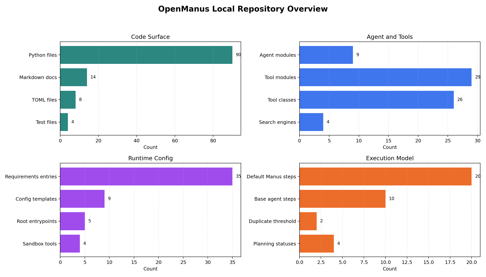

# OpenManus 工程分析报告（2026-06-15）

> 分析对象：`/path/to/OpenManus`  
> 本报告基于本地代码快照、README/config/source、轻量编译检查，以及上游公开资料交叉确认。

## 核心结论

OpenManus 是一个开源通用 AI Agent 框架。它的目标不是做某个垂直数据平台，而是提供一个能通过 LLM 调用工具、浏览网页、执行 Python、编辑文件、接入 MCP、执行规划流程的 agent 基础实现。

从工程形态看，它明显比 DeepEye 轻：主要是 Python 包和命令行入口，配置一个 LLM 后就能从 `python main.py` 开始交互。优势是结构清楚、工具扩展直接、MCP 支持方便；限制是生产安全边界、依赖稳定性、任务成功率评测和长期任务治理都需要使用者自己补齐。

下图是本地仓库快照的结构统计。



## 本地仓库状态

| 项目 | 结果 |
|---|---|
| 本地路径 | `/path/to/OpenManus` |
| 当前分支 | `main` |
| 当前提交 | `52a13f2a57d8c7f6737eefb02ccf569594d44273` |
| 提交日期 | `2026-01-04` |
| 提交说明 | `Update README.md` |
| 工作区状态 | OpenManus 仓库自身 `git status --short` 无输出 |
| `origin` | `https://github.com/XFDG/OpenManus.git` |
| `upstream` | `https://github.com/FoundationAgents/OpenManus.git` |

已按请求配置好 git remote：保留 `origin`，新增官方上游 `upstream`。注意本地快照停在 `2026-01-04`，如果要跟踪官方最新代码，后续需要 `git fetch upstream` 后再评估差异。

## 是什么

OpenManus 的 README 把它描述为一个无需 invite code 的开源通用 agent 实现。上游项目页也将其定位为 open-source framework，用于构建能自主执行复杂任务的 general AI agents。

本地代码里，它主要由这些部分组成：

| 路径 | 作用 |
|---|---|
| `app/agent` | BaseAgent、ReActAgent、ToolCallAgent、Manus、Browser、SWE、DataAnalysis、MCP 等 agent |
| `app/tool` | PythonExecute、BrowserUseTool、StrReplaceEditor、AskHuman、Terminate、Search、Crawl、MCP、Sandbox tools 等 |
| `app/flow` | PlanningFlow 和 flow factory，多 agent/多步骤任务编排 |
| `app/sandbox` | Docker sandbox client/manager/terminal abstraction |
| `app/mcp` | MCP server/client 相关能力 |
| `config` | 多 provider LLM、浏览器、搜索、sandbox、MCP、Daytona 配置模板 |
| 根目录入口 | `main.py`、`run_mcp.py`、`run_flow.py`、`run_mcp_server.py`、`sandbox_main.py` |

## 环境要求

| 类别 | 要求 | 说明 |
|---|---|---|
| Python | `>=3.12` | README、`setup.py` 均指向 Python 3.12 |
| 包管理 | conda 或 uv | README 推荐 uv，也提供 conda 方式 |
| LLM 配置 | `config/config.toml` | 至少配置 `[llm]` 的 model/base_url/api_key/max_tokens/temperature |
| 依赖 | `requirements.txt` | 本地统计 35 条依赖，包含 openai、pydantic、playwright、browser-use、crawl4ai、mcp、docker 等 |
| 浏览器自动化 | `playwright install` | 可选，但 BrowserUseTool 相关任务需要 |
| Docker sandbox | Docker | 开启 sandbox 或相关测试时需要 |
| MCP | `config/mcp.json` 或 config section | 可通过 SSE 或 stdio 接入外部 MCP server |

推荐安装流程：

```bash
cd /path/to/OpenManus
uv venv --python 3.12
source .venv/bin/activate
uv pip install -r requirements.txt
cp config/config.example.toml config/config.toml
# 编辑 config/config.toml，填入 LLM API 信息
python main.py
```

浏览器任务需要额外执行：

```bash
playwright install
```

MCP 版本和 flow 版本入口：

```bash
python run_mcp.py
python run_flow.py
python run_mcp_server.py
```

## 解决什么问题

| 问题 | OpenManus 的目标 |
|---|---|
| 闭源通用 agent 难以本地研究和改造 | 提供可直接运行和修改的开源 agent 框架 |
| LLM 只能聊天，不能行动 | 通过 tool calling 执行 Python、浏览器、搜索、文件编辑、MCP 工具等 |
| 任务需要多步骤规划 | 通过 `PlanningFlow` 和 `PlanningTool` 维护 plan/step/status |
| 工具生态变化快 | 通过 `ToolCollection` 和 MCP client 动态接入工具 |
| 不同 provider 配置分散 | 通过 TOML 模板支持 Anthropic、OpenAI/Azure、Ollama、Google、PPIO、Jiekou.AI、Bedrock 等模式 |

一句话说，它解决的是“让一个 LLM agent 在本地具备通用行动能力”的基础框架问题。

## 怎么解决

### 1. BaseAgent 提供统一执行循环

`app/agent/base.py` 定义了 agent 的共同骨架：

| 机制 | 作用 |
|---|---|
| `AgentState` | 管理 IDLE/RUNNING/FINISHED/ERROR 等状态 |
| `Memory` | 保存用户、assistant、tool 消息 |
| `max_steps` | 限制执行步数，默认 BaseAgent 是 10 |
| `state_context` | 执行期间临时切换状态，异常时进入 ERROR |
| `is_stuck()` | 检测重复回复，避免 agent 一直原地打转 |
| `SANDBOX_CLIENT.cleanup()` | run 结束后清理 sandbox 资源 |

### 2. ToolCallAgent 将 LLM 决策转成工具调用

`app/agent/toolcall.py` 在 ReActAgent 基础上实现工具调用主循环：

| 阶段 | 作用 |
|---|---|
| `think()` | 调 LLM，根据当前 memory 和 tool schema 决定是否调用工具 |
| `act()` | 顺序执行本轮 tool calls |
| `execute_tool()` | JSON 参数解析、工具查找、执行、异常封装 |
| `special_tool_names` | 如 `Terminate` 触发 agent 完成 |
| `max_observe` | 限制工具输出注入上下文的长度 |

这使得工具调用有统一的日志、错误处理、memory 写回和停止逻辑。

### 3. Manus 组合默认工具和 MCP 扩展

`app/agent/manus.py` 是默认通用 agent。它默认挂载：

| 工具 | 能力 |
|---|---|
| `PythonExecute` | 本地 Python 执行 |
| `BrowserUseTool` | 浏览器自动化 |
| `StrReplaceEditor` | 文件编辑 |
| `AskHuman` | 向用户请求输入 |
| `Terminate` | 显式结束任务 |

同时它会读取 MCP 配置，通过 SSE 或 stdio 连接 MCP server，并把 MCP tools 动态加入 `available_tools`。

### 4. PlanningFlow 做轻量任务编排

`app/flow/planning.py` 用 `PlanningTool` 创建计划，并维护 step 状态：

| 状态 | 含义 |
|---|---|
| `not_started` | 尚未执行 |
| `in_progress` | 当前步骤 |
| `completed` | 已完成 |
| `blocked` | 被阻塞 |

执行时，PlanningFlow 会选择合适 executor agent，逐步执行 plan，直到没有 active step 或 agent 结束。这个设计比直接单 agent 循环更适合复杂任务，但本地实现仍是轻量版编排，不是强一致的生产工作流引擎。

### 5. LLM/工具/搜索/sandbox 分层

| 层 | 本地实现 |
|---|---|
| LLM | `app/llm.py`，支持 OpenAI compatible、Azure、AWS Bedrock，并做 token counting/retry |
| 搜索 | Google、Baidu、DuckDuckGo、Bing 四类 search backend |
| 浏览器 | `browser-use` + Playwright |
| 网页抓取 | `crawl4ai` |
| Sandbox | Docker sandbox manager/client/terminal |
| 图表/数据分析 | `app/tool/chart_visualization`，含 Node/TS 可视化辅助 |

## 效果如何

| 维度 | 结论 |
|---|---|
| 公开定位 | 上游官网和 README 均定位为 open-source general AI agent framework |
| 社区/发布 | README 提供 Hugging Face demo、Zenodo DOI、Star History，并提到 OpenManus-RL |
| 本地工程完整度 | agent/tool/flow/sandbox/MCP/配置模板齐全，适合快速二次开发 |
| 本地可验证结果 | Python 语法编译通过；未启动实际 agent，因为缺 `config/config.toml` 和真实 LLM key |
| 定量效果 | 本地仓库没有内置、可直接复现的任务成功率/延迟/成本 benchmark |

本次轻量验证记录：

| 命令 | 结果 |
|---|---|
| `python3 -m compileall -q app main.py run_flow.py run_mcp.py` | 通过，无语法错误输出 |
| `test -f config/config.toml` | 失败，当前只有 example 配置，需要用户复制并填真实 key |

没有运行 `python main.py`，因为这会进入交互式 agent 流程，并依赖真实 LLM API。没有运行完整测试，因为 sandbox 测试会涉及 Docker 环境和依赖安装。

## 优势与限制

### 优势

| 优势 | 说明 |
|---|---|
| 轻量直接 | 安装依赖和配置 LLM 后即可从 CLI 运行 |
| 工具结构清楚 | `ToolCollection`、BaseTool、tool schema 和执行路径容易理解 |
| MCP 扩展方便 | 支持 SSE 和 stdio 两类 MCP server |
| 多 provider 配置模板 | 对本地/云端模型切换友好 |
| 默认工具覆盖广 | Python、浏览器、文件编辑、搜索、抓取、sandbox、人类确认都有 |
| 适合做 agent 实验 | 比大型平台更容易改 prompt、加工具、换 LLM、插入新 flow |

### 限制

| 限制 | 影响 |
|---|---|
| 更像框架/原型 | README 自称 simple implementation，生产治理能力需要额外建设 |
| 安全风险由使用者承担 | Python 执行、浏览器、文件编辑、Docker sandbox 都需要严格隔离 |
| 任务可靠性依赖模型 | tool selection、参数 JSON、网页自动化都可能不稳定 |
| 依赖面较散 | browser-use、playwright、crawl4ai、docker、mcp 等版本组合需要维护 |
| 缺少内置 benchmark | 无法直接判断复杂任务成功率和成本 |
| 本地快照可能落后上游 | 当前 commit 是 2026-01-04，建议定期 fetch upstream |

## 推荐使用方式

| 使用场景 | 建议 |
|---|---|
| 快速体验通用 agent | 配好 `config/config.toml` 后运行 `python main.py` |
| 做工具扩展 | 从 `app/tool/base.py` 和 `app/tool/tool_collection.py` 入手 |
| 接 MCP 工具 | 复制 `config/mcp.example.json`，再用 `python run_mcp.py` |
| 做多步骤任务 | 用 `python run_flow.py`，必要时打开 `runflow.use_data_analysis_agent` |
| 做浏览器任务 | 先执行 `playwright install`，再关注 browser config 和 headless 设置 |
| 做生产化 | 先加 sandbox 策略、权限隔离、审计日志、任务队列、失败恢复和 benchmark |

## 和当前项目的关系

OpenManus 对你当前 GPU/HPC 相关项目的直接价值不是 kernel 优化，而是“自动化工程助手框架”：

| 当前需求 | OpenManus 可借鉴点 |
|---|---|
| 自动读文档、跑命令、整理结果 | ToolCallAgent + file/search/python tools 的设计可参考 |
| 给现有分析流程加 agent | 轻量 CLI agent 比完整平台更容易嵌入 |
| 接入内部工具 | MCP client/server 路径值得复用 |
| 做数据可视化小助手 | DataAnalysis agent 和 chart visualization 工具可参考 |
| 生产级性能实验管理 | OpenManus 本身不够，需要外接队列、权限、日志和实验数据库 |

## 原始文件

| 文件 | 说明 |
|---|---|
| `assets/openmanus_overview_data_2026-06-15.csv` | 图表原始数据 |
| `assets/plot_openmanus_overview_2026-06-15.py` | 绘图脚本 |
| `assets/openmanus_overview_2026-06-15.png` | 报告内嵌组合图 |

## 参考资料

- OpenManus 上游仓库：https://github.com/FoundationAgents/OpenManus
- OpenManus 官网：https://openmanus.github.io/
- FoundationAgents 项目页：https://foundationagents.org/projects/openmanus/
- OpenManus Zenodo DOI：https://doi.org/10.5281/zenodo.15186407
- 本地 README：`/path/to/OpenManus/README.md`
- 本地配置模板：`/path/to/OpenManus/config/config.example.toml`
