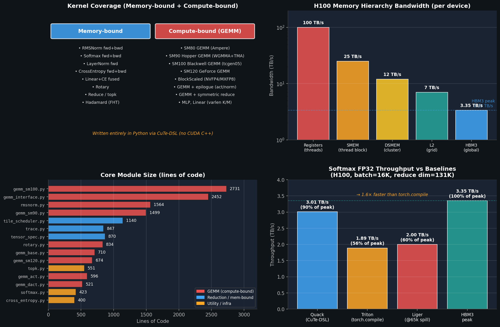
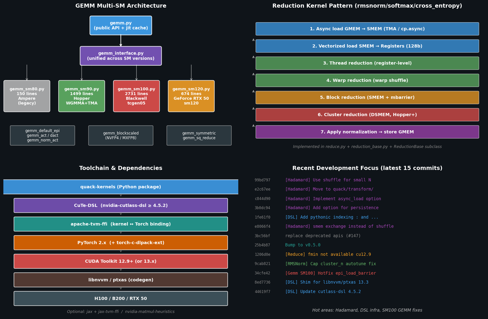

# QuACK 工程分析

> 日期：2026-06-08
> 本地工程：`/path/to/quack`
> 口径：本地 fork (XFDG/quack) clone 实际读码 + 上游 `Dao-AILab/quack` README + 2025-07-10 Hazy Research / Tri Dao blogpost（《Getting Memory-bound Kernels to Speed-of-Light》）+ AGENTS.md 内部约定。本轮未在本地机器跑 H100/B200 benchmark。

## 1. 核心结论

QuACK = **"Quirky Assortment of CuTe Kernels"** —— 一个用 **CuTe-DSL（Python）** 写的、面向 Hopper / Blackwell / RTX 50 的高性能 kernel 集合，发行包名 `quack-kernels`。作者是 Wentao Guo、Ted Zadouri、Tri Dao（Flash Attention 作者团队）。

| 维度 | 简述 |
|---|---|
| 是什么 | 用 CuTe-DSL（不是 CUDA C++）写的 H100/B200/RTX50 kernel 库 |
| 主要问题 | 1) 写高性能 GPU kernel 的开发成本 vs 收益矛盾；2) memory-bound kernel 离 speed-of-light 还有 30–50% 差距 |
| 解法 | 一套贯穿 register→warp→block→cluster→grid 的 reduction 模板；GEMM 按 SM 版本分发；全部 Python 实现 |
| 效果 | Softmax FP32 @ H100 跑出 **3.01 TB/s，89.7% of HBM3 peak**；比 `torch.compile` Triton 快 ~1.6×；GEMM SM90/SM100 对标 cuBLAS |
| 当前版本 | v0.5.0；本地 HEAD `99bd797`（[Hadamard] Use shuffle for small N） |

下图概览：左上是 kernel 覆盖面，右上是 H100 各级内存带宽（解释为什么要按层级 reduce），左下是核心模块代码量，右下是 Softmax FP32 与基线的吞吐对比：



## 2. 本地仓库状态

| 项 | 值 |
|---|---|
| 路径 | `/path/to/quack` |
| Remote | `https://github.com/XFDG/quack.git`（fork from `Dao-AILab/quack`） |
| 本地 HEAD | `99bd797` — `[Hadamard] Use shuffle for small N` |
| 版本号 | `0.5.0`（`quack/__init__.py`） |
| 代码体量 | `quack/` 主目录 ~29.5 K 行 Python；其中 GEMM 子系统 ~11.7 K 行 |
| 包名 | `quack-kernels`（PyPI），import 名 `quack` |

## 3. 是什么 — 一句话

> **一个 Python 包，提供"开箱即用"的 GPU kernel，但内部是用 CuTe-DSL 重写、按硬件层级精心打磨的实现。**

用户角度：

```python
from quack import rmsnorm, softmax, cross_entropy
# 直接当 torch op 用
y = rmsnorm(x, weight)
```

实现角度：

- `quack/rmsnorm.py`（1564 行）= 完整的 RMSNorm fwd+bwd kernel
- `quack/gemm_sm100.py`（2731 行）= Blackwell tcgen05 持久化 GEMM
- 全部走 `@cute.jit` / `@cute.kernel` 装饰器，最后被 CuTe-DSL 编译成 PTX/SASS

## 4. 环境要求

### 4.1 硬件

| 项 | 要求 |
|---|---|
| GPU | H100（SM90）/ B200, B300（SM100）/ RTX 50（SM120），明确**不支持** Ampere 之外的旧架构 |
| CUDA | Toolkit 12.9+（CUDA 13.x 走 `[cu13]` extra） |
| Python | 3.10+（README 写 3.12，pyproject 写 ≥3.10） |

### 4.2 软件栈

| 组件 | 版本 / 说明 |
|---|---|
| `nvidia-cutlass-dsl` | ≥ 4.5.2 — CuTe-DSL 本体 |
| `torch` | PyTorch 2.x，CUDA 13.x 走 `--extra-index-url https://download.pytorch.org/whl/cu130` |
| `apache-tvm-ffi` | 0.1.6 ≤ x < 0.2 —— kernel ↔ torch 绑定 |
| `torch-c-dlpack-ext` | dlpack 扩展 |
| `einops` | 张量算子 |
| **可选** | `nvidia-matmul-heuristics`（GEMM 调参）/ `jax + jax-tvm-ffi`（JAX 绑定）/ `pandas`（benchmark） |

> 注意：上游 README 明确说 CUDA 13.x **不要用 `uv` 装**，会因 [NVIDIA/cutlass#3259](https://github.com/NVIDIA/cutlass/issues/3259) 触发 race。

### 4.3 安装

```bash
# 标准
pip install quack-kernels

# CUDA 13.x
pip install 'quack-kernels[cu13]' --extra-index-url https://download.pytorch.org/whl/cu130

# 开发
cd /path/to/quack
pip install -e '.[dev]'
pre-commit install
```

## 5. 解决什么问题

GPU kernel 开发有两个长期矛盾：

| 痛点 | 现状 |
|---|---|
| **memory-bound kernel 离 SOL 远** | torch.compile / Triton 在 large reduction（≥64K）会有 register spill；典型 softmax 只能跑到 ~2 TB/s，离 HBM3 peak 3.35 TB/s 差 40% |
| **手写 CUDA C++ 维护成本高** | 性能能榨到 95%+，但代码难写、难改、难复用；研究者用不动 |
| **GEMM 的硬件适配** | Hopper 要 WGMMA+TMA，Blackwell 要 tcgen05+TMEM+CLC，每代都要重写 |
| **FP8 / NVFP4 / MXFP8 落地** | block scaling 的 SF layout、padding、varlen 都是工程坑 |

QuACK 给出的解法：**Python 写出接近 CUDA C++ 的性能，且按硬件层级提供模板**。

## 6. 解法的实现

下图展示 GEMM 多 SM 架构、reduction kernel 7 步模板、工具链依赖栈和最近开发热点：



### 6.1 Memory-bound：贯穿内存层级的 reduction 模板

`reduction_base.py` 定义 `ReductionBase`，子类有 `rmsnorm.py` / `softmax.py` / `cross_entropy.py` / `topk.py`。统一的 7 步：

1. Async load GMEM → SMEM（TMA / cp.async）
2. Vectorized load SMEM → Registers（每次 128 bit = 4×FP32 = 8×BF16）
3. Thread reduction（寄存器内）
4. Warp reduction（warp shuffle）
5. Block reduction（SMEM + mbarrier）
6. **Cluster reduction（DSMEM, Hopper+）** — 关键差异点，让 16 个 SM 形成"mega SM"，可吃 0.5M 输入而不回 GMEM
7. 应用归一化 → 写回 GMEM

blogpost 公开数据（H100, batch=16K, reduce_dim=131K, FP32 softmax）：

| 实现 | 实测吞吐 | 占 HBM3 peak |
|---|---|---|
| **QuACK CuTe-DSL** | **3.01 TB/s** | **89.7%** |
| `torch.compile` Triton | 1.89 TB/s | 56% |
| Liger（@ 65k spill） | ~2.0 TB/s | 60% |

reduction dim ≥ 4K 时 QuACK 都能稳在 ~3 TB/s（~90% peak）；≥ 65K 时全面超过基线。

### 6.2 Compute-bound：GEMM 多 SM 分发

入口 `gemm.py`（298 行）→ `gemm_interface.py`（2452 行）→ 按 device capability 分发：

| 模块 | 行数 | 架构 | 关键硬件 |
|---|---|---|---|
| `gemm_sm80.py` | 150 | Ampere | mma.async（legacy） |
| `gemm_sm90.py` | 1499 | Hopper H100 | WGMMA + TMA + warpgroup pipeline |
| `gemm_sm100.py` | 2731 | Blackwell B200/B300 | tcgen05.mma + TMEM + 2-SM cluster |
| `gemm_sm120.py` | 674 | GeForce RTX 50 | SM120（消费级 Blackwell） |

Epilogue 体系（可正交组合）：

- `gemm_default_epi.py` — 基础 bias / alpha / beta
- `gemm_act.py`（596 行）/ `gemm_dact.py`（521 行）— 激活/反激活融合
- `gemm_norm_act.py`（414 行）— norm+activation 融合
- `gemm_blockscaled_interface.py`（326 行）— **NVFP4 / MXFP8 block-scaled**
- `gemm_symmetric.py` / `gemm_sq_reduce.py` — 对称 / 平方归约融合

所有 GEMM 共用 `tile_scheduler.py`（1140 行，持久化 grid 调度）和 `pipeline.py`（自定义 PipelineTmaUmma 等）。

### 6.3 CuTe-DSL 约定（见 AGENTS.md）

`@cute.jit` / `@cute.kernel` 函数体只能写 Python 的一个子集：

- `cutlass.const_expr()` 标记编译期常量
- `cutlass.range_constexpr()` 编译期展开循环
- `cutlass.range()` 运行时循环
- 不允许 `break` / `continue`，jit 函数不能 `return` 值
- Python list/dict 都是编译期静态
- 类型必须编译期可定（无依赖类型）
- 控制流体内定义的变量不能在外面用

> **坑**：CuTe DSL 用 `inspect.getsourcelines()` 解析 kernel。**REPL 里定义 `@cute.kernel` 会失败**（找不到源码）—— 必须写文件。

## 7. 工程亮点（从代码读到的）

| 文件/特性 | 价值 |
|---|---|
| `quack/cache/jit.py` + `_compile_worker.py` | JIT 编译结果磁盘缓存 + 多进程并行编译，避免每次启动重编 |
| `quack/autotuner.py` | autotune 框架，按 `(M, N, K, dtype, ...)` 选 `GemmConfig` |
| `quack/tile_scheduler.py`（1140 行） | 持久化 grid 的 tile 调度，复用 SM、隐藏 launch overhead |
| `quack/varlen_utils.py`（226 行） | 变长序列（attention / MoE 场景）支持 |
| `quack/sort/bitonic_sort.py` + 生成器 | bitonic sorting network 模板生成 |
| `quack/transform/hadamard.py` | Fast Hadamard Transform（最近的开发热点） |
| `quack/trace.py`（847 行） | kernel trace 工具，用于诊断 / profiling |
| `quack/dsl/cute_dsl_shim.py` + `cute_dsl_ptxas.py` | 兼容多版本 libnvvm/ptxas（13.3 shim） |
| `quack/linear_cross_entropy.py` | Linear+CE 融合（省一次 logits 落地） |
| `quack/mlp.py` | 完整 MLP 融合 kernel |
| `tools/dump_sass.py` | 反汇编工具，用于看 register spill 等问题 |

## 8. 与本地其他项目的关系

| 项目 | 关系 |
|---|---|
| `sonic-moe` | sonic-moe 实际调用 QuACK 的 GEMM。`h200-moe-dev` skill 记录："quack GEMM (CUTLASS 3.x) 纯 GEMM 达 **66.5% MFU @ H200**，无需再优化" |
| `megatron-lm`（本机 fork） | Megatron 走 TransformerEngine + tgale96 grouped_gemm；和 QuACK 是两条平行的 GEMM 实现路线 |
| `ThunderKittens` / `mKernel` | TK 也是 tile primitive DSL，但走 CUDA C++ 路线；QuACK 是 CuTe-DSL（Python）路线，作者背景重合（Tri Dao） |
| `flash-attention` | 同一作者团队（Dao-AILab）；QuACK 补 attention 之外的 memory-bound kernel |
| `vllm` / 推理框架 | QuACK 的 rmsnorm/softmax/cross_entropy 可以直接接入推理路径替换 torch 实现 |

## 9. 上手命令

### 9.1 跑 benchmark

```bash
cd /path/to/quack/benchmarks

python benchmark_rmsnorm.py
python benchmark_softmax.py
python benchmark_gemm.py
python benchmark_gemm_autotuned.py    # 走 autotuner
python benchmark_gemm_epilogues.py    # bias/activation 融合
python benchmark_hadamard.py
```

### 9.2 跑 tests（先小范围）

```bash
cd /path/to/quack
pytest tests/test_rmsnorm.py -x -k "bfloat16"
pytest tests/test_gemm_256x512.py -x
pytest tests/test_softmax.py -x
```

AGENTS.md 强调：迭代时只跑少量 parametrization，全量跑只用于最终 PR。

### 9.3 用作普通 Python 包

```python
import torch
from quack import rmsnorm, softmax, cross_entropy

x = torch.randn(8192, 4096, device='cuda', dtype=torch.bfloat16)
w = torch.randn(4096, device='cuda', dtype=torch.bfloat16)
y = rmsnorm(x, w)

# JAX
from quack.softmax_jax import softmax as jax_softmax
```

### 9.4 GEMM with autotune

```python
from quack.gemm import gemm
y = gemm(a, b, alpha=1.0, beta=0.0)   # 内部按 device capability 选 SM 实现 + autotune
```

## 10. 开发热点（从最近 commits 读出）

按时间倒序观察主线：

| commit | 主题 |
|---|---|
| `99bd797` / `e2c67ee` / `c844d90` / `3b0dc94` / `e8066f4` | **Hadamard kernel** 重构与优化（最近主线） |
| `1fe61f0` | DSL 增强：pythonic 索引 `:` 和 `...` |
| `1206d0e` / `34cfe42` | bugfix：cu12.9 兼容、SM100 epilogue barrier |
| `9cab821` | RMSNorm autotune 配置修复 |
| `8ed7736` | DSL shim：可选 libnvvm 与 ptxas 13.3 |
| `44619f7` | cutlass-dsl 升级到 4.5.2 |

**信号**：当前重心是 Hadamard / DSL infra；GEMM SM100 已基本稳定，进入维护期。

## 11. 看代码的入口建议

- **想了解整体设计** → `AGENTS.md`（项目自己写给 coding agent 的，最权威的导览）
- **memory-bound 套路** → `reduction_base.py` → `reduce.py` → `rmsnorm.py`
- **GEMM 框架** → `gemm.py` → `gemm_interface.py` → `gemm_sm90.py`（Hopper 是写得最成熟的）
- **想看 Blackwell** → `gemm_sm100.py` + `sm100_utils.py` + `pipeline.py`（PipelineTmaUmma）
- **想看 block-scaled FP4/FP8** → `gemm_blockscaled_interface.py` + `mx_utils.py` + `blockscaled_gemm_utils.py`
- **调试** → `quack/trace.py` + `tools/dump_sass.py` + `docs/register_spilling_sm100.md`

## 12. 原始资料

| 文件 | 内容 |
|---|---|
| `/path/to/quack/README.md` | 上游 README，安装 + 性能图 |
| `/path/to/quack/AGENTS.md` | 项目设计文档（约定 + 架构） |
| `/path/to/quack/media/2025-07-10-membound-sol.md` | Hazy Research blogpost，全部性能数字来源 |
| `/path/to/quack/AI/` | 内部技术笔记（FP4 SF layout、TMA 故障、SM120 硬件等） |
| `/path/to/quack/docs/jax.md` | JAX 绑定文档 |
| `assets/quack_overview.png` | kernel 覆盖 + 内存带宽 + 模块体量 + softmax 对比 |
| `assets/quack_architecture.png` | GEMM 分发 + reduction 模板 + 工具链 + commit 热点 |
