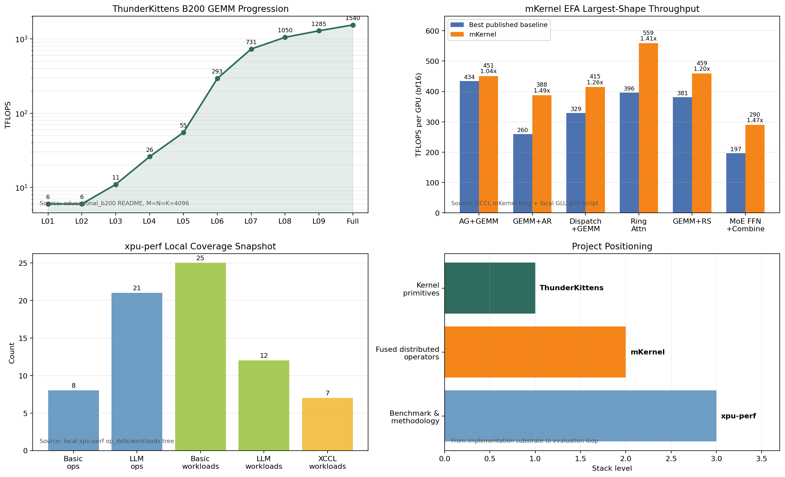

# ThunderKittens、mKernel 与 xpu-perf 工程分析

> 日期: 2026-06-08  
> 本地工程: `/path/to/ThunderKittens`, `/path/to/mKernel`, `/path/to/xpu-perf`  
> 口径: 结合本地 clone、README/源码、上游 GitHub、Hazy Research 文章/论文、UCCL mKernel blog。本文中的性能数据来自公开发布图和本地仓库脚本记录，本轮未重新跑 H100/H200/B200 benchmark。

## 1. 核心结论

ThunderKittens、mKernel 和 xpu-perf 是三层不同的问题。

| 工程 | 一句话定位 | 主要解决的问题 | 典型使用者 |
|---|---|---|---|
| ThunderKittens | 面向 NVIDIA GPU 的 CUDA 内嵌 tile primitive / kernel DSL | 让开发者用更少、更可维护的 CUDA 写出接近手写极限的 AI kernels | 写 attention、GEMM、state-space、linear attention、低精度 kernel 的 kernel engineer |
| mKernel | 多 GPU、多节点 fused persistent kernels 集合 | 把 NVLink/RDMA 通信和 GEMM/attention/MoE compute 融合到同一个 kernel，消除 host-driven 通信和粗粒度 overlap 的气泡 | 做分布式训练/推理通信计算融合、MoE/TP/SP 热路径优化的系统工程师 |
| xpu-perf | 面向 XPU/AI 加速器的性能评估方法论和 benchmark 工具链 | 从芯片、算子、模型仿真、训练/推理实测到业务 trace，建立统一评测口径 | 做芯片选型、异构平台对比、模型部署容量评估、TCO 评估的 infra/benchmark 工程师 |

简化理解:

- **ThunderKittens 是“写快 kernel 的底层积木”**: register/shared/global tile、TMA、WGMMA、TCGEN05、pipeline template、静态 layout 检查。
- **mKernel 是“用这些积木做出的多节点通信计算融合算子”**: AllGather+GEMM、GEMM+AllReduce、MoE dispatch+GEMM、Ring Attention、GEMM+ReduceScatter、完整 MoE FFN+Combine。
- **xpu-perf 是“判断这些 kernel / 芯片 / 软件栈到底值不值的评测闭环”**: micro benchmark、XCCL/LLM ops、模型仿真、trace generation、训练/推理评估。
- `mKernel` README 明确致谢其 MMA/compute 代码改编自 ThunderKittens；本地源码也保留了大量 TK-style tile/TMA/WGMMA 组件。

下图左上是 ThunderKittens Blackwell educational GEMM 的逐步性能爬坡，右上是 mKernel 在 2 nodes x 8 H200 EFA 发布数据中最大 shape 的吞吐对比；左下补充 xpu-perf 本地 op/workload 覆盖面，右下展示三者所处层级。



## 2. 本地仓库状态

| 工程 | 本地路径 | remote | 本地 HEAD |
|---|---|---|---|
| ThunderKittens | `/path/to/ThunderKittens` | `https://github.com/XFDG/ThunderKittens.git`, forked from `HazyResearch/ThunderKittens` | `34b15f7e`, 2026-05-28, `Use XOR shuffles for register tile reductions (#198)` |
| mKernel | `/path/to/mKernel` | `https://github.com/XFDG/mKernel.git`, forked from `uccl-project/mKernel` | `35bed59`, 2026-06-08, `[Comm] Add peermem-compatible RDMA backing (#29)` |
| xpu-perf | `/path/to/xpu-perf` | `https://github.com/XFDG/xpu-perf.git`, upstream project `bytedance/xpu-perf` | `71a1210`, 2026-04-22, `fix gpu vendor ops def. (#193)` |

注意: ThunderKittens 的权威上游是 HazyResearch；mKernel 的权威上游是 UCCL project；xpu-perf 的权威上游是 ByteDance。本地三个仓库都是 XFDG fork。

## 3. ThunderKittens

### 3.1 是什么

ThunderKittens 是 Hazy Research 开源的 CUDA 内嵌 DSL / header-only kernel framework，目标是让开发者更容易写高性能 AI kernels。上游 README 将其概括为 “Tile primitives for speedy kernels”，核心原则是 simplicity、extensibility、speed。它不是一个通用深度学习框架，也不是只提供固定 GEMM API 的库，而是一个贴近 CUDA 的 tile primitive 层。

从抽象层看，它把现代 GPU kernel 常用对象拆成几类:

| 抽象 | 所在层级 | 作用 |
|---|---|---|
| register tile / vector | warp / warpgroup register file | 在寄存器中保存 2D/1D tile，做 elementwise、reduction、mma accumulator 等 |
| shared tile / vector | CTA shared memory | 管理 swizzled shared-memory layout，减少 bank conflict |
| global layout / TMA descriptor | global memory 到 shared memory | 用 TMA 做异步搬运和地址生成 |
| warp / warpgroup ops | warp、4-warp warpgroup | 调 WGMMA、TCGEN05、TMA、store/load、reduce 等硬件指令 |
| prototype / LCF template | CTA / grid | producer-consumer、load-compute-finish、persistent grid 等流水模板 |

Hazy 的论文把 ThunderKittens 的抽象映射到三层 GPU 层级: warp-level 16x16 tiles、thread-block-level async overlap template、grid-level launch/teardown/memory-cost hiding。论文报告它在一系列 AI kernel 上能达到或超过已有 kernel，具体包括 GEMM/attention inference 对齐 CuBLAS/FlashAttention-3，attention backward 强基线提升 10-40%，state-space model 提升 8x，linear attention 提升 14x。

### 3.2 环境要求

本地 README 给出的要求比较激进，主要面向 Hopper/Blackwell:

| 项 | 要求 |
|---|---|
| GPU | 主要构建和测试在 Hopper 与 Blackwell；Ampere 不再主动支持，但可能还能工作 |
| CUDA | CUDA 12.8+ |
| C++ | C++20，README 建议 gcc/g++ 11 以上或 clang 11 |
| 架构宏 | 需要且只能定义一个 `KITTENS_SM80` / `KITTENS_SM90` / `KITTENS_SM100` / `KITTENS_SM103` / `KITTENS_SM120` |
| 构建形式 | 本体 header-only；2.0 后不再作为顶层 Python package 安装，`kernels/` 下每个 kernel 单独编译 |
| PyTorch kernel | PyTorch 2.8+、PyBind11，并保证 PyTorch CUDA 版本和本机 CUDA 匹配 |
| 测试 | `tests/Makefile` 默认 `ARCH=SM90`，可切到 `SM80/SM90/SM100/SM103/SM120`；编译测试量很大 |

典型命令:

```bash
cd /path/to/ThunderKittens

# primitive unit tests, 默认 SM90
cd tests
make -j32 ARCH=SM90
mkdir -p outputs
./unit_tests printout

# 单个 kernel，例如 H100 BF16 GEMM
cd ../kernels/gemm/bf16_h100
make
make run
```

### 3.3 解决什么问题

ThunderKittens 的背景是: AI 模型结构变化很快，很多高价值算子不是 cuBLAS/cuDNN 的标准矩阵乘或卷积，直接手写 CUDA 又要处理大量硬件细节。

关键痛点包括:

| 痛点 | 为什么难 |
|---|---|
| H100 WGMMA | 4 warp 协同、异步发射、layout 约束复杂，不用 WGMMA 又很难吃满 H100 tensor core |
| TMA / 地址生成 | Hopper/Blackwell 上地址生成和 global-to-shared 搬运本身会吃资源，TMA 能省寄存器和指令，但 descriptor 和 barrier 管理麻烦 |
| shared-memory bank conflict | WGMMA/TMA 需要合适 swizzle，否则会有 coalescing 和 bank conflict 问题 |
| pipeline overlap | 高性能 kernel 需要 load、compute、store、softmax/reduction 等阶段细粒度交叠 |
| 可维护性 | FlashAttention 这类 kernel 代码量大、特殊 case 多，算法研究者和系统工程师都很难快速改 |

ThunderKittens 要解决的是“**把硬件正确用法封成可组合 primitive，同时不挡住开发者继续写原生 CUDA**”。

### 3.4 怎么解决

ThunderKittens 的方法不是隐藏 CUDA，而是把 CUDA 中最容易写错、又最影响性能的部分模板化和类型化:

| 机制 | 作用 |
|---|---|
| tile 类型系统 | 编译期携带 dtype、shape、layout 信息，避免把不兼容的 tile 布局喂给 MMA / transpose / load |
| warp/warpgroup scope | 默认 warp-level 操作；WGMMA 等需要 4 warp 时显式走 `warpgroup` / `group<4>` |
| shared-memory swizzle | 通过 shared tile layout 管 bank conflict 和 WGMMA 需要的 shared memory 排布 |
| TMA helpers | 封装 tensor map、异步 load/store、mbarrier expect/wait，降低地址生成成本 |
| pipeline template | `load-store-compute-finish` 风格，把 producer/consumer/finish 阶段组织起来 |
| header-only + CUDA embedded | 能和手写 CUDA 混用；遇到 DSL 覆盖不到的地方，可以直接写 CUDA/PTX 级逻辑 |
| 自带 kernels | attention、GEMM、rotary、layernorm、Mamba2、linear attention、parallel collectives 等可直接参考 |

本地 `kernels/gemm/educational_h100` 和 `educational_b200` 很适合作学习材料。Blackwell 版本从简单 for-loop 到 tcgen05、TMA、warp specialization、epilogue pipeline、2-CTA cluster，展示每个硬件机制带来的性能跃迁。

### 3.5 效果如何

公开和本地 README 里比较有代表性的结果:

| 来源 | 结果 |
|---|---|
| ThunderKittens README | H100 simple matmul 示例少于 100 行，约 855 TFLOPs，约 86% theoretical max |
| 本地 `educational_b200/README.md` | B200 educational GEMM 从 6 TFLOPs 逐级到 1285 TFLOPs；同目录说明完整 `bf16_b200` kernel 在 `M=N=K=4096` 达 1540 TFLOPs |
| arXiv 论文 | GEMM/attention inference 对齐 CuBLAS/FlashAttention-3；attention backward 强基线提升 10-40%；SSM 8x；linear attention 14x |
| 2025 Blackwell blog | Blackwell tensor core、tensor memory、CTA pair/cluster 等新硬件能力被抽象进 TK，支持 MXFP8/NVFP4 等低精度路径 |

这些结果的意义不是“TK 自动让任意 kernel 变快”，而是说明: 对适合 tile 化、pipeline 化、tensor-core 化的 AI 算子，TK 能让高性能实现的代码量和维护成本显著下降，同时仍能逼近手写 CUDA 的性能上限。

### 3.6 优势与限制

优势:

| 优势 | 说明 |
|---|---|
| 抽象足够底层 | 比 Triton 更贴近 CUDA/Hopper/Blackwell 指令模型，适合写非标准 fused kernel |
| 比纯手写 CUDA 更规整 | tile/layout/barrier/pipeline 被统一表达，可读性和复用性更好 |
| 性能上限高 | 能直接用 WGMMA、TMA、TCGEN05、tensor memory、distributed shared memory 等硬件能力 |
| header-only | 引入成本低，便于在已有 CUDA 工程里局部使用 |
| 生态开始扩展 | 已有 attention、GEMM、linear attention、Mamba2、parallel kernel demo 等 |

限制:

| 限制 | 影响 |
|---|---|
| 仍需要 CUDA 硬件知识 | 写 serious kernel 仍要懂 warpgroup、barrier、TMA、occupancy、layout |
| 编译和模板错误成本高 | C++20 + CUDA template 错误信息可能很长；测试编译量很大 |
| 硬件适配强 | Hopper/Blackwell 友好；Ampere 不再主动维护 |
| 不是通用算子库 | 需要自己挑 kernel、改 Makefile、做 benchmark/校验；2.0 后没有顶层 Python package |

## 4. mKernel

### 4.1 是什么

mKernel 是 UCCL project 开源的多 GPU、多节点 fused persistent kernels 工程。它的目标不是写单卡 kernel primitive，而是把 **intra-node NVLink 通信、inter-node RDMA 通信、dense compute** 放进同一个 persistent CUDA kernel。

本地 README 当前列了 6 个 kernel:

| Kernel | 融合内容 | 典型场景 |
|---|---|---|
| AllGather + GEMM | AllGather -> GEMM | Tensor parallel / activation shard gather 后矩阵乘 |
| GEMM + AllReduce | GEMM -> AllReduce | TP partial output reduce |
| MoE Dispatch + GEMM | All-to-All dispatch -> grouped GEMM | Expert parallel MoE 的 dispatch + expert GEMM |
| MoE Dispatch + FFN + Combine | All-to-All dispatch -> grouped FFN -> All-to-All combine | 完整 MoE expert layer，含 gemm1、SwiGLU、gemm2、combine |
| Ring Attention | Ring KV exchange -> FlashAttention | Sequence parallel/context parallel attention |
| GEMM + ReduceScatter | GEMM -> ReduceScatter | TP/sequence parallel output partition |

UCCL blog 2026-05-25 主体介绍的是前 5 个 fused kernels；本地 README/Makefile 已经包含第 6 个完整 MoE FFN+Combine。

### 4.2 环境要求

mKernel 的环境比 ThunderKittens 更系统化、更挑机器，因为它要跨节点跑 RDMA。

| 项 | 要求 |
|---|---|
| GPU | NVIDIA Hopper；默认编译目标 `sm_90a`，实际发布数据是 2 nodes x 8 H200 |
| CUDA | 默认 `CUDA_HOME=/usr/local/cuda-12.9`，可覆盖 |
| Python | Python + PyTorch；`requirements.txt` 为 `torch`, `numpy`, `matplotlib` |
| CX7 backend | libibverbs headers/libs，ConnectX-7 / InfiniBand / RoCE |
| EFA backend | AWS EFA 安装，`libfabric`, `libibverbs`, `efadv`，默认 `EFA_HOME=/opt/amazon/efa` |
| 集群 | homogeneous multi-GPU nodes、`torchrun`、node0 到 peer node 的免密 SSH、`NODE*_IP` 数据面可达 |
| 架构/拓扑 | README/脚本默认 `2 nodes x 8 GPUs`，H200 脚本会配置 RoCE/EFA/NCCL 相关环境 |

典型命令:

```bash
cd /path/to/mKernel

# EFA 或 CX7 二选一
make BACKEND=efa PYTHON=python3 all
make BACKEND=cx7 PYTHON=python3 all

# 两节点 benchmark 示例
NODE0_IP=<node0-data-ip> \
NODE1_IP=<node1-data-ip> \
NODE1_SSH=<node1-ssh-target> \
bash bench/run.sh all bench 2

make plots
```

### 4.3 解决什么问题

mKernel 解决的是 host-driven distributed communication 的瓶颈。UCCL blog 给出的动机很明确:

- AI training/serving 中通信占比越来越高；文中引用生产系统中 forward pass 通信可达 43.6%，端到端训练可达 32%，MoE/框架中 inter-device communication 可达 47%。
- 传统 NCCL/NVSHMEM/host stream overlap 的控制路径由 CPU 驱动，粒度往往是 kernel 或 collective 边界。
- GPU 越快，kernel launch、CPU check、inter-stream event 这种微秒级调度气泡越明显。
- MoE、TP、SP/CP 这类 workload 真正需要的是 tile/chunk 粒度的通信计算 overlap。

mKernel 的核心目标是把“collective 完成后再 GEMM”变成“tile/chunk 到了就 GEMM；GEMM tile 出来了就 reduce/send”。这样可以把通信隐藏进 compute，而不是用两个 stream 粗粒度重叠。

### 4.4 怎么解决

mKernel 的实现可以分成四层。

第一层: persistent kernel + CTA role specialization。

源码 `src/ag_gemm.cu` 开头就说明单个 kernel launch 内有两组 CTA 并发:

| CTA 角色 | 做什么 |
|---|---|
| intra-comm CTAs | 节点内 multicast gather，本 rank A rows 的早期 RDMA 发送，等待 peer RDMA arrival，再把收到的 rows republish 到 multicast buffer |
| compute CTAs | 对 local half 和 remote half 做 GEMM；local tile 等节点内 barrier，remote tile 等 RDMA arrival/republish signal |

`gemm_ar` 更复杂，源码注释把角色拆成 compute、intra-AR、inter-send、inter-reduce-and-publish；`fused_globals` 里保留了 `num_intra_ar_sms`、`num_inter_send_sms`、`num_inter_reduce_publish_sms`、`arrival_flags`、ready queues、chunk flags 等运行时状态。

第二层: intra-node 使用 CUDA IPC / multicast / TMA。

`include/dist/parallel_buffer.cuh` 负责 VMM allocation、CUDA IPC handle exchange、multicast VA 初始化。`distributed_buffer.cuh` 则把 per-device local tensor、multicast pointer、TMA descriptor cache、arrival flags、send ring 组织成统一 descriptor。

第三层: inter-node 使用 libibverbs/EFA backend，不走 NCCL/NVSHMEM fast path。

`session_select.h` 用编译宏选择 backend:

| Backend | Macro | Transport |
|---|---|---|
| CX7 | `-DINTERNODE_BACKEND_IBVERBS` | libibverbs RC |
| EFA | `-DINTERNODE_BACKEND_EFA` | libibverbs + efadv SRD |

源码中 session 负责 RDMA transport、GPU MR 注册、D2H FIFO、arrival flags、proxy thread。更准确地说，GPU kernel 在 tile/chunk 粒度发布 transfer command 和轮询 arrival；host-side proxy/session 对接 libibverbs/EFA 资源并提交网络操作。它不像 NCCL 那样把整体 collective 作为外部库调用，而是把通信调度嵌进 fused kernel 的数据流。

第四层: operator-specific fusion。

| Kernel | 数据流 |
|---|---|
| AG+GEMM | A shard 通过 NVLink/RDMA gather；GEMM 消费已到达 tile |
| GEMM+AR | GEMM 输出 tile 立即进入 intra-node reduce、inter-node send/reduce、final publish |
| Dispatch+GEMM | MoE tokens dispatch 到 expert owner，tokens 到达后立即 grouped GEMM |
| Dispatch+FFN+Combine | dispatch、gemm1、SwiGLU、gemm2、combine 全部保持在一个 fused pipeline |
| Ring Attention | KV chunk ring exchange 与 local FlashAttention 并发 |
| GEMM+RS | GEMM 输出 tile 立即 reduce-scatter 到 owner rank |

### 4.5 效果如何

UCCL blog 的发布环境是两个 2-node x 8-H200 集群，区别在 inter-node fabric: AWS EFA 或 ConnectX-7。下面表格取 EFA 最大 shape 的发布图数值；baseline 取同图中的最强 baseline。

| Kernel | 最大 shape / 口径 | 最强 baseline | mKernel | Speedup |
|---|---|---:|---:|---:|
| AllGather + GEMM | `32768x32768x2048` | 434 TFLOPS/GPU, Triton-distributed | 451 TFLOPS/GPU | 1.04x |
| GEMM + AllReduce | `32768x2048x32768` | 260 TFLOPS/GPU, CuBLAS+NCCL | 388 TFLOPS/GPU | 1.49x |
| MoE Dispatch + GEMM | 131072 total tokens, `H=7168,I=2048,top_k=8,E=256` | 329 TFLOPS/GPU, DeepEP+DeepGEMM CX7 reference | 415 TFLOPS/GPU | 1.26x |
| Ring Attention | `total_seq=196608` | 396 TFLOPS/GPU, MagiAttention | 559 TFLOPS/GPU | 1.41x |
| GEMM + ReduceScatter | `32768x2048x32768` | 381 TFLOPS/GPU, CuBLAS+NCCL | 459 TFLOPS/GPU | 1.20x |
| MoE Dispatch + FFN + Combine | 131072 total tokens, full MoE FFN | 196.7 TFLOPS/GPU, CuBLAS+NCCL all-to-all baseline | 289.6 TFLOPS/GPU | 1.47x |

观察:

- mKernel 的收益在 **collective 与 compute 能细粒度交叠** 时最明显，例如 GEMM+AllReduce、Ring Attention、完整 MoE FFN+Combine。
- AllGather+GEMM 在最大 shape 上相对 Triton-distributed 的优势只有 1.04x，说明不是所有融合都能大幅赢；当 compute 本身已经很大、baseline overlap 也不错时，边际收益会缩小。
- MoE Dispatch+GEMM 的意义不只是 TFLOPS 数字，它减少了 dispatch staging buffer round-trip，让 token 到达 expert owner 后更早进入 grouped GEMM。
- 完整 MoE FFN+Combine 是对线上 MoE 更接近的端到端形态，比只看 dispatch+GEMM 更能体现全层融合价值。

### 4.6 优势与限制

优势:

| 优势 | 说明 |
|---|---|
| 跨节点细粒度 overlap | 把 NVLink、RDMA、GEMM/attention 放进同一 persistent kernel，tile/chunk 到达即消费 |
| 减少 launch 和 staging | 不再把 collective、GEMM、combine 拆成多个 kernel / stream / buffer round-trip |
| 面向真实分布式算子 | 直接覆盖 TP、SP/CP、MoE EP 热路径，而不是只做单卡 microkernel |
| 后端可切换 | CX7/IB/RoCE 和 AWS EFA 共享 operator API，session/proxy 层不同 |
| TK compute 基础 | MMA/TMA/tile compute 能复用 ThunderKittens 风格，减少从零实现 tensor-core kernel 的成本 |

限制:

| 限制 | 影响 |
|---|---|
| 环境门槛高 | 需要多 H200 节点、RDMA/EFA、NIC/GPU 亲和、SSH、torchrun、正确数据面 IP |
| 泛化性不如 NCCL | mKernel 是 operator-specific fusion；单独 allreduce/allgather 或不同 shape/topology 不一定直接受益 |
| 调参面大 | SM role split、QP 数、chunk size、arrival queue、proxy threads、NIC rails 都可能影响性能 |
| 仍在活跃开发 | README roadmap 仍列 Blackwell、异构加速器/NIC、topology-aware routing、internode megakernels |
| 正确性和诊断复杂 | arrival flag、GPU-side barrier、proxy timeline、RDMA ordering、multi-node hang triage 都需要系统工程能力 |

## 5. xpu-perf

### 5.1 是什么

xpu-perf 是 ByteDance 开源的 XPU/AI accelerator 性能评估工具链。它的目标不是提供单个 kernel，也不是只给某个 GPU 做 micro benchmark，而是打通:

```text
芯片厂商 -> AI infra engine 层 -> AI infra serving 层 -> 业务层
```

README 里给出的最终目标是: 制定更合理、专业的评估方法论和工具，消除层间信息隔离，找到核心指标需求，最终以更低 TCO 提供更高业务服务性能。

上游 GitHub about 将它定位为 HPCA 2026 AI Accelerator Benchmark，强调从生产实践视角评估 AI accelerators，包括软硬件易用性和通用性。它引用的论文是 HPCA 2026 Industry Track 的 “Characterizing Cloud-Native LLM Inference at ByteDance and Exposing Optimization Challenges and Opportunities for Future AI Accelerators”。

### 5.2 子项目结构

| 子项目 | 定位 | 当前状态 |
|---|---|---|
| `micro_perf` | 高频计算/通信算子测试框架 | 当前最核心、最成熟的模块 |
| `xpu_sim` / `projects/xpu_oj/llm_sim` | 基于算子测试结果的 LLM 端到端和 breakdown 性能仿真 | 可把模型 topology 拆成算子请求，再组装成模型 latency |
| `trace_gen` | LLM 推理请求生成工具 | 对外 bundle v2.1，支持 HPP/NHPP/NB 和动态采样 |
| `(old) infer_perf` | 原小模型/LLM 推理测试框架 | README 标注已过时，未来聚焦 vLLM/SGLang bench |
| `train_perf` | LLM 训练评估工程 | 包含训练精度、确定性、内存、训练效率评估方案 |

本地覆盖面快照:

| 类别 | 数量 | 来源 |
|---|---:|---|
| basic op definition files | 8 | `projects/micro_perf/op_defs/basic_ops` |
| LLM op definition files | 21 | `projects/micro_perf/op_defs/llm_ops` |
| basic workload JSON | 25 | `projects/micro_perf/workloads/basic` |
| LLM workload JSON | 12 | `projects/micro_perf/workloads/llm` |
| XCCL workload JSON | 7 | `projects/micro_perf/workloads/xccl_ops` |

其中 LLM op defs 已覆盖 `flash_attention`、`rotary_embedding`、`store_kv_cache`、`quant_matmul`、`moe_softmax_topk`、`moe_gather`、`moe_scatter_dynamic_quant`、`moe_quant_group_gemm`、`moe_quant_group_gemm_combine`、`moe_swiglu` 等和 MoE/LLM 推理强相关的算子。

### 5.3 环境要求

根目录 `pyproject.toml`:

| 项 | 要求 |
|---|---|
| Python | `>=3.9` |
| 安装方式 | `pip install -e .` |
| 根依赖 | `prettytable`, `jsonlines`, `flask`, `requests`, `numpy<=1.26.4` |
| license | Apache-2.0 |
| 当前版本 | `0.1.0` |

`micro_perf` 额外依赖:

| 模块 | 依赖 |
|---|---|
| `projects/micro_perf` | `prettytable`, `jsonlines`, `psutil`, `flask`, `requests` |

典型命令:

```bash
cd /path/to/xpu-perf
pip3 install -e .

cd projects/micro_perf
pip3 install -r ./requirements.txt

# remote bench server
python3 ./server.py --backend GPU --device 0,1,2,3

# client request
python3 ./client.py --task_dir ./workloads/basic --task add
python3 ./client.py --task_dir ./workloads/xccl_ops --task all_reduce

# old local bench
python3 launch.py --backend GPU --device 0,1,2,3 --task_dir ./workloads/basic --task add
```

`trace_gen` 对外 release 包采用 wheel 安装，要求 CPython 3.9+，提供 `trace-gen` CLI。

### 5.4 解决什么问题

xpu-perf 解决的是“性能评估口径碎片化”的问题。它面向的是异构加速器和真实业务 workload，而不是单点 kernel 优化。

| 痛点 | xpu-perf 的对应能力 |
|---|---|
| 芯片厂商、算子库、推理框架、业务方各说各话 | 从芯片/算子/模型/业务 trace 建立统一测试链路 |
| 只看理论峰值或单个 GEMM，无法判断业务价值 | 同时报告 latency、TFLOPS/TOPS、memory bandwidth、communication bandwidth、roofline ratio |
| 新硬件/新软件栈适配成本高 | `ProviderRegistry` + vendor ops，把 op schema 和 provider 实现解耦 |
| LLM/DiT 场景的算子组合复杂 | `op_defs` 定义基础/LLM 专用算子，`llm_sim` 按模型 topology 组装端到端性能 |
| 线上请求分布和 benchmark 输入不一致 | `trace_gen` 支持真实场景风格的 prefill/decode 请求长度和到达过程生成 |
| 训练评估不只看吞吐 | `train_perf` 把精度、确定性、内存、MFU/训练效率纳入方案 |

### 5.5 怎么解决

核心是把“算子定义”和“厂商实现”拆开，再把算子结果接到模型和业务层。

第一层: `micro_perf` operator schema。

`projects/micro_perf/op_defs` 维护基础算子和 LLM 算子的 schema、参数、shape/dtype、FLOPs/bytes 估算。维护文档明确 `op_defs` 不负责 backend kernel 或 runtime execution logic，只负责 operator metadata。

第二层: vendor/provider 实现。

`vendor_ops` 目录用于 vendor-specific operator implementations。其维护文档强调:

| 模块 | 负责内容 |
|---|---|
| `op_defs` | operator schema、benchmark arguments |
| `vendor_ops` | vendor-side implementation、provider metadata |

在 `src/xpu_perf/micro_perf/core/op.py` 中，`ProviderRegistry` 维护:

| 映射 | 作用 |
|---|---|
| `ENGINE_OPS` | engine -> ops |
| `BASE_IMPL_MAPPING` | op -> base class |
| `OP_MAPPING` | op -> provider implementation |
| `PROVIDER_INFO` | provider -> package/version info |

vendor class 不需要显式继承 base class；`register_vendor_impl` 会自动构造 `(vendor_cls, base_cls)` 的派生类，让 vendor 未覆盖的方法回落到 base 实现。

第三层: runtime benchmark。

`BasicOp` 统一 `prepare_args -> vendor_parser -> vendor_impl -> vendor_impl_run -> summary` 生命周期。`summary(latency_us)` 对计算算子输出 `mem_bw(GB/s)`、`calc_flops_power(tflops)`、`calc_mem_ratio`；对通信算子输出 `algo_bw(GB/s)`、`bus_bw(GB/s)`。

第四层: 模型仿真。

`projects/xpu_oj/llm_sim` 会根据模型、并行方式、dtype、breakdown template 生成算子参数清单，向 `micro_perf` server 发起测试请求，再按算子调用顺序组装回模型端到端 latency。README 示例使用 `qwen3-235b-a22b`、`SP8-TP8-EP8`、prefill 输入，输出逐算子的 latency/tflops/mem_bw/comm_bw 和总 `total_latency`。

第五层: 业务 trace。

`trace_gen` 提供 HPP、NHPP、negative-binomial bucket model 和动态内存采样。CSV 列包括 `timestamp`、`q_len`、`kv_len`、`out_len`，并区分 Prefill 和 Decode phase。这个模块让 benchmark 输入更接近实际业务请求分布。

### 5.6 效果如何

本地仓库没有像 mKernel 那样自带统一的公开性能柱状图；它的“效果”主要体现在评测闭环覆盖和口径统一上。

| 维度 | 具体效果 |
|---|---|
| 算子层 | 可对 compute-bound / memory-bound / communication-bound 算子输出统一指标，包括 latency、bandwidth、TFLOPS/TOPS、roofline ratio |
| 通信层 | 对 all-reduce、all-gather、all-to-all、reduce-scatter、H2D/D2H/D2D 等输出 algo/bus bandwidth 和 per-rank list |
| LLM 层 | 覆盖 FA、quant matmul、MoE dispatch/combine、SwiGLU、KV cache、norm、rotary 等常见 LLM/MoE 算子 |
| 模型层 | 可将算子测试结果组装成模型 e2e latency 和 kernel breakdown |
| 业务层 | 可生成 prefill/decode trace，评估不同 QPS、突发性、场景分布下的部署表现 |
| 训练层 | 评估方案覆盖算子精度、loss 曲线、确定性、内存占用/碎片化、MFU/训练效率 |

换句话说，xpu-perf 不直接回答“某个 kernel 怎么写到最快”，而回答“在某个芯片、软件栈、模型、并行策略、业务 trace 下，这套系统到底表现如何、瓶颈在哪里、TCO 判断是否成立”。

### 5.7 优势与限制

优势:

| 优势 | 说明 |
|---|---|
| 评估链路完整 | 从 micro op 到模型仿真、trace、训练评估，覆盖硬件选型常见问题 |
| 面向异构 | XPU 口径不是 NVIDIA-only；vendor provider 机制适合接入 GPU/NPU/MLU/DCU 等后端 |
| 指标口径清晰 | compute/memory/communication 分开输出，便于定位 MFU/MBU/CBU 类瓶颈 |
| 贴近 LLM/MoE | op defs 和 workload 已覆盖 MoE dispatch、group GEMM、combine、FA、KV cache 等热点 |
| 适合工程对比 | 可以把不同芯片、不同算子库、不同推理框架放到同一 workload 下比较 |

限制:

| 限制 | 影响 |
|---|---|
| 不是优化库 | 它不会替你生成更快 kernel，需要配合 ThunderKittens/mKernel/CUTLASS/Triton/DeepEP 等实现侧项目 |
| 结果依赖 provider 质量 | vendor ops 接得不好，评估结果会混入后端实现缺陷 |
| 模型仿真依赖模板准确性 | topology、op template、并行策略、overlap 建模不准确时，e2e latency 会偏离真实服务 |
| 部分模块仍在演进 | `infer_perf` 已标注 old；根版本仍是 `0.1.0`，op_defs/vendor_ops 独立语义版本还在建立 |
| 公开数据有限 | 当前更像评测框架和方法论，缺少一份跨厂商、跨模型的完整公开 benchmark 报告 |

## 6. 三者关系与对 H200 MoE 优化的启发

如果按“从单卡 kernel 到多节点 MoE layer，再到评估闭环”的层次看:

```text
ThunderKittens:  tile primitives / WGMMA / TMA / pipeline / kernel DSL
        ↓
mKernel compute path: TK-style GEMM / attention tiles
        ↓
mKernel distributed path: NVLink multicast + RDMA + arrival queues + persistent role CTAs
        ↓
MoE / TP / SP fused operators: dispatch, grouped GEMM, FFN, combine, reduce, ring attention
        ↓
xpu-perf: op benchmark / model simulation / trace generation / training & serving evaluation
```

对当前 H200 MoE GEMM 工作有几个直接启发:

| 方向 | 启发 |
|---|---|
| GEMM 本体 | quack/CUTLASS 路径已经能把 pure GEMM 打高；TK 适合做更定制的 fused kernel 或 Blackwell 低精度探索 |
| GEMM 外围 | 如果 e2e loss 来自 routing、dispatch、combine、gather/scatter，mKernel 的思路比继续只调 GEMM config 更有潜力 |
| profile 口径 | 需要区分 pure GEMM TFLOPS、operator-level latency、full-layer e2e latency；mKernel 的收益主要在后两者 |
| 多节点 EP | token dispatch 和 expert GEMM 的融合是 mKernel 最贴近 MoE 的部分，可以作为 DeepEP/quack/sonic-moe 后续方向参考 |
| 工程风险 | mKernel 依赖特定拓扑和通信后端，短期更适合研究/专项验证；生产落地要评估可靠性、诊断、fallback 和 shape coverage |
| 评估闭环 | xpu-perf 可以把 kernel 级收益映射到 LLM/MoE 模型 e2e latency、业务 trace 和 TCO 口径，避免只优化 microbenchmark |

## 7. 推荐使用方式

| 目标 | 建议 |
|---|---|
| 学习 Hopper/Blackwell kernel 写法 | 先读 ThunderKittens README，再跑 `kernels/gemm/educational_h100` 或 `educational_b200` |
| 写单卡 fused attention/GEMM 变体 | 用 ThunderKittens，从已有 kernel 改，保留 PyTorch correctness/benchmark harness |
| 优化 MoE dispatch/compute/combine e2e | 重点读 mKernel `dispatch_gemm` 和 `dispatch_gemm_glu_combine` |
| 优化 TP GEMM+collective | 读 mKernel `ag_gemm`、`gemm_ar`、`gemm_rs`，关注 role split 和 arrival queue |
| 建立芯片/软件栈评测口径 | 用 xpu-perf 的 `micro_perf` 定义 op-level benchmark，再通过 `llm_sim` 和 `trace_gen` 连接模型/业务层 |
| 做线上可用路径 | 先建立 NCCL/DeepEP/quack baseline，再按 shape/topology 小范围验证 mKernel，不建议一开始替换所有 collective |

## 8. 参考资料

外部资料:

- HazyResearch/ThunderKittens GitHub: <https://github.com/HazyResearch/ThunderKittens>
- ThunderKittens paper, arXiv 2410.20399: <https://arxiv.org/abs/2410.20399>
- Hazy Research, “GPUs Go Brrr”, 2024-05-12: <https://hazyresearch.stanford.edu/blog/2024-05-12-tk>
- Hazy Research, “ThunderKittens Now on Blackwells!”, 2025-03-15: <https://hazyresearch.stanford.edu/blog/2025-03-15-tk-blackwell>
- Hazy Research, “ThunderKittens 2.0”, 2026-02-19: <https://hazyresearch.stanford.edu/blog/2026-02-19-tk-2>
- UCCL mKernel blog, 2026-05-25: <https://uccl-project.github.io/posts/mkernel/>
- uccl-project/mKernel GitHub: <https://github.com/uccl-project/mKernel>
- bytedance/xpu-perf GitHub: <https://github.com/bytedance/xpu-perf>
- xpu-perf project site: <https://xpu-perf.ai/>
- HPCA 2026 Industry Track accepted paper list: <https://conf.researchr.org/track/hpca-2026/hpca-2026-industry-track>

本地文件:

- `/path/to/ThunderKittens/README.md`
- `/path/to/ThunderKittens/kernels/gemm/educational_b200/README.md`
- `/path/to/ThunderKittens/kernels/common.mk`
- `/path/to/mKernel/README.md`
- `/path/to/mKernel/Makefile`
- `/path/to/mKernel/src/ag_gemm.cu`
- `/path/to/mKernel/include/dist/distributed_buffer.cuh`
- `/path/to/mKernel/include/comm/internode/session_select.h`
- `/path/to/mKernel/plots/plot_glu_combine_efa.py`
- `/path/to/xpu-perf/README.md`
- `/path/to/xpu-perf/pyproject.toml`
- `/path/to/xpu-perf/projects/micro_perf/README.md`
- `/path/to/xpu-perf/projects/micro_perf/op_defs/README.md`
- `/path/to/xpu-perf/projects/micro_perf/vendor_ops/README.md`
- `/path/to/xpu-perf/src/xpu_perf/micro_perf/core/op.md`
- `/path/to/xpu-perf/projects/xpu_oj/llm_sim/README.md`
- `/path/to/xpu-perf/projects/trace_gen/README_CN.md`
- `/path/to/xpu-perf/projects/train_perf/README.md`

生成文件:

- `assets/tk_mkernel_overview_2026-06-08.png`
- `assets/tk_mkernel_overview_data.csv`
- `assets/plot_tk_mkernel_overview.py`


## 背景

本 PR 用于提交 ICS6201 课程设计项目中核心检测模型的训练修复脚本与最终核心训练产物。

本次优先保证两个核心模型族：

- RT-DETR-L
- Faster R-CNN Detectron2

每个模型均完成 seed1/seed2/seed3 三组正式训练。

## 主要修改

- 修复多 GPU 训练调度逻辑，避免任务错误复用正在运行的 GPU。
- 增加恢复训练 manifest 机制，支持跳过已完成任务、恢复未完成任务。
- 优化正式训练与恢复流程，支持按 primary / secondary 任务分组执行。
- 增加验证集配置与快速 dry-run 检查流程。
- 修复 Ultralytics / Detectron2 训练脚本中的恢复、日志和参数传递问题。
- 提交核心任务训练产物与指标文件。

## 已完成核心任务

| 模型 | Seed | 状态 | 主要产物 |
|---|---:|---|---|
| RT-DETR-L | 1 | 完成 | `runs_formal/rtdetr_seed1-2/weights/best.pt` |
| RT-DETR-L | 2 | 完成 | `runs_formal/rtdetr_seed2-2/weights/best.pt` |
| RT-DETR-L | 3 | 完成 | `runs_formal/rtdetr_seed3-2/weights/best.pt` |
| Faster R-CNN Detectron2 | 1 | 完成 | `runs_detectron2/faster_rcnn_seed1/model_final.pth` |
| Faster R-CNN Detectron2 | 2 | 完成 | `runs_detectron2/faster_rcnn_seed2/model_final.pth` |
| Faster R-CNN Detectron2 | 3 | 完成 | `runs_detectron2/faster_rcnn_seed3/model_final.pth` |

## RT-DETR-L 最终指标

| Seed | mAP50-95 |
|---:|---:|
| 1 | 0.6794 |
| 2 | 0.6753 |
| 3 | 0.6758 |

## 产物说明

本 PR 包含以下核心训练产物：

- RT-DETR-L:
  - `best.pt`
  - `last.pt`
  - `results.csv`

- Faster R-CNN Detectron2:
  - `model_final.pth`
  - `metrics.json`

大文件通过 Git LFS 管理。

## 验证情况

- 已确认 GPU 训练进程结束。
- 已确认 RT-DETR-L 三个 seed 均完成 120 epoch。
- 已确认 Faster R-CNN Detectron2 三个 seed 均生成 `model_final.pth`。
- 已确认恢复 manifest 能正确识别核心任务为 complete，避免重复训练核心任务。

## 后续工作

- 继续恢复非核心 secondary 任务，例如 YOLO11 / DDW-YOLO / YOLOv10 / YOLOv8。
- 汇总不同模型的最终评估结果。
- 整理最终课程设计报告与实验对比表。