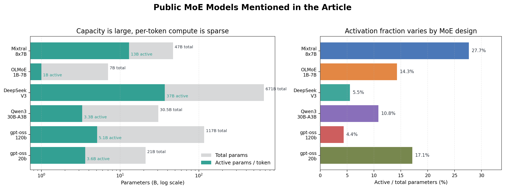
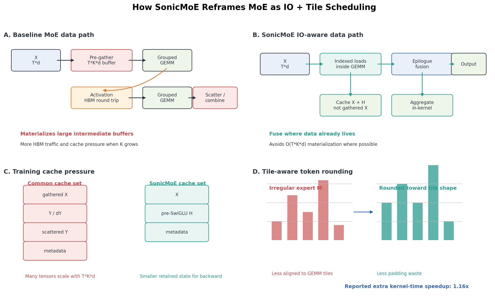
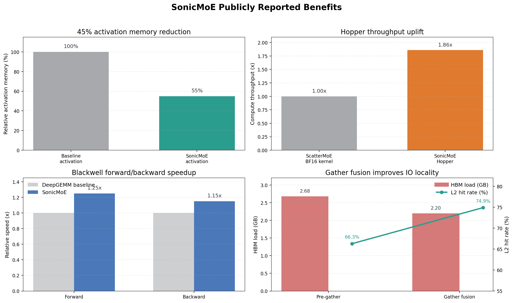

# 从 MoE 到 SonicMoE：为什么细粒度 MoE 需要 IO-aware 算子

> 说明：本文只使用公开资料，包括 arXiv 论文、GitHub 开源仓库、Hugging Face model card、官方博客和公开文档；不包含公司内部 profile、私有仓库、私有 benchmark 或内部对话结论。

## 一句话结论

MoE 的目标是“总参数量很大，但每个 token 只激活一小部分参数”，因此它可以用接近小模型的计算量承载更大的模型容量；SonicMoE 则进一步解决了细粒度 MoE 在 GPU 上的真实瓶颈：不是 FLOPs 不够，而是 gather/scatter、activation cache、HBM IO 和 Grouped GEMM tile 浪费太重。

SonicMoE 的核心优势可以概括为：

- 避免缓存或物化 `O(T*K*d)` 级别的大中间激活；
- 把 gather、activation、部分 backward 逻辑融合到 GEMM 或 epilogue 路径里；
- 利用更适合 Hopper/Blackwell 的 Grouped GEMM 软件栈；
- 用 tile-aware token rounding 降低 Grouped GEMM padding 浪费。

官方论文报告：SonicMoE 在 Hopper 上相对 ScatterMoE BF16 MoE kernel 减少 45% activation memory，并取得 1.86x compute throughput 提升；在 Blackwell 上，相对高度优化的 DeepGEMM baseline，forward/backward 分别有 25%/15% 相对加速；高稀疏场景下，token rounding 额外带来 1.16x kernel execution time 提升。来源见 [SonicMoE arXiv](https://arxiv.org/abs/2512.14080)。

## 1. MoE 是什么

Mixture-of-Experts, MoE，本质是一种稀疏激活架构。普通 dense Transformer 的 FFN/MLP 层会对每个 token 使用同一组参数；MoE 则把 FFN 替换成多个 expert，并用 router 给每个 token 选择少数几个 expert。

一个简化表达是：

```text
router(x) -> top-k experts
y = sum_i gate_i(x) * expert_i(x)
```

在大语言模型里，MoE 通常不是替换 attention，而是替换 Transformer block 里的 feed-forward network。这样做的好处是：模型可以拥有很多 expert，总参数量很大；但每个 token 只经过 top-k 个 expert，active parameters 远小于 total parameters。

这就是 MoE 最重要的工程意义：

```text
total parameters 决定模型容量上限
active parameters 决定每个 token 的主要计算成本
```

Switch Transformer 论文对这个思想有非常典型的表述：MoE 可以拥有非常大的参数规模，但计算成本近似保持不变；该论文还报告了相同计算资源下最高 7x pre-training speedup，以及相对 T5-XXL 的 4x speedup。来源见 [Switch Transformer arXiv](https://arxiv.org/abs/2101.03961)。

## 2. 从开源模型看 MoE 为什么流行

下面这些公开模型展示了 MoE 的共同模式：总参数很大，但每个 token 激活的参数只占一部分。

| 模型或论文 | 公开来源 | 总参数 / 激活参数 | MoE 结构信息 | 说明 |
|---|---:|---:|---:|---|
| Switch Transformer | [arXiv 2101.03961](https://arxiv.org/abs/2101.03961) | 最高扩展到 trillion-parameter 级别 | top-1 routing | 早期把 sparse expert scaling 推到大规模训练的代表工作 |
| Mixtral 8x7B | [arXiv 2401.04088](https://arxiv.org/abs/2401.04088) | 47B total / 13B active | 每层 8 个 expert，每 token 选 2 个 | Apache 2.0，公开 base 和 instruct 权重 |
| OLMoE-1B-7B | [arXiv 2409.02060](https://arxiv.org/abs/2409.02060) | 7B total / 1B active | sparse MoE | 公开模型权重、训练数据、代码和 logs |
| DeepSeek-V3 | [GitHub](https://github.com/deepseek-ai/DeepSeek-V3) / [arXiv 2412.19437](https://arxiv.org/abs/2412.19437) | 671B total / 37B active | DeepSeekMoE | 公开仓库说明其训练使用 14.8T tokens |
| Qwen3-30B-A3B | [Hugging Face model card](https://huggingface.co/Qwen/Qwen3-30B-A3B) | 30.5B total / 3.3B active | 128 experts，每 token 激活 8 个 | Qwen3-MoE 已被 Hugging Face Transformers 支持 |
| gpt-oss-120b / gpt-oss-20b | [OpenAI release blog](https://openai.com/index/introducing-gpt-oss/) | 117B / 5.1B active；21B / 3.6B active | 128 或 32 total experts，每 token 激活 4 个 | Apache 2.0 open-weight models |

这些数字说明一件事：现代开源/开放权重模型越来越倾向于用 MoE 把“容量”和“每 token 计算量”拆开。模型越往细粒度方向发展，expert 数越多，每个 expert 越小，激活比例越低，系统层面的挑战就越明显。



## 3. MoE 的理想很美，工程问题很硬

从算法视角看，MoE 很优雅：

```text
给每个 token 找几个 expert -> expert 各自计算 -> 把结果加权合并
```

但在 GPU 上，MoE 会变成一串很现实的操作：

1. router 算出每个 token 的 top-k expert；
2. 根据 expert id，把 token 分发、重排或 gather 到 expert-major layout；
3. 对每个 expert 做 M 维长度不同的 Grouped GEMM；
4. 做 activation，比如 SwiGLU；
5. 做第二个 Grouped GEMM；
6. scatter/combine 回 token-major layout；
7. 训练 backward 还要保存或重算若干中间激活。

Dense MLP 的核心通常是几次规则的大 GEMM；MoE 变成了很多个小而不均匀的 GEMM，再加上大量 metadata、gather、scatter、combine。于是瓶颈不再只是 tensor core 算力，而是：

- expert 负载不均衡；
- Grouped GEMM 每组 M 不同，tile padding 浪费；
- token gather/scatter 导致非连续访存；
- 中间 tensor 在 HBM 里反复读写；
- 训练时为了 backward 保存大量 activation；
- expert parallelism 下还会引入跨卡通信。

这也是为什么“MoE 模型参数更省计算”不自动等于“MoE 系统一定更快”。MoE 需要专门的 kernel 和 runtime 支撑。

## 4. 为什么细粒度 MoE 更难

SonicMoE 论文和公开博客都强调了 fine-grained MoE 的趋势。这里有两个概念：

```text
G = d / n
```

其中 `d` 是模型 hidden size，`n` 是每个 expert 的 intermediate size。`G` 越大，说明 expert 越小、粒度越细。

```text
rho = K / E
```

其中 `K` 是每个 token 激活的 expert 数，`E` 是总 expert 数。`rho` 越小，说明越稀疏。

细粒度和高稀疏对模型质量/计算成本可能有好处，但对 kernel 很不友好：

- expert 更小，每个 expert 的 GEMM shape 更小，更容易 memory-bound；
- top-k 和 expert 数增长后，`T*K*d` 级别的数据量变大；
- 如果先把 token gather 成连续 buffer，再喂给 GEMM，会额外产生大规模 HBM 写读；
- Grouped GEMM 里小 M、不均匀 M 会导致 tile padding 和调度浪费。

SonicMoE 公开博客里给出的直观解释是：pre-gather 后的输入大小是 `T*K*d`，而原始输入只有 `T*d`；当 `K` 增大时，pre-gather buffer 会变大，更容易超出 L2 cache 容量，导致更多 HBM 访问。来源见 [SonicMoE Blackwell blog](https://tridao.me/blog/2026/sonicmoe-blackwell/)。

## 5. SonicMoE 是什么

SonicMoE 不是一个新语言模型，也不是一种新的 MoE router。它是一个面向 MoE layer 的高性能实现，标题就是 [SonicMoE: Accelerating MoE with IO and Tile-aware Optimizations](https://arxiv.org/abs/2512.14080)。

公开 GitHub 仓库：[Dao-AILab/sonic-moe](https://github.com/Dao-AILab/sonic-moe)

仓库 README 描述它是一个针对 NVIDIA Hopper、Blackwell datacenter 和 Blackwell consumer GPU 优化的 MoE 实现，主要使用 [CuTeDSL](https://docs.nvidia.com/cutlass/media/docs/pythonDSL/cute_dsl_general/dsl_introduction.html) 和 [Triton](https://github.com/triton-lang/triton)，当前版本构建在 [QuACK](https://github.com/Dao-AILab/quack) 的 Grouped GEMM kernels 上，而 QuACK 又基于 CUTLASS/CuTe 体系。

也就是说，SonicMoE 的定位是：

```text
MoE 算子层 / kernel 层优化
```

它关注的不是“router 该学什么语义”，而是“给定 routing 结果以后，如何更少搬数据、更少缓存、更高效地完成 forward/backward”。

## 6. SonicMoE 的核心设计



### 6.1 避免缓存 O(T*K*d) 级别的大中间激活

标准 MoE 训练里，为了 backward，常见实现会缓存 gathered X、down-proj output Y、scattered Y 等中间结果。这些 tensor 的规模通常跟 `T*K*d` 成正比。

SonicMoE 的设计目标是避免缓存或物化这些 `O(T*K*d)` 大对象。公开博客里总结得很直接：SonicMoE 的 forward 只缓存 `X` 和 pre-SwiGLU activation `H`，gathered X 不缓存，expert aggregation kernel 把 scatter 和 sum 合在一起。

这带来的直接收益是 activation memory 不再随 expert granularity 线性增长。SonicMoE 论文摘要报告了 45% activation memory reduction。

### 6.2 Gather fusion：运行时 gather，而不是先 pre-gather

一种朴素做法是先启动一个 gather kernel，把 token 按 expert 排成连续 buffer，再做 Grouped GEMM。

SonicMoE 更倾向于把 gather 融到 GEMM 的 load 路径里：GEMM 运行时直接从原始 `X` 或 `dO` 里按 index 取数据，不提前物化 `T*K*d` 的 gathered buffer。

公开博客里有一个很关键的数据点：在一个 B300 上的 varlen-M Grouped GEMM 对比里，gather fusion 和 pre-gather contiguous load 的 L2->SMEM traffic 接近，但 gather fusion 的 HBM load traffic 更低，2.20 GB vs 2.68 GB，L2 hit rate 更高，74.9% vs 66.3%。来源见 [SonicMoE Blackwell blog: L2 Cache Locality with Gather Fusion](https://tridao.me/blog/2026/sonicmoe-blackwell/)。

这个结果背后的直觉是：

```text
原始输入: T*d
pre-gather 输入: T*K*d
```

`K` 越大，pre-gather buffer 越大，越难留在 cache 里；gather fusion 读的是更紧凑的原始输入，因此更有机会利用 L2 locality。

### 6.3 Epilogue fusion：结果还在 accumulator 里时就处理

Grouped GEMM 的输出如果先写回 HBM，再启动 activation kernel，再读回 HBM，就会产生额外 IO。

SonicMoE 使用 QuACK/CuTeDSL 这类 GEMM 软件抽象，把很多 post-processing 放进 epilogue 里：也就是 MMA accumulator 还在寄存器或 Blackwell TMEM 附近时，直接完成 SwiGLU、dSwiGLU、scatter/aggregation 相关处理，减少 HBM round trip。

QuACK 的 GitHub README 说明其 kernel 使用 CuTe-DSL 编写，并包含 Hopper/Blackwell GEMM + epilogue 等 kernel。来源见 [Dao-AILab/quack](https://github.com/Dao-AILab/quack)。

### 6.4 Backward 重排：不缓存 Y，也能算 dS 和 dH

训练最难的是 backward，因为 backward 往往需要 forward 的中间结果。

标准路径里，router score 的梯度 `dS` 可能依赖 down-proj output `Y`，于是很多实现会缓存 `Y`。SonicMoE 使用代数重排，把计算从：

```text
dS = <dO, Y>
Y = A * W2
```

改写成等价的：

```text
dA' = dO * W2^T
dS = <dA', A>
```

这样就不需要缓存 `Y` 和 `dY`。公开博客把这一点称为通过从 `dO` 和 `H` 直接计算 `dS` 与 `dH`，绕开 `Y`/`dY` 的缓存和物化。

### 6.5 Tile-aware token rounding：减少 Grouped GEMM padding 浪费

Grouped GEMM 的问题是每个 expert 的 token 数不同，GEMM 的 M 维不规则。GPU kernel 通常按 tile 运行，如果某个 expert 的 token 数不是 tile size 的整数倍，就会出现 padding，造成无效计算。

SonicMoE 提出 token rounding：routing 时考虑 tile 粒度，让 expert token 数更贴近 kernel 友好的形状。论文摘要报告，在 high MoE sparsity settings 下，tile-aware token rounding 相对 vanilla top-k routing 带来 1.16x kernel execution time speedup，同时保持相近 downstream performance。

## 7. SonicMoE 和常见 MoE kernel/库的关系

可以把 MoE 系统分成三层：

```text
模型层：router、expert 数、top-k、loss、load balancing
runtime 层：dispatch、expert parallelism、all-to-all、metadata
kernel 层：Grouped GEMM、gather/scatter、activation、combine、backward
```

SonicMoE 主要站在 kernel 层，并对 runtime 层的 metadata 形态有要求。

它和一些公开项目的关系可以这样理解：

| 项目 | 公开来源 | 角色 |
|---|---|---|
| Triton | [GitHub](https://github.com/triton-lang/triton) | 高生产力 GPU kernel DSL，用于写自定义 deep learning primitive |
| CUTLASS / CuTe | [GitHub](https://github.com/NVIDIA/cutlass) | NVIDIA 高性能线性代数模板库和 CuTe layout/MMA/copy 抽象 |
| QuACK | [GitHub](https://github.com/Dao-AILab/quack) | Dao-AILab 的 CuTe kernels 集合，提供 Hopper/Blackwell GEMM + epilogue 等能力 |
| SonicMoE | [GitHub](https://github.com/Dao-AILab/sonic-moe) | 基于 QuACK/Triton 的 MoE forward/backward 算子实现 |

SonicMoE 的优势不是单个 trick，而是把 MoE 计算图按 GPU 的真实瓶颈重排：

```text
少物化 -> 少 HBM IO
少缓存 -> 少 activation memory
gather fusion -> 更好 L2 locality
epilogue fusion -> 少 kernel boundary
tile-aware routing -> 少 padding 浪费
```

## 8. 从公开 repo 怎么读 SonicMoE

如果要从开源代码入手，建议按这个顺序读：

1. [README](https://github.com/Dao-AILab/sonic-moe)：先看项目定位、安装、支持 GPU、benchmark 入口。
2. [sonicmoe/moe.py](https://github.com/Dao-AILab/sonic-moe/blob/main/sonicmoe/moe.py)：看 MoE layer 的高层封装、router 和 backend 选择。
3. [sonicmoe/functional](https://github.com/Dao-AILab/sonic-moe/tree/main/sonicmoe/functional)：看 forward/backward、topk、reduction/gather 这些功能入口。
4. [sonicmoe/functional/triton_kernels](https://github.com/Dao-AILab/sonic-moe/tree/main/sonicmoe/functional/triton_kernels)：看 routing metadata、bitmatrix、Triton kernel。
5. [QuACK](https://github.com/Dao-AILab/quack)：看 SonicMoE 底层 GEMM 软件栈。

读代码时可以带着三个问题：

- routing 结果如何变成 expert-major metadata？
- Grouped GEMM 如何读取非连续 token？
- 哪些中间结果没有落 HBM，而是在 kernel 内部或 epilogue 中被消费？

这比只看 API 更容易理解 SonicMoE 为什么快。

## 9. 公开性能数据怎么解读

SonicMoE 论文和公开博客给了几类数据：

| 数据点 | 来源 | 解读 |
|---|---|---|
| activation memory 减少 45% | [SonicMoE arXiv](https://arxiv.org/abs/2512.14080) | 主要来自避免缓存/物化 `O(T*K*d)` 大中间激活 |
| Hopper 上相对 ScatterMoE BF16 kernel 有 1.86x compute throughput | [SonicMoE arXiv](https://arxiv.org/abs/2512.14080) | 表明它不是只省显存，也提升 kernel throughput |
| 64 H100 上 213B tokens/day，对比 ScatterMoE 96 H100 上 225B tokens/day | [SonicMoE arXiv](https://arxiv.org/abs/2512.14080) | 说明端到端训练吞吐接近，但使用更少 GPU |
| Blackwell 上 forward/backward 相对 DeepGEMM baseline 加速 25%/15% | [SonicMoE arXiv](https://arxiv.org/abs/2512.14080) | 说明在已有强 GEMM baseline 下，fusion 和 IO-aware 仍有收益 |
| token rounding 额外 1.16x kernel execution time speedup | [SonicMoE arXiv](https://arxiv.org/abs/2512.14080) | tile-aware routing 可以减少 Grouped GEMM padding 浪费 |
| gather fusion 比 pre-gather 方案 HBM load 更低、L2 hit rate 更高 | [SonicMoE Blackwell blog](https://tridao.me/blog/2026/sonicmoe-blackwell/) | 解释 IO-aware 设计为什么在硬件上成立 |



需要注意的是，这些数字来自作者公开论文/博客中的实验环境。不同模型 shape、GPU 架构、batch size、routing 分布、expert parallelism 方案都会影响实际收益。

## 10. SonicMoE 不是在解决所有 MoE 问题

为了避免误解，也要说清楚 SonicMoE 的边界：

- 它不是新的 MoE 模型架构；
- 它不是替代 router 训练策略的算法；
- 它不是完整分布式训练框架；
- 它主要解决的是 MoE layer 的 kernel/runtime efficiency；
- 公开博客中也提到，当前 SonicMoE 聚焦 single GPU, EP degree=1，但 IO-aware 思路可以迁移到 expert parallelism 场景。

换句话说，SonicMoE 解决的是：

```text
给定 MoE routing 和 expert weights，如何更高效地完成 MoE forward/backward
```

而不是：

```text
如何训练出更好的 router
如何做全链路分布式调度
如何替代所有 inference serving 框架
```

## 11. 关于 compact/sort：它属于工程接入层

MoE kernel 通常希望拿到 expert-major 的 metadata，例如：

```text
每个 expert 有多少 token
expert-major slot 对应哪个原始 token
token-major compact slot 如何映射回 expert-major slot
```

因此，从 router 输出的 `[T, K]` top-k expert id 到 SonicMoE/Grouped GEMM 能消费的 metadata，中间通常会有 compact、sort、prefix-sum、scatter index 这类步骤。

这些步骤很重要，但它们属于工程接入层和 metadata preprocessing，不是 SonicMoE 论文里“为什么 MoE forward/backward 更省显存、更少 IO”的核心思想。公开博客和论文的主线仍然是：

```text
避免 O(T*K*d) 中间激活
融合 gather/activation/aggregation
优化 Grouped GEMM tile 与 IO
```

如果某个集成环境需要额外的 fused compact-sort extension，需要确认该 extension 是否随公开包发布、是否在当前源码里存在、以及是否有 fallback。这个判断应基于对应的公开源码和安装包，而不要把私有分支实现混入公开博客。

## 12. 总结

MoE 的价值是让模型总容量变大，但每个 token 的计算只走少量 expert。这个思路已经在 Mixtral、OLMoE、DeepSeek-V3、Qwen3-MoE、gpt-oss 等公开模型里反复出现。

但 MoE 真正落到 GPU 上，会遇到 dense MLP 没有的系统问题：token dispatch、expert-major 重排、Grouped GEMM 小 shape、gather/scatter、combine、activation cache、backward memory。随着模型走向更细粒度、更稀疏，这些问题会越来越像主瓶颈。

SonicMoE 的贡献在于，它没有只把 MoE 当成“很多个 GEMM”来优化，而是把整个 MoE forward/backward 重新看成一个 IO 和 tile 调度问题：

```text
不该落 HBM 的中间结果就不要落
能在 GEMM load/epilogue 里完成的逻辑就融合进去
能减少 tile padding 的 routing 形状就主动调整
能复用 L2 的访问路径就不要提前展开成更大的 buffer
```

这就是 SonicMoE 相比普通 Grouped GEMM 接入更有优势的地方：它优化的是 MoE 的完整数据流，而不只是单个矩阵乘。

## 参考资料

- SonicMoE paper: <https://arxiv.org/abs/2512.14080>
- SonicMoE GitHub: <https://github.com/Dao-AILab/sonic-moe>
- SonicMoE Blackwell blog: <https://tridao.me/blog/2026/sonicmoe-blackwell/>
- QuACK GitHub: <https://github.com/Dao-AILab/quack>
- CUTLASS GitHub: <https://github.com/NVIDIA/cutlass>
- Triton GitHub: <https://github.com/triton-lang/triton>
- Switch Transformer: <https://arxiv.org/abs/2101.03961>
- Mixtral of Experts: <https://arxiv.org/abs/2401.04088>
- OLMoE: <https://arxiv.org/abs/2409.02060>
- DeepSeek-V3 GitHub: <https://github.com/deepseek-ai/DeepSeek-V3>
- DeepSeek-V3 Technical Report: <https://arxiv.org/abs/2412.19437>
- Qwen3-30B-A3B model card: <https://huggingface.co/Qwen/Qwen3-30B-A3B>
- gpt-oss release blog: <https://openai.com/index/introducing-gpt-oss/>
