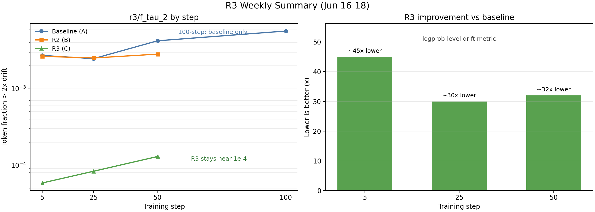

# 6月11日-6月18日 周报

## 总体总结

本周期围绕 R3 / Router Replay 在 veRL + Megatron + vLLM 上的 8 卡 H200 验证推进。前半段主要做 R3 论文和任务调研，明确 R3 要解决的是 MoE RL 中 rollout/inference engine 与 training engine 的 router 离散路径不一致问题；工程上 replay 的是 rollout 阶段真实选中的 expert id，不是 replay logits、expert 输出或冻结 router。基于这个理解，确定第一阶段先跑普通 `main_ppo + Megatron + vLLM + 开源非 FP8 MoE`，暂不引入 fully async、SGLang、VeOmni、FP8 和多节点变量。

工程链路已跑通：`main_ppo + Megatron + vLLM + Qwen3-30B-A3B BF16 + GSM8K + 8xH200` 可以稳定完成 R3 baseline 和 A/B/C 对照，`r3/*` 指标正常进入 console 和 SwanLab。期间解决了三个关键阻塞：`plt_num_loops` 透传到 Megatron 导致初始化崩溃、vLLM 安装包版本号 `0.2.dev17` 被 veRL 拒绝、vLLM CUDA graph 导致 `sample_tokens timed out`；其中 CUDA graph hang 已通过固定 `ROLLOUT_ENFORCE_EAGER=True` 稳定规避。

实验层面完成 5/25/50 step 的 baseline(A) / R2(B) / R3(C) 对照，100 step baseline 已完成，B/C 暂未补跑。logprob-level 指标证明 R3 明显降低训推漂移：核心指标 `r3/f_tau_2` 在 5/25/50 step 分别比 baseline 低约 45x、30x、32x；baseline 漂移随训练步数增加而上升，R3 基本保持在 `~1e-4` 量级。SwanLab 已完成 A/B/C 同图 summary comparison run，后续对 leader 展示可以直接看同图曲线。

需要注意边界：当前结论是“R3 显著降低 logprob-level 训推漂移”，不是“最终任务效果已经提升”。route-level 的 `topk_overlap=1.0`、`route_mismatch_rate=0.0` 在 `metric_use_replay_target_as_actual=True` 下表示 replay route 自一致性和机制链路正确，不能单独当作自然 route mismatch 的效果证明。

## 工作进展、计划与问题

| 工作 | 目的 | 当前进展 |
|---|---|---|
| R3 调研与 baseline 链路 | 明确 R3 要解决的问题、工程语义和第一阶段验证范围，并验证 8 卡 H200 能否承载 R3 baseline | 已完成 R3 论文、公开实现和任务调研，确认 R3 replay 的是 rollout 阶段真实选中的 top-k expert ids，即 `routed_experts`，不是 replay logits、expert 输出或冻结 router；第一阶段聚焦普通 `main_ppo + Megatron + vLLM + 开源非 FP8 MoE`。目前已跑通 `Qwen3-30B-A3B BF16 + GSM8K + 8xH200`。公开版实现说明见 [R3 工程实现](../r3/R3_工程实现公开版.md)。 |
| 阻塞排查与 A/B/C 对照 | 消除训练启动和 rollout hang 问题，并用 logprob-level 指标判断 R3 是否降低训推漂移 | 已解决/规避三类阻塞：`plt_num_loops` 透传导致 Megatron 初始化崩溃、vLLM 版本号 `0.2.dev17` 被 veRL 拒绝、vLLM CUDA graph 导致 `sample_tokens timed out`；当前固定 `ROLLOUT_ENFORCE_EAGER=True`。已打通 baseline/R2/R3 同名指标；5/25/50 step 对照显示 R3 的 `r3/f_tau_2` 比 baseline 低约 30-46 倍。公开结果见 [R3 实验结果](../r3/R3_实验结果公开版.md)。 |
| 后续扩展与当前风险 | 把当前单模型结论扩展到更多开源 MoE，并迁移到多节点环境复现 | 已完成 A/B/C 汇总图和 15-step 补充对照；100 step 只完成 baseline，B/C 未补齐。多节点运行、checkpoint 和 CUDA Graph 风险见 [R3 排障与运行](../r3/R3_CUDA_Graph与集群排障公开版.md)。凭据仅通过 Secret 或环境变量注入，不写入文档与脚本。 |

## 关键实验结果

`r3/f_tau_2` 是训推概率差超过 2 倍的 token 比例，越低越好。R3 明显低于 baseline/R2；baseline 随训练步数漂移上升，R3 基本稳定。

| step | baseline(A) | R2(B) | R3(C) | R3 vs baseline |
|---:|---:|---:|---:|---|
| 5 | 2.72e-3 | 2.65e-3 | 5.86e-5 | ~45x lower |
| 25 | 2.47e-3 | 2.52e-3 | 8.34e-5 | ~30x lower |
| 50 | 4.23e-3 | 2.83e-3 | 1.30e-4 | ~32x lower |
| 100 | 5.67e-3 | - | - | baseline only |

补充：6月18日重新跑了 15-step baseline vs R3 两组对照，`r3/f_tau_2` 为 `3.53e-3` vs `4.58e-5`，R3 低约 77x；这是对 5/25/50 step 结论的补充验证，不替代上表主口径。

## 原始文件

| 文件 | 说明 |
|---|---|
| [r3_weekly_0616_0618_data.csv](./r3_weekly_0616_0618_data.csv) | 周报图表原始数据 |
| [r3_weekly_0616_0618_summary.png](./r3_weekly_0616_0618_summary.png) | 周报 1x2 组合图 |
