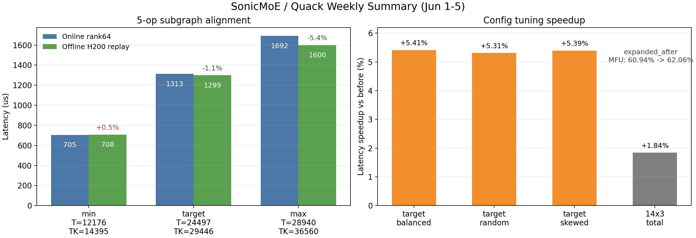

# 6月1日-6月5日 周报

## 总体总结

本周围绕 SonicMoE / Quack 在 H200 上的线上线下对齐、sonic_moe debug 和小幅 tuning 展开。核心结论是：此前“本地慢 4-6 倍”主要来自测试口径错误，线上 `_FusedMoEProjection` 进入 quack 的 rows 是 DeepEP/Flex compact 后的 `TK_valid`，不是 standalone sonic-moe 的 `T * topk`。按 Megatron/DeepEP metadata 回放后，本地 H200 与线上 rank64 三个代表 shape 基本对齐。

后续只针对两个 quack GEMM 做 config-level tuning，目标线上 shape 约有 `+5.3%` 收益，14 shape x 3 expert 分布整体约 `+1.84%`。当前建议是小改 autotune 候选，同时规划一个轻量 profiling 框架，用真实 shape 统计各算子的 MFU/MBU/计算强度。

## 版本1 邮件版

**我做了什么：** 本周完成 SonicMoE / Quack 线上线下对齐和 sonic_moe debug，排查了 warmup/autotune 污染、standalone sonic-moe 与线上 Megatron/DeepEP metadata 口径差异，以及 `sonicmoe.compact_sort` 缺失问题。确认线上不是 `T*8=195976` rows，而是 DeepEP compact 后 `TK_valid=29446` rows；构造 Megatron/DeepEP metadata replica，抽取线上 1024 条 forward range，三点本地 H200 回放与线上差异为 `+0.46% / -1.11% / -5.40%`。同时完成 quack H200 config-level tuning 验证，目标 shape 稳定约 `+5.3%`，全量 14 shape x 3 分布约 `+1.84%`。

**未来的计划：** 新开分支把 `gemm_gated` 的 `cluster_m=1, cluster_n=1` 候选加入 SM90 autotune 空间，用 14 shape x 3 分布回归；参考 bytedance/xpu-perf 的 benchmark 思路，设计一个轻量 transformer block profiling 框架：给定模型配置和 seq/并行信息，按真实 shape 跑出每个算子的 MFU、MBU、计算强度等指标。简化版先不追求完整并行和端到端正确性，重点是统计真实负载下 kernel 的计算/访存 trade-off；拿到 NCU 权限后再补单算子的详细硬件计数器。

**目前的问题：** 本地 `sonic-moe` 缺少 Megatron 分支依赖的 `sonicmoe.compact_sort` fused 接口，源码/安装包版本需要对齐；目前只有 rank64 profile 和 shape 信息，缺少完整线上 metadata；NCU 权限还没有取得，已提工单但暂无反馈，因此暂时只能用 Nsys 和理论 FLOPs/IO 估算；quack tuning 是小幅收益，不支持直接做大规模 kernel 重写。

## 版本2 共享文档版

### 我做了什么

| 工作 | 结果 | 线上文档 |
|---|---|---|
| SonicMoE / Quack 对齐 | 确认 `195976 -> 29446` 是 DeepEP compact local routed rows 口径差异；本地 H200 三点回放与线上基本一致 | H200 GEMM 性能对比汇总 |
| sonic_moe debug | 排查 warmup/autotune 污染、metadata 构造差异、`compact_sort` 缺失和 standalone/线上路径差异 | H200 MoE 性能分析报告 |
| quack GEMM tuning | `gemm_gated cluster_m=1` 候选对目标 shape 约 `+5.3%`，全量约 `+1.84%` | quack::gemm 优化可行性报告 |

### 未来的计划

| 优先级 | 计划 | 验收 |
|---|---|---|
| P0 | 落地 `gemm_gated cluster_m=1, cluster_n=1` autotune 候选 | `online_target` 保持约 `+5%`，14 shape x 3 分布不回退 |
| P1 | 参考 bytedance/xpu-perf，设计轻量 transformer block profiling 框架 | 给定模型配置和 seq/并行信息，输出每个算子的 MFU/MBU/计算强度 |
| P1 | 获取线上真实 `tokens_per_expert / expert_frequency_offset` 和更多 rank/profile | 用真实 metadata 替代 synthetic distribution 复测 |
| P2 | NCU 权限恢复后补单算子硬件计数器 | 校准理论 FLOPs/IO 与实际 cache/memory 行为差异 |

### 目前的问题

| 问题 | 影响 | 当前判断 |
|---|---|---|
| `sonicmoe.compact_sort` 缺失 | 影响完全复现线上 fused compact/sort 路径 | 需要对齐 Megatron 集成分支和 sonic-moe 包版本 |
| 线上 metadata 内容不足 | Nsight 只给 shape，不能看到真实每 expert 分布 | 先用 1024 条 range + synthetic 分布覆盖 |
| NCU 权限未开 | 不能看单算子的详细硬件计数器、AI、访存等信息 | 已提工单，暂时没有反馈 |
| tuning 收益有限 | 全量收益约 `+1%` 到 `+2%` | 做最小 config-level 改动，不建议 kernel rewrite |
